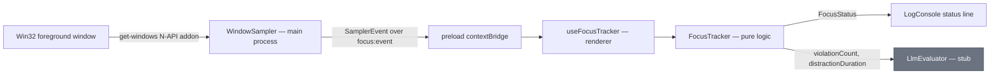
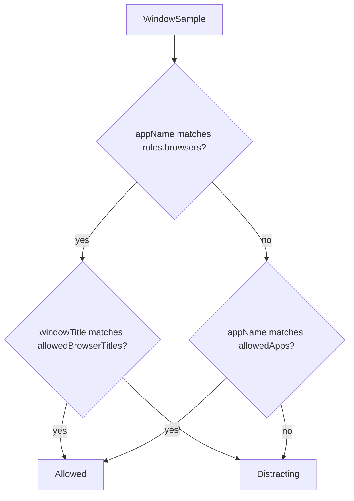
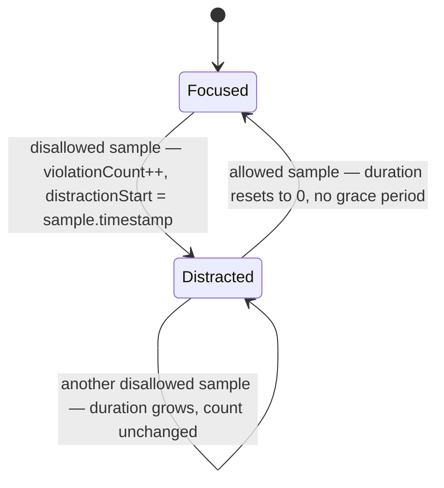

# Implementation Guide: Desktop Usage Tracking

**Status:** For review. Companion to `desktop-usage-tracking.md` — that document decides *what* to build; this one decides *how*, down to interfaces, file contents, and verification commands.

**Relationship to the plan:** the plan left five questions open (§10). All five are answered in §0 below. Two were answered by the module owner; three follow the plan's own recommendations. Where this guide contradicts the plan, §1 says so and why — the plan's Milestone 1 verification step does not do what it claims, and that is corrected here.

---

## 0. Decisions locked

| # | Question | Decision | Source |
|---|---|---|---|
| 1 | Sampler path (§3) | **Option B — run Electron natively on Windows**, using the `get-windows` package | Module owner |
| 2 | Allowlist target (§6) | **Hybrid** — `appName` allowlist for ordinary apps, plus title rules applied only to apps marked as browsers | Module owner |
| 3 | Disallowed → different disallowed | **One violation.** You didn't stop being distracted | Plan's recommendation |
| 4 | Grace period on brief flicks | **None in v1.** Add only if real use proves it annoying | Plan's recommendation |
| 5 | Orphaned IPC channels | **Delete and replace** with typed channels. The names are camera-era artifacts and the shape is different | Plan's recommendation |

Because Option B was chosen, the WSL-interop subprocess path is off the table. That has one welcome consequence: **nothing here re-adopts the stdio-subprocess pattern**, so ADR-001 is untouched and the plan's §8 worry about partially reversing ADR-008 disappears. A different ADR question takes its place — see §8.

### Findings that shaped this guide

These were verified against the actual packages and the actual repo, not assumed. Each one changes the code you write.

1. **`npx tsc --noEmit` never looks at the renderer.** `tsconfig.json:15` sets `"exclude": ["src/renderer/**/*"]`. Running `tsc --noEmit --listFiles` returns **zero** files under `src/renderer`. Vite builds with esbuild (transpile-only) and vitest does not typecheck either, so renderer TypeScript is currently never typechecked at all. The plan's Milestone 1 verification would pass without ever reading `FocusTracker`. §1 fixes this.

2. **`get-windows@9.3.0` is ESM-only** (`"type": "module"`, `exports.default: "./index.js"`). This project's main process is CommonJS, and Electron 30 ships Node 20.9, which predates `require(esm)`. A plain import will fail at runtime.

3. **TypeScript will silently break the workaround.** Compiled with the project's current `"module": "CommonJS"`, `await import('get-windows')` is emitted as `Promise.resolve().then(() => require('get-windows'))` — a `require`, which throws `ERR_REQUIRE_ESM`. Under `module: node16` or `nodenext` the same source is emitted as `await import('get-windows')`, untouched. Verified by compiling the same file three ways. §2 handles this.

4. **A prebuilt Windows binary exists, so no compiler toolchain is needed.** `get-windows` runs `node-pre-gyp install --fallback-to-build` on install, and release `v9.3.0` publishes `napi-9-win32-unknown-x64.tar.gz` (confirmed reachable, HTTP 200). The happy path downloads it. Visual Studio Build Tools are only needed if that download fails and it falls back to building `Sources/windows/main.cc`.

5. **It is N-API 9, so `electron-rebuild` is not required.** The addon targets `napi_versions: [9]`, and N-API is ABI-stable across Node and Electron. Electron 30's Node 20.9 supports N-API 9. This is the main cost Option B was expected to carry, and it largely isn't there.

6. **A failed native install fails *silently*.** In `lib/windows.js`, `getAddon()` checks whether the binding file exists and, if not, returns stubs: `getActiveWindow() {}`. That returns `undefined`, not an error. The published signature admits it — `activeWindow(): Promise<Result | undefined>`. Without an explicit check, a broken install makes the whole feature quietly do nothing. §2 makes this loud.

7. **`WindowsResult` carries no `url`.** The `url` field is macOS-only. On Windows the browser tab is reachable *only* through the window title, which is why decision 2's hybrid matches titles rather than URLs.

For reference: a Win32 probe from this WSL shell returned `appName: "zen"`, `windowTitle: "(75) GPT 6 Astra is a freak - YouTube — Zen Browser"`. That single sample is the argument for decision 2 — matching `appName` alone would have made the entire browser all-or-nothing.

---

## 1. Milestone 1 — `FocusTracker`, test-first

No OS involvement, no Electron, no dependency on Option B. Start here.

### 1.1 Shared types

`WindowSample` crosses main → preload → renderer, and CLAUDE.md forbids `any` across a process boundary. Preload cannot cleanly import from the renderer tree, so the sample shape does not live in the renderer.

Create `src/shared/types.ts`:

```typescript
/**
 * One observation of the foreground window. Produced in the main process,
 * carried over IPC, consumed by FocusTracker in the renderer.
 *
 * windowTitle is personal activity data: compare it in memory, never render,
 * log, or persist it. See context.md constraint 1.
 */
export interface WindowSample {
  appName: string;
  windowTitle: string;
  timestamp: number; // ms since epoch, supplied by the sampler
}

/** Why the sampler cannot currently report samples. */
export interface SamplerError {
  reason: 'addon-unavailable' | 'query-failed';
  message: string;
}

/** Everything the sampler sends to the renderer, as a discriminated union. */
export type SamplerEvent =
  | { kind: 'sample'; sample: WindowSample }
  | { kind: 'error'; error: SamplerError };
```

`SamplerError` is not scope creep; it is the direct answer to finding 6. Without a way to say "the addon didn't load," a broken install is indistinguishable from a perfectly focused user.

> **Gotcha.** The renderer reaches this file across vite's `root: src/renderer` boundary. That is safe *only* for type-only imports, which esbuild erases without resolving. Always use the statement form `import type { WindowSample } from '...'`. The inline form `import { type WindowSample }` can leave an empty runtime import behind, which will fail to resolve. For the same reason, keep `src/shared/` strictly types — no consts, no enums, no functions.

### 1.2 Module-local types

Create `src/renderer/services/focus/types.ts`:

```typescript
import type { WindowSample } from '../../../shared/types';

export type { WindowSample };

/** What the tracker answers with. Deliberately free of window titles. */
export interface FocusStatus {
  isDistracted: boolean;
  distractionDuration: number; // consecutive SECONDS in the current distraction; 0 when focused
  violationCount: number;      // distinct distraction episodes this session
  currentApp: string;
}

/**
 * The hybrid allowlist (decision 2).
 *
 * Ordinary apps are judged on appName alone. Apps named in `browsers` are
 * judged on their window title instead, because for a browser the app name
 * says nothing useful — the tab is the activity.
 *
 * All matching is case-insensitive substring matching.
 */
export interface FocusRules {
  allowedApps: string[];
  browsers: string[];
  allowedBrowserTitles: string[];
}
```

Re-exporting `WindowSample` keeps the focus module's imports local: consumers import everything from `./types`, and only this one file knows the shared path.

### 1.3 The tests

Create `src/renderer/services/focus/FocusTracker.test.ts`. Write each test, watch it fail, then write only enough code to pass it.

Time comes from `sample.timestamp`, never `Date.now()` inside the tracker. That is what lets these tests assert arithmetic with plain numbers and no fake timers.

```typescript
import { describe, test, expect, beforeEach } from 'vitest';
import { FocusTracker } from './FocusTracker';
import type { FocusRules } from './types';

const RULES: FocusRules = {
  allowedApps: ['Code', 'Windows Terminal'],
  browsers: ['zen', 'chrome', 'msedge'],
  allowedBrowserTitles: ['MDN', 'Stack Overflow', 'localhost'],
};

const T0 = 1_700_000_000_000;

// Small helper so each test reads as a sequence of events, not object literals.
const sample = (appName: string, windowTitle: string, offsetSeconds: number) => ({
  appName,
  windowTitle,
  timestamp: T0 + offsetSeconds * 1000,
});

describe('FocusTracker', () => {
  let tracker: FocusTracker;

  beforeEach(() => {
    tracker = new FocusTracker(RULES);
  });

  // ... tests below
});
```

Write them in this order:

| # | Scenario | Expectation |
|---|---|---|
| 1 | One allowed sample (`Code`) | `isDistracted: false`, `distractionDuration: 0`, `violationCount: 0` |
| 2 | One disallowed sample (`Discord`) | `isDistracted: true`, `distractionDuration: 0`, `violationCount: 1` |
| 3 | Two disallowed samples 10s apart | `distractionDuration: 10`, `violationCount: 1` |
| 4 | Disallowed, then allowed | `isDistracted: false`, `distractionDuration: 0`, `violationCount: 1` |
| 5 | Disallowed → allowed → disallowed | `violationCount: 2`, `distractionDuration: 0` |
| 6 | Two *different* disallowed apps in a row (`Discord`, then `Spotify`) | `violationCount: 1` — decision 3, asserted explicitly |
| 7 | `code` lowercase, `CODE` uppercase | both allowed — matching is case-insensitive |
| 8 | `reset()` after several violations | all counters back to the initial state |

Then the four the hybrid rule adds:

| # | Scenario | Expectation |
|---|---|---|
| 9 | Browser with an allowed title (`zen`, `"MDN Web Docs — Array"`) | not distracted |
| 10 | Browser with a disallowed title (`zen`, `"... - YouTube — Zen Browser"`) | distracted, `violationCount: 1` |
| 11 | Allowed non-browser app with an irrelevant title (`Code`, `"YouTube.md"`) | **not** distracted — titles are ignored outside browsers |
| 12 | Browser with an empty title | distracted — nothing to match against, so it cannot be allowed |

Test 11 is the one that proves the hybrid is actually a hybrid rather than a global title match. Test 12 pins down behaviour you would otherwise discover by accident when a window reports no title.

Note what test 6 tells you about the implementation: because a violation is counted only on the *transition* into distraction, the tracker never has to compare one app against another. Decision 3 costs no code.

### 1.4 `FocusTracker.ts`

Create `src/renderer/services/focus/FocusTracker.ts`. The shape the tests drive out:

```typescript
import type { FocusRules, FocusStatus, WindowSample } from './types';

const matchesAny = (haystack: string, needles: string[]): boolean => {
  const value = haystack.toLowerCase();
  return needles.some((needle) => value.includes(needle.toLowerCase()));
};

export class FocusTracker {
  private isDistracted = false;
  private violationCount = 0;
  private distractionStart: number | null = null;
  private distractionDuration = 0;
  private currentApp = '';

  constructor(private readonly rules: FocusRules) {}

  /** Feeds one observation in and returns the resulting status. */
  public accept(sample: WindowSample): FocusStatus {
    this.currentApp = sample.appName;

    if (this.isAllowed(sample)) {
      this.isDistracted = false;
      this.distractionStart = null;
      this.distractionDuration = 0;
    } else if (!this.isDistracted) {
      // Transition into a new distraction episode.
      this.isDistracted = true;
      this.violationCount += 1;
      this.distractionStart = sample.timestamp;
      this.distractionDuration = 0;
    } else {
      // Still distracted: grow the duration from the episode's start.
      const elapsedMs = sample.timestamp - (this.distractionStart ?? sample.timestamp);
      this.distractionDuration = Math.max(0, Math.floor(elapsedMs / 1000));
    }

    return this.getStatus();
  }

  public getStatus(): FocusStatus {
    return {
      isDistracted: this.isDistracted,
      distractionDuration: this.distractionDuration,
      violationCount: this.violationCount,
      currentApp: this.currentApp,
    };
  }

  public reset(): void {
    this.isDistracted = false;
    this.violationCount = 0;
    this.distractionStart = null;
    this.distractionDuration = 0;
    this.currentApp = '';
  }

  /** Decision 2: browsers are judged on title, everything else on app name. */
  private isAllowed(sample: WindowSample): boolean {
    if (matchesAny(sample.appName, this.rules.browsers)) {
      return matchesAny(sample.windowTitle, this.rules.allowedBrowserTitles);
    }
    return matchesAny(sample.appName, this.rules.allowedApps);
  }
}
```

Two details worth keeping:

- `Math.max(0, ...)` guards against a sample arriving with an earlier timestamp than the episode start. It costs one call and prevents a negative duration reaching `LlmEvaluator`.
- `getStatus()` returns a fresh object each call, so a React consumer holding a previous status never sees it mutate underneath.

`matchesAny` uses substring matching, which is forgiving in the right direction: `'Code'` matches `"Visual Studio Code"`. It is also loose — `'Code'` would match a window titled `"Codecademy"` if you ever put it in `browsers`. For a personal tool tuned by its only user, that trade is fine; note it and move on.

### 1.5 Verification — and the correction to the plan

The plan says to verify with `npx tsc --noEmit`. Per finding 1, that command does not read the renderer, so it would report success without checking a line of `FocusTracker`. Fix it properly by adding a renderer typecheck.

Create `tsconfig.renderer.json`:

```json
{
  "extends": "./tsconfig.json",
  "compilerOptions": {
    "noEmit": true,
    "jsx": "react-jsx",
    "module": "ESNext",
    "moduleResolution": "bundler",
    "types": ["vitest/globals"]
  },
  "include": ["src/renderer/**/*", "src/shared/**/*"],
  "exclude": []
}
```

`"exclude": []` is load-bearing. `exclude` is inherited from the base config, and the base excludes exactly the directory you are trying to check — without the override, this config checks nothing. `jsx` is needed because the base config has no `jsx` setting and the renderer contains `.tsx`.

Add to `package.json`:

```json
"typecheck": "tsc --noEmit && tsc -p tsconfig.renderer.json"
```

Then verify:

```bash
npm run test:ui && npm run typecheck
```

> **Expect the first `typecheck` run to surface pre-existing renderer errors** — most likely `App.tsx:5-13`, where a local `interface Window` and `declare const window: Window` stand in for real typings. That is the first time this code has ever been typechecked, so those errors are new information, not a regression you introduced. §3.3 replaces that hack properly. If the noise gets in the way of finishing Milestone 1, narrow `include` to `["src/renderer/services/focus/**/*", "src/shared/**/*"]` for this milestone and widen it in Milestone 3.

Commit at this point. The tracker is complete, tested, and typechecked, with no dependency on anything Windows-specific.

---

## 2. Milestone 2 — the sampler

Everything platform-specific lives in this one file. That is the whole point of the split.

### 2.1 Environment setup

Option B means the app runs on Windows, not in WSL. Once, before any code:

1. Install Node 20 or newer **on Windows** (not the WSL install).
2. Clone the repo onto the Windows filesystem — `C:\dev\FocusSentinel`, not `\\wsl$\...` and not a `/mnt/c` path driven from WSL. Native installs and file watching are both unreliable across that boundary.
3. `npm install` there. Electron will fetch its Windows binary; `get-windows`'s `install` script will run `node-pre-gyp install --fallback-to-build`.

Watch that install line. Per finding 4 it should download `napi-9-win32-unknown-x64.tar.gz` and finish in seconds. If it instead starts compiling `main.cc` and fails, you need the Visual Studio C++ Build Tools — but check first that the download simply wasn't blocked, since building is the fallback, not the norm.

### 2.2 Prove the addon actually loaded

Do this before writing the sampler. Finding 6 means a broken install is silent, and you do not want to debug that through three layers of IPC.

```bash
node --input-type=module -e "import {activeWindow} from 'get-windows'; const r = await activeWindow(); console.log(r ? {app: r.owner.name, platform: r.platform} : 'UNDEFINED — addon did not load');"
```

`UNDEFINED` means the native binding is missing; no amount of application code will fix that. A printed app name means you are clear to proceed.

**Write down what `owner.name` actually reports.** It may be a process name (`zen`), an executable name (`zen.exe`), or a friendly description (`Zen Browser`) — the Win32 implementation's choice, not something to guess at. Your `FocusRules.browsers` and `allowedApps` entries have to match whatever it really says, and substring matching gives you some slack. Note that `msedge`, `chrome`, and `zen` are the process-name spellings you would need if it reports process names.

### 2.3 The CommonJS/ESM problem

Findings 2 and 3 together: `get-windows` is ESM-only, and the current `"module": "CommonJS"` rewrites your dynamic import into a `require` that throws at runtime. Three ways out.

| Approach | Verdict |
|---|---|
| **Set `module: node16` for the main-process build**, keep CommonJS output, use `await import()` | **Recommended.** Verified: `node16` and `nodenext` both emit `await import('get-windows')` verbatim. Main and preload stay CommonJS, so `__dirname` in `main.ts:22` and `main.ts:39` keeps working. |
| Pin `active-win@8.2.1` (the pre-rename version; `main: "./index"`, no `"type": "module"`, so CommonJS) | Works with no build change, and is the fallback if the recommended path fights you. Costs you an unmaintained major version. |
| Convert the main process to ESM output | Invasive. Breaks every `__dirname` in `main.ts` and changes the `package.json` `main` contract for no benefit here. |

Take the first. In `tsconfig.json`:

```json
"module": "node16",
"moduleResolution": "node16"
```

This is a genuine change to how the main process compiles, so verify it deliberately rather than trusting it:

```bash
npm run build && grep -n "import(\|require(" dist/main/WindowSampler.js | head
```

You want to see `await import('get-windows')`. If you see `Promise.resolve().then(() => require('get-windows'))`, the setting did not take effect and the app will throw `ERR_REQUIRE_ESM` the moment sampling starts.

Be ready for `moduleResolution: node16` to be stricter than `node` about extensions and `@types` resolution in `main.ts` and `preload.ts`. Those are compile errors, which is the good kind — they surface immediately, not at runtime.

### 2.4 `WindowSampler.ts`

Create `src/main/WindowSampler.ts`:

```typescript
import type { SamplerError, SamplerEvent, WindowSample } from '../shared/types';

type GetWindows = typeof import('get-windows');

/**
 * Asks the OS which window has focus, on an interval, and reports what it
 * finds. Deliberately dumb: no allowlist, no timing rules, no decisions —
 * those all live in FocusTracker in the renderer.
 */
export class WindowSampler {
  private timer: NodeJS.Timeout | null = null;
  private module: GetWindows | null = null;
  private inFlight = false;

  constructor(
    private readonly intervalMs: number,
    private readonly onEvent: (event: SamplerEvent) => void,
  ) {}

  public async start(): Promise<void> {
    if (this.timer) {
      return;
    }

    try {
      // Kept as a dynamic import on purpose: get-windows is ESM-only and this
      // file compiles to CommonJS. Requires module: node16 — see §2.3.
      this.module = await import('get-windows');
    } catch (error) {
      this.fail('addon-unavailable', `Could not load get-windows: ${errorMessage(error)}`);
      return;
    }

    await this.tick(); // report immediately rather than after one full interval
    this.timer = setInterval(() => void this.tick(), this.intervalMs);
  }

  public stop(): void {
    if (this.timer) {
      clearInterval(this.timer);
      this.timer = null;
    }
    this.module = null;
  }

  private async tick(): Promise<void> {
    // A slow query must not stack up behind the interval.
    if (!this.module || this.inFlight) {
      return;
    }
    this.inFlight = true;

    try {
      const result = await this.module.activeWindow();

      // A failed native install does not throw — it returns undefined.
      // See lib/windows.js getAddon(). Say so out loud.
      if (!result) {
        this.fail('addon-unavailable', 'activeWindow() returned undefined; the native addon is not loaded.');
        return;
      }

      const sample: WindowSample = {
        appName: result.owner.name,
        windowTitle: result.title,
        timestamp: Date.now(),
      };

      this.onEvent({ kind: 'sample', sample });
    } catch (error) {
      this.fail('query-failed', errorMessage(error));
    } finally {
      this.inFlight = false;
    }
  }

  private fail(reason: SamplerError['reason'], message: string): void {
    this.onEvent({ kind: 'error', error: { reason, message } });
  }
}

const errorMessage = (error: unknown): string =>
  error instanceof Error ? error.message : String(error);
```

Points that matter:

- **The timestamp is set here**, by the producer, exactly as the plan specifies. The tracker never reads a clock, which is what keeps §1.3's tests free of fake timers.
- **`inFlight` prevents pile-up.** The interval fires on a schedule; the query is async. Without the guard, a stalled call would let ticks queue behind it.
- **Nothing is logged.** No `console.log` of a sample anywhere in this file — `windowTitle` is exactly the data §9 of the plan puts out of bounds. If you need to debug, print `result.owner.name` alone.
- **`stop()` is idempotent** and clears the module reference, so a restart re-imports and re-checks.

### 2.5 Verification

Wire it to a temporary app-name-only print, run the app on Windows, and alt-tab around:

```typescript
const sampler = new WindowSampler(2000, (event) => {
  console.log(event.kind === 'sample' ? event.sample.appName : event.error);
});
void sampler.start();
```

Confirm the app names track what you actually switch to, including Windows-side apps like Discord and your browser — the thing Option A could never have seen from inside WSL. Then delete the temporary print; §3 replaces it with the real channel.

Update `src/main/CONTEXT.md`: a new file in the manifest, a new integration boundary (`get-windows`, native N-API addon), and the note stating there is no subprocess needs revising — it is still true that nothing is spawned, and now worth saying that the sampler runs in-process, as that note predicted.

---

## 3. Milestone 3 — the IPC channel

Decision 5: delete `onTelemetry` and `sendCommand`, add typed replacements. `src/preload/CONTEXT.md` already calls them dead code awaiting exactly this feature.

### 3.1 `preload.ts`

Replace the two orphaned methods. The file becomes:

```typescript
import { contextBridge, ipcRenderer, type IpcRendererEvent } from 'electron';
import type { SamplerEvent } from '../shared/types';

export const FOCUS_EVENT_CHANNEL = 'focus:event';

contextBridge.exposeInMainWorld('api', {
  /**
   * Subscribes to foreground-window samples from the main process.
   * Returns an unsubscribe function for cleanup in UI components.
   */
  onFocusEvent: (callback: (event: SamplerEvent) => void): (() => void) => {
    const subscription = (_event: IpcRendererEvent, value: SamplerEvent) => callback(value);
    ipcRenderer.on(FOCUS_EVENT_CHANNEL, subscription);

    return () => {
      ipcRenderer.removeListener(FOCUS_EVENT_CHANNEL, subscription);
    };
  },

  minimize: () => ipcRenderer.send('window-minimize'),
  maximize: () => ipcRenderer.send('window-maximize'),
  close: () => ipcRenderer.send('window-close'),
});
```

Every `any` is gone: `IpcRendererEvent` replaces `_event: any`, and `SamplerEvent` replaces `data: any`. That satisfies CLAUDE.md's rule against `any` across a process boundary — which the old signatures broke twice.

There is no command channel going the other way. Nothing in v1 needs the renderer to control the sampler, and inventing `sendCommand`'s replacement before a caller exists would just recreate the orphan the plan is cleaning up.

> `contextBridge` structured-clones what crosses it. `SamplerEvent` is a plain object tree of strings and numbers, so it clones cleanly. Keep it that way — no `Date`, no class instances, no functions.

### 3.2 `main.ts`

The channel name is needed in both processes. **Do not import it from `preload.ts`.** That file's body calls `contextBridge.exposeInMainWorld(...)` at the top level, so importing it into the main process executes that call where `contextBridge` does not exist, and the app dies at startup. Two safe options: duplicate the one string literal in both files, or create `src/shared/channels.ts` holding the `const` and import it from `main.ts` and `preload.ts`.

If you take the second, note the boundary: a runtime `const` in `src/shared/` is fine for main and preload, which are compiled by `tsc`, but the **renderer must never import it** — that would be a real runtime import across vite's `root` boundary, which §1.1's rule exists to prevent. Read that rule as "`src/shared/types.ts` is types-only," not "`src/shared/` is types-only." The renderer has no use for the channel name anyway; it only ever calls `window.api.onFocusEvent`.

Construct the sampler **once, at module scope** — not inside `createWindow()`:

```typescript
let mainWindow: BrowserWindow | null = null;

const sampler = new WindowSampler(2000, (event) => {
  if (mainWindow && !mainWindow.isDestroyed()) {
    mainWindow.webContents.send(FOCUS_EVENT_CHANNEL, event);
  }
});
```

Module scope is not just for `before-quit`'s benefit. `main.ts:67-71` calls `createWindow()` again on `activate`, so constructing inside it would build a second sampler on the second window — the first interval would keep ticking with nothing referencing it, and the `closed` handler would only ever stop the newest one. Constructing once avoids that entirely, and the callback reads `mainWindow` at fire time, so it follows whichever window is current.

Start it once the renderer can actually receive:

```typescript
mainWindow.webContents.once('did-finish-load', () => {
  void sampler.start();
});
```

That ordering matters more than it looks. `start()` fires an immediate tick, and a `webContents.send` that lands before the renderer has loaded is dropped silently — you would lose the first sample every launch, and in dev the retry-on-`did-fail-load` path at `main.ts:31-38` makes it worse.

Stop it on teardown, in the existing `closed` handler and on quit:

```typescript
mainWindow.on('closed', () => {
  sampler.stop();
  mainWindow = null;
});

app.on('before-quit', () => sampler.stop());
```

Because the sampler now outlives any single window, `closed` stopping it is the right call only if you also restart it in `createWindow()`'s `did-finish-load` — which the snippet above already does, since that handler is registered per window.

An interval of 2s matches what §2.5 verified and what §5's lag arithmetic assumes. The tracker does not care.

### 3.3 Renderer typings

Replace the `interface Window` / `declare const window` hack at `App.tsx:5-13` with a real global declaration. Create `src/renderer/global.d.ts`:

```typescript
import type { SamplerEvent } from '../shared/types';

declare global {
  interface Window {
    api: {
      onFocusEvent: (callback: (event: SamplerEvent) => void) => () => void;
      minimize: () => void;
      maximize: () => void;
      close: () => void;
    };
  }
}
```

Then delete those lines from `App.tsx`. Its `window.api.minimize()` calls keep working, now against a declaration that matches what preload actually exposes rather than a local shadow that merely resembled it. This is also what clears the pre-existing errors §1.5 warned about.

### 3.4 Verification

```bash
npm run typecheck
```

Then update `src/preload/CONTEXT.md`: drop the orphaned-channels note and the two `Void` nodes from its Mermaid diagram, and document `onFocusEvent` with its real types. The diagram becomes a straight line in both directions — window controls out, focus events in.

---

## 4. Milestone 4 — wire tracker to sampler

### 4.1 A subscription hook

Create `src/renderer/services/focus/useFocusTracker.ts`:

```typescript
import { useEffect, useRef, useState } from 'react';
import { FocusTracker } from './FocusTracker';
import type { FocusRules, FocusStatus, SamplerError } from './types';

const INITIAL_STATUS: FocusStatus = {
  isDistracted: false,
  distractionDuration: 0,
  violationCount: 0,
  currentApp: '',
};

export function useFocusTracker(rules: FocusRules) {
  const trackerRef = useRef<FocusTracker | null>(null);
  const [status, setStatus] = useState<FocusStatus>(INITIAL_STATUS);
  const [error, setError] = useState<SamplerError | null>(null);

  if (!trackerRef.current) {
    trackerRef.current = new FocusTracker(rules);
  }

  useEffect(() => {
    return window.api.onFocusEvent((event) => {
      if (event.kind === 'error') {
        setError(event.error);
        return;
      }
      setError(null);
      setStatus(trackerRef.current!.accept(event.sample));
    });
  }, []);

  return { status, error, reset: () => { trackerRef.current?.reset(); setStatus(INITIAL_STATUS); } };
}
```

The tracker lives in a ref, not in state: it is mutable session-long state, and putting it in `useState` would invite a re-render to discard the violation count. Returning the unsubscribe function straight from `useEffect` uses the cleanup contract that `onFocusEvent` was designed for.

Add `SamplerError` to the re-exports in `focus/types.ts`.

### 4.2 Display

`LogConsole.tsx` already exists, is unmounted, and takes `streamLogs: string[]`. It is a reasonable first consumer, with one hard constraint from the plan's §9: **never pass a window title into it.** Feed it app name and status only:

```typescript
`${status.isDistracted ? 'warn' : 'info'}|${status.currentApp} — ${status.isDistracted ? `distracted ${status.distractionDuration}s` : 'focused'} (violations: ${status.violationCount})`
```

The `type|message` shape is what `LogConsole.tsx:22-26` already splits on for its CSS class.

Two notes while you are in there: its header still reads "Raw JSON Stream Packet Console", a camera-era name worth changing, and it renders an unbounded array — for a long session, cap the array you pass it.

Surface `error` visibly rather than swallowing it. A sampler that cannot load its addon must look broken, or you will read "focused" all afternoon and believe it (finding 6).

### 4.3 The allowlist has to come from somewhere

v1 keeps it in memory and unpersisted, per the plan. That means a constant in the renderer:

```typescript
export const DEFAULT_RULES: FocusRules = {
  allowedApps: ['Code', 'Windows Terminal', 'Obsidian'],
  browsers: ['chrome', 'msedge', 'zen', 'firefox'],
  allowedBrowserTitles: ['MDN', 'Stack Overflow', 'localhost', 'GitHub'],
};
```

Tune these against what §2.2 told you `owner.name` actually reports. Persisting this list is a deliberate exception to the zero-retention rule and needs its own decision — do not let it slip in as a convenience.

Expect to iterate here. A pure allowlist plus decision 4's no-grace-period means any unfamiliar page title reads as a distraction. That is the known cost of decisions 2 and 4 together, and the plan's instruction is to feel it in real use before adding machinery against it. If it does grate, the cheapest fix is a grace period (decision 4's escape hatch), not a longer list.

### 4.4 Verification

Run the app on Windows, alt-tab between an allowed app, an allowed browser tab, and a distracting one. Confirm the duration climbs in ~2s steps, resets on return, and that the violation count increments once per episode rather than once per sample. Confirm no window title appears anywhere on screen or in the devtools console.

Create `src/renderer/services/focus/CONTEXT.md` at this point, in the established format: Directory Manifest & Boundaries, the two Mermaid diagrams from §6 below, and Public Interfaces & Contracts covering `WindowSample`, `FocusStatus`, `FocusRules`, and `FocusTracker`.

---

## 5. Milestone 5 — connect to `LlmEvaluator`

Honest framing, carried over from the plan: this proves plumbing, not behaviour. `evaluate()` at `LlmEvaluator.ts:214-220` still returns a `[Stub]` string instead of calling the model.

### 5.1 What `EvaluatorContext` needs

`PromptBuilder.ts:15-21` wants four fields. This module produces two:

| Field | Source |
|---|---|
| `violationCount` | `FocusStatus.violationCount` |
| `distractionDuration` | `FocusStatus.distractionDuration` |
| `timeRemaining` | **No producer.** Needs a session timer. Pass an explicit placeholder |
| `activeSessionGoal` | **No producer.** Needs the goal input. Pass an explicit placeholder |

Make the placeholders obviously placeholders — `timeRemaining: 25 * 60` and a goal string that reads as a stand-in — so nobody later mistakes them for real values.

### 5.2 The timing arithmetic

Worth stating plainly, because two independently-chosen constants interact:

- The sampler ticks every **2s**, so `distractionDuration` only ever takes the values 0, 2, 4, 6, …
- `LlmEvaluator.minDistractionDuration` is **5** seconds (`LlmEvaluator.ts:31`), and `evaluate()` returns `''` below that.
- So the first sample that clears the gate is the **fourth** of an episode, at `distractionDuration: 6` — roughly **6 seconds** after you switch to a distracting window.

That is a reasonable delay. It is also invisible unless written down, so if you later want a faster or slower check-in, these are the two numbers to change, not the tracker.

### 5.3 Guard against firing every tick

Once past 6s, every subsequent 2s sample also clears the gate. `LlmEvaluator`'s own 2-minute cooldown (`speechCooldown`, `LlmEvaluator.ts:30`) stops the model from speaking repeatedly, but each skipped call still pushes a status update through `updateStatus` to every subscriber. Cheap, but noisy.

Track which episode you have already acted on. `violationCount` is exactly the right key — it changes once per episode:

```typescript
const evaluatedEpisode = useRef(0);

if (status.isDistracted
    && status.distractionDuration >= 5
    && evaluatedEpisode.current !== status.violationCount) {
  evaluatedEpisode.current = status.violationCount;
  void llmEvaluator.evaluate('Supportive Mentor', context);
}
```

Three things about that condition, because each one is easy to get wrong:

- **The `>= 5` duplicates a private field, and has to.** `minDistractionDuration` is `private readonly` on `LlmEvaluator` (`LlmEvaluator.ts:31`) with no getter, so the renderer cannot read it. The literal is a deliberate copy. If you change one, change both — or add a getter and import the real value, which is the cleaner fix if the duplication bothers you.
- **You cannot just delete the `>= 5` and let `evaluate()` do the gating.** Without it, the very first sample of an episode (`distractionDuration: 0`) sets the per-episode flag, `evaluate()` returns `''` because it is below its own threshold, and the episode is marked as handled before the real check-in ever fires. The guard and the flag have to agree on when an episode counts as attempted.
- **The flag records *attempted*, not *spoken*.** If an episode's one attempt lands inside the 2-minute `speechCooldown` (`LlmEvaluator.ts:30`), `evaluate()` returns `''` and that episode passes in silence — no retry. That is a real behaviour choice: it keeps the tool from nagging, at the cost of occasionally missing a distraction entirely. Decide it knowingly. Retrying while distracted instead means dropping the flag and leaning on the cooldown alone, accepting the status-update noise.

`evaluate()` **throws** if the engine is not initialized (`LlmEvaluator.ts:206-208`), so this call needs a `.catch()` or a surrounding `try`. Do not let an uninitialized model take down the tracker — the tracker is the useful part.

Pick `'Supportive Mentor'`; it is the only one of the four presets aligned with the direction in `context.md`. The other three are written as reprimands about phone use and are due for reframing in a separate increment.

### 5.4 Verification

With the model uninitialized, confirm you see the throw handled and the tracker still updating. With it initialized, confirm a `[Stub]` string comes back carrying the real violation count and duration, and that it fires once per episode rather than once per tick. Piping that string into `WebSpeechProvider.speak()` is the next increment, not this one.

---

## 6. Diagrams for `focus/CONTEXT.md`

Architecture, updated for Option B — note there is no subprocess, which is the main structural difference from the plan's §4 diagram:



The decision rule, which the plan's state machine did not cover now that matching is hybrid:



State machine, unchanged from the plan except that decisions 3 and 4 are now settled:



---

## 7. Sequencing summary

| Milestone | Deliverable | Verify | Blocked by |
|---|---|---|---|
| 1 | `src/shared/types.ts`, `focus/types.ts`, `FocusTracker.ts` + 12 tests, `tsconfig.renderer.json`, `typecheck` script | `npm run test:ui && npm run typecheck` | nothing |
| 2 | Windows toolchain, `get-windows` dependency, `module: node16`, `WindowSampler.ts`, `main/CONTEXT.md` | addon smoke test; alt-tab by hand; grep `dist/` for a real `import()` | Windows setup |
| 3 | Typed `focus:event` channel, orphans deleted, `global.d.ts`, `preload/CONTEXT.md` | `npm run typecheck`; samples arrive in the renderer | 1, 2 |
| 4 | `useFocusTracker`, status display, `DEFAULT_RULES`, `focus/CONTEXT.md` | live status tracks reality; no titles rendered | 3 |
| 5 | `LlmEvaluator` wired with placeholders and a per-episode guard | `[Stub]` string carries real counters, once per episode | 4 |

One commit per milestone, tests green before the next begins.

---

## 8. Documentation obligations

- **`src/renderer/services/focus/CONTEXT.md`** — new, in Milestone 4. Established format, diagrams from §6.
- **`src/main/CONTEXT.md`** — updated in Milestone 2 for `WindowSampler` and the `get-windows` boundary.
- **`src/preload/CONTEXT.md`** — updated in Milestone 3; the orphaned-channels note and its `Void` diagram nodes come out.
- **`src/renderer/services/llm/CONTEXT.md`** — updated in Milestone 5, since `EvaluatorContext` finally has a real producer for two of its four fields.
- **`context.md`** — its "What's next" section can move desktop usage tracking from planned to built once Milestone 4 lands.

### The ADR question

Option B removes the plan's original ADR trigger — nothing here re-adopts the stdio-subprocess pattern, so ADR-001 and ADR-008 are untouched. But CLAUDE.md also says to ask about an ADR when adding a dependency or making a structural pivot, and Option B does both:

- It adds `get-windows`, the project's first runtime dependency with a **native addon**.
- It changes **where the app is developed and run** — Windows rather than WSL — which is a standing constraint on everything built afterwards, not a detail of this module.
- It sets `module: node16` for the main-process build, which changes how every future main-process file resolves imports.

CLAUDE.md says not to create one unasked, so this guide does not. **Open question for review: should this be ADR-009?** The dev-platform change is the part most worth recording, since it outlives this module. My read: yes, and it is one ADR covering all three points, not three.

---

## 9. Privacy checklist

From the plan's §9, as a checklist to run before each commit:

- [ ] No `windowTitle` in any `console.log`, in `LogConsole`, or on screen — app name and status only.
- [ ] Nothing written to disk: no sample history, no session log, no allowlist file.
- [ ] `src/shared/types.ts` is types-only, so nothing crosses process boundaries that isn't declared.
- [ ] The allowlist stays in memory; persisting it is a separate, deliberate decision.
- [ ] No network calls. `get-windows` talks only to the local Win32 API at runtime — its only download happens once, at `npm install`.
- [ ] No telemetry, crash reporting, or analytics.

---

## 10. Open questions for review

1. **§8 — ADR-009?** Recommendation: yes, one ADR covering the `get-windows` dependency, the Windows dev-platform change, and `module: node16`.
2. **§4.3 — the starting allowlist.** The values in `DEFAULT_RULES` are placeholders; they need your real apps, spelled the way `owner.name` reports them (§2.2).
3. **§2.3 — fallback tolerance.** If `module: node16` causes trouble across `main.ts` and `preload.ts`, is pinning `active-win@8.2.1` acceptable, or would you rather work through the resolution errors?
4. **§1.5 — typecheck scope.** Should `tsconfig.renderer.json` cover the whole renderer immediately (surfacing pre-existing `App.tsx` errors in Milestone 1), or start scoped to the focus module and widen in Milestone 3?
5. **§5.3 — missed episodes.** The per-episode flag means a distraction whose single attempt lands inside the 2-minute speech cooldown passes in silence. Is that the right trade against nagging, or should it retry while still distracted?
6. **§3.2 — channel name.** Duplicate the `'focus:event'` literal in `main.ts` and `preload.ts`, or add `src/shared/channels.ts` as one source of truth?
