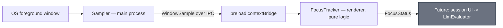
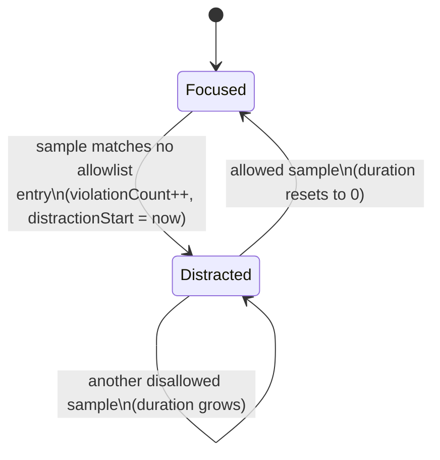

# Implementation Plan: Desktop Usage Tracking

**Status:** Draft, pending review. Not an ADR — this is a working plan for one feature. It does raise at least one decision that will need an ADR of its own (see §8).

**Goal of this document:** define *what* to build and *in what order*, precisely enough to implement against, without prescribing the code. The module owner is writing the implementation by hand.

---

## 1. What this module is for

`context.md` lists the next milestone as a distraction signal that matches how this user actually loses focus at a computer — replacing the retired webcam/phone detector.

The concrete gap: `LlmEvaluator.evaluate(preset, context)` takes an `EvaluatorContext` containing `violationCount`, `distractionDuration`, `timeRemaining`, and `activeSessionGoal`. Nothing in the codebase produces any of those values. This module produces the first two.

Its job, stated in one line: **watch which window has focus, decide whether that counts as on-task, and report how long the current distraction has lasted and how many have occurred this session.**

That is the whole job. It does not talk to the LLM, does not speak, does not draw UI.

---

## 2. Non-goals

This section exists because this project has a documented history of scope creep (`docs/adr/008`). Everything below has been considered and deliberately excluded from v1.

| Excluded | Why |
|---|---|
| Tracking every open browser tab | OS window APIs report one entry per window with the *visible* tab's title. Enumerating background tabs requires a browser extension — a separate product with its own install story, permissions, and messaging channel. |
| Auto-closing a tab after N visits | Same blocker. Without an extension the only reachable unit is the whole browser window, and closing that destroys 20 unrelated tabs. Parked until/unless an extension is in scope. |
| Persisting history, sessions, or window titles to disk | `context.md` constraint 1: zero data retention. Window titles are personal activity data. |
| A goal-input UI | Separate planned increment. See §6 for what v1 does instead. |
| A session/Pomodoro timer | Same. `timeRemaining` has no producer yet. |
| Reframing the LLM personas | Separate increment, noted in `services/llm/CONTEXT.md`. |
| Idle/AFK detection | `powerMonitor.getSystemIdleTime()` is a genuinely different signal (away from keyboard vs. actively distracted). Worth adding later; not part of this module's contract. |

---

## 3. Environment finding — decide this before anything else

The obvious implementation (`get-windows` / `active-win`, the standard npm active-window packages) **does not work in this development environment**, and this was verified rather than assumed.

Evidence gathered on 2026-08-22:

- The shell reports `DISPLAY=:0`, `WAYLAND_DISPLAY=wayland-0`, and `/mnt/wslg` exists — Electron here renders through WSLg, not a normal Linux desktop.
- Querying the X server directly returns `_NET_ACTIVE_WINDOW … window id # 0x0` and `_NET_CLIENT_LIST: no such atom on any window`. WSLg's compositor does not publish the window properties these packages read.
- Separately, and more fundamentally: even a working X11 query would only ever see Linux GUI windows running under WSLg. Chrome, Discord, and every other Windows-side app — where the actual distraction happens — would be invisible to it.

So the sampler cannot be a stock Linux active-window package. Three viable paths:

**Option A — Win32 query through WSL interop.** Verified working. A `powershell.exe` call to `GetForegroundWindow` + `GetWindowText` returned the correct Windows foreground window (PID and title) from inside WSL. Cold `powershell.exe` start measured at 0.13s, so even per-tick spawning is affordable at a multi-second interval; a long-running child process printing on an interval would be cleaner still. No npm dependency at all. Downside: WSL-specific, and a long-running child process is a fresh instance of the stdio-subprocess pattern ADR-001 chose (ADR-008 retired the camera pipeline that used it, not the pattern itself) — worth adopting deliberately rather than drifting back into.

**Option B — run Electron natively on Windows.** `get-windows` then uses the Win32 API directly and sees everything, and the app runs where the user actually works. This is the "correct" long-term answer if the app is meant to be used daily. Cost: a second toolchain, native module rebuilds for Electron, and a change to how the project is developed and launched.

**Option C — idle time only.** `powerMonitor.getSystemIdleTime()` needs no dependency and no window access. It's a much weaker signal (it cannot tell focused work from focused procrastination) and under WSLg its accuracy is itself unverified. Listed for completeness; not recommended as the primary signal.

**This is the one decision that blocks the plan's later half.** §5's Milestone 1 is deliberately built so it can start *before* this is resolved.

---

## 4. Architecture

Two pieces, split so that all the logic is testable without an operating system.



**Sampler (main process)** is deliberately dumb: ask the OS what has focus, emit `{ appName, windowTitle, timestamp }`, repeat. No allowlist, no timing, no decisions. All the environment-specific ugliness from §3 is confined here, so changing from Option A to Option B later touches one file.

**FocusTracker (renderer)** holds every rule and all the state. It takes samples in and answers questions. It never calls an OS API, which is what makes it fully testable.

This is the same split as `LlmEvaluator`/`PromptBuilder` in ADR-007: the decision logic lives apart from the thing that talks to the outside world.

### State machine



---

## 5. Placement

`src/renderer/services/focus/`, alongside `llm/` and `tts/`.

Not an arbitrary choice: `vite.config.ts` sets `root: src/renderer`, so vitest only collects tests under that directory. A module placed there is tested by `npm run test:ui` with no config change. Putting the pure logic in `src/main/` instead would require a vitest projects config before a single test could run — real work, for no benefit, since this half needs no Electron API.

The sampler *does* belong in `src/main/` (it needs Node/child-process access). It stays untested by unit tests for now, which is acceptable precisely because it contains no logic worth testing. If that changes, adding a vitest project for main is the follow-up — noted, not scheduled.

---

## 6. Interfaces

Types go in `src/renderer/services/focus/types.ts`. CLAUDE.md forbids `any` across a process boundary, so `WindowSample` is a real interface, not a loose object.

```typescript
interface WindowSample {
  appName: string;
  windowTitle: string;
  timestamp: number;      // ms epoch, supplied by the sampler
}

interface FocusStatus {
  isDistracted: boolean;
  distractionDuration: number;  // consecutive SECONDS in the current distraction; 0 when focused
  violationCount: number;       // distinct distraction episodes this session
  currentApp: string;
}
```

`distractionDuration` is seconds, not milliseconds, and it is *consecutive* — matching `EvaluatorContext.distractionDuration` as documented in `services/llm/CONTEXT.md`. Returning to an allowed window resets it to zero. A background window sitting open unattended contributes nothing, because only the focused window is ever sampled.

`FocusTracker`'s surface should stay small — roughly: construct with an allowlist, feed it a sample, ask it for status, reset it. Exact method names are the implementer's call; the contract above is what matters.

### The allowlist

v1 keeps this simple and in memory: a list of strings matched case-insensitively against the sample. Not persisted — persistence would be a deliberate exception to the zero-retention rule and needs recording, not slipping in.

**What the allowlist matches against is the sharpest question in this plan.** Matching `appName` alone is clean and keeps titles out of the comparison entirely — but for a browser-heavy user it means Chrome is either always allowed or always distracting, which makes the whole signal close to useless. Matching `windowTitle` too is the only way to tell a docs tab from a YouTube tab in the same browser, but then the tracker holds and compares exactly the personal data §9 says to keep out of every output. The privacy rule still holds either way (compare in memory, never render or log the title), but this is a real tension, not a detail — decide it deliberately.

Two further behaviours to decide while writing tests, because they change what the numbers mean:

1. **Switching directly from one disallowed window to another** — one continuous distraction, or two violations? (Recommendation: one. You didn't stop being distracted.)
2. **A brief flick to an allowed window and back** — does that reset the duration and count a second violation? A grace period would prevent that, but adds state. (Recommendation: no grace period in v1. Add it only if it proves annoying in real use.)

---

## 7. Sequencing

Each milestone is its own commit, verified before the next begins.

**Milestone 1 — FocusTracker, TDD, no OS involvement.** Independent of §3, so it can start immediately.

Write these tests in order, each one failing before the code that satisfies it exists:

1. A single allowed sample → not distracted, duration 0, violationCount 0.
2. A single disallowed sample → distracted, duration 0, violationCount 1.
3. Two disallowed samples 10s apart → duration 10, violationCount still 1.
4. Disallowed, then allowed → not distracted, duration 0, violationCount stays 1.
5. Disallowed → allowed → disallowed → violationCount 2, duration restarts at 0.
6. Two *different* disallowed windows in a row → whichever answer §6.1 decides, asserted explicitly.
7. Matching is case-insensitive.
8. Reset clears all counters.

Time comes from the sample's `timestamp`, never from `Date.now()` inside the tracker — otherwise tests need fake timers to test arithmetic.

Verify: `npm run test:ui` green, `npx tsc --noEmit` clean.

**Milestone 2 — the sampler.** Blocked on §3. Implement the chosen option in `src/main/`, on an interval (2s is a sensible start; the tracker doesn't care). Verify by hand: alt-tab between apps and confirm the emitted samples name the right windows, including Windows-side ones.

**Milestone 3 — the IPC channel.** `preload/CONTEXT.md:15` records that `onTelemetry`/`sendCommand` were kept because "the next feature will likely repurpose this same telemetry/command shape." This is that feature, so decide now: rename them to honest names, or delete them and add typed replacements. Either way they stop being orphans, `preload.ts` loses its `any` signatures, and `preload/CONTEXT.md` gets updated to match. Recommendation: delete and replace — the names are camera-era artifacts and the shape is different anyway.

**Milestone 4 — wire tracker to sampler.** Renderer subscribes, feeds samples in, and displays live status. `LogConsole.tsx` already exists and is unmounted; this is a natural first consumer — but per §9 it must not render window titles.

**Milestone 5 — connect to `LlmEvaluator`.** Honest framing: this milestone proves *plumbing*, not behaviour. `evaluate()` is still a stub that returns `[Stub] [System: …] [User: …]` rather than calling the model (`services/llm/CONTEXT.md`), and two of the four `EvaluatorContext` fields have no producer — `timeRemaining` needs a session timer and `activeSessionGoal` is required with no goal input built. v1 passes explicit placeholders for both. The real test of the project's core hypothesis needs those three things finished; this milestone just gets the wires in place.

---

## 8. Documentation obligations

Per CLAUDE.md:

- **New module → `CONTEXT.md`.** `src/renderer/services/focus/CONTEXT.md` in the established format: Directory Manifest & Boundaries, Mermaid diagrams, Public Interfaces & Contracts.
- **`src/preload/CONTEXT.md`** updated in Milestone 3 when the orphaned channels are resolved.
- **`src/main/CONTEXT.md`** updated in Milestone 2 for the sampler.
- **ADR.** §3 is a structural decision about how this app reaches the OS — and under Option A it partly reverses ADR-008's retirement of the stdio-subprocess pattern. That warrants an ADR (`009-…`). CLAUDE.md says to ask before creating one, so: ask once §3 is decided.

---

## 9. Privacy constraints

Window titles are personal activity data and are covered by `context.md` constraint 1:

- In memory only, for the life of the session. Nothing written to disk.
- No window titles in `LogConsole`, `console.log`, or any persisted output. Show the app name or a status only.
- The allowlist is in-memory in v1. Making it persistent is a deliberate exception requiring its own decision.
- Nothing leaves the machine — no telemetry, no network calls. Under Option A the child process talks only to the local Win32 API.

---

## 10. Open questions for review

1. **§3** — which sampler path: A (WSL interop, verified working, no dependency), B (run on Windows natively, the better long-term answer, more setup), or C (idle time only)?
2. **§6, allowlist** — match on `appName` only (clean, but Chrome becomes all-or-nothing), or on `windowTitle` too (useful, but the tracker then handles the most sensitive field it sees)?
3. **§6.1** — disallowed → different disallowed: one violation or two?
4. **§6.2** — grace period on brief flicks away, or not?
5. **Milestone 3** — rename the orphaned IPC channels, or delete and replace them?
