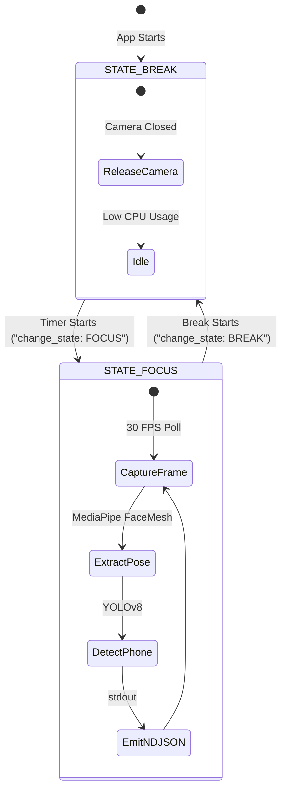

# Core Computer Vision Module Context

This module contains the core computer vision detection and evaluation algorithms. It captures frames from local camera feeds, analyzes landmark positions, performs spatial coordinates calculations, and identifies distraction objects in real-time.

---

## Planned Core Interfaces

### 1. `PoseEstimator` Class
* **Purpose:** Uses MediaPipe facial landmark features to determine head yaw, pitch, and roll angles to evaluate focus.
* **Public Methods:**
  * `estimate_pose(image_matrix) -> Tuple[float, float, float]`: Takes a raw camera frame and returns yaw, pitch, and roll in degrees.

### 2. `ObjectDetector` Class
* **Purpose:** Employs a lightweight YOLOv8 Nano model to search for distraction vectors (specifically mobile phones).
* **Public Methods:**
  * `detect_objects(image_matrix) -> List[Dict]`: Processes the frame, returns confidence scores and bounding boxes for targeted objects (e.g. `cell_phone`), and filters out other classes.

### 3. `CameraStream` Class
* **Purpose:** Coordinates camera access, capture rate throttling, and frame dispatch.
* **Public Methods:**
  * `start_capture() -> None`: Initializes the OpenCV stream wrapper.
  * `read_frame() -> numpy.ndarray`: Retrieves the latest matrix frame from cache.
  * `release() -> None`: Safely releases the hardware camera block.

---

## Pipeline Execution & Throttling Flow

## Dependencies
* **MediaPipe** (facial landmark mesh tracking)
* **OpenCV** (hardware stream video capture)
* **Ultralytics YOLOv8** (object classification model)
