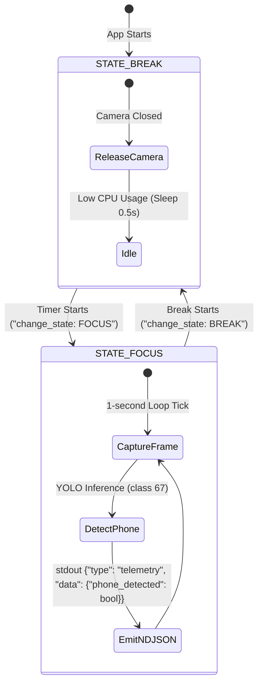

# Core Computer Vision Module Context

This module contains the core computer vision detection and evaluation algorithms. It captures frames from local camera feeds, runs inference on the frame stream to detect targeted objects, and immediately drops raw frames from memory to maintain absolute user privacy.

---

## Core Interfaces

### 1. `ObjectDetector` Class
* **Purpose:** Employs a lightweight YOLO model (`yolo26n.pt` downloaded to models directory) via Ultralytics to detect physical distraction objects (specifically mobile phones) in video frame matrices.
* **Public Methods:**
  * `detect_phone(frame) -> bool`: Processes an OpenCV frame matrix and returns `True` if a cell phone (COCO class ID `67`) is detected with confidence higher than the threshold (default: 0.45).

### 2. Camera Management (State Machine in `main.py`)
* **Purpose:** Manages the active hardware camera stream, coordinates state-dependent capture, and fallbacks cleanly.
* **Key Components:**
  * `execute_loop_tick(cap, state, target_camera_index)`: Checks for state shifts or camera index changes. Safely releases old cameras and spawns the new index.
  * `MockVideoCapture`: A robust dummy fallback stream that initializes when camera devices are unavailable, preventing infinite blocking and test hangs.

---

## Pipeline Execution & Throttling Flow

## Dependencies
* **OpenCV (opencv-python)** (hardware video stream capture)
* **Ultralytics YOLO** (object detection framework)

