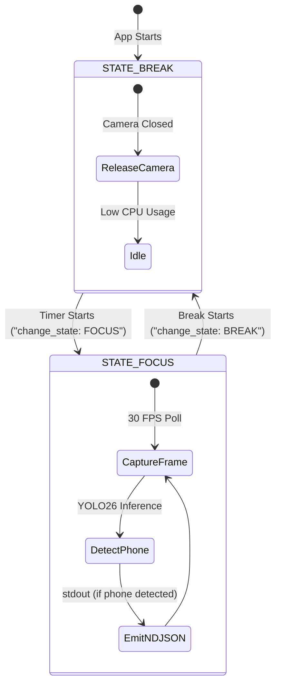

# Core Computer Vision Module Context

This module contains the core computer vision detection and evaluation algorithms. It captures frames from local camera feeds, runs inference on the frame stream to detect targeted objects, and immediately drops raw frames from memory to maintain absolute user privacy.

---

## Core Interfaces

### 1. `ObjectDetector` Class
* **Purpose:** Employs a lightweight YOLO26 Nano model to detect distraction objects (specifically mobile phones) in the video frames.
* **Public Methods:**
  * `detect_objects(image_matrix) -> List[Dict]`: Processes the frame and returns confidence scores and bounding boxes for targeted objects (e.g. `cell_phone` class).

### 2. `CameraStream` Class
* **Purpose:** Coordinates hardware camera access, capture rate throttling, and frame dispatch.
* **Public Methods:**
  * `start_capture() -> None`: Initializes the OpenCV stream wrapper.
  * `read_frame() -> numpy.ndarray`: Retrieves the latest matrix frame from cache.
  * `release() -> None`: Safely releases the camera device block.

---

## Pipeline Execution & Throttling Flow

## Dependencies
* **OpenCV** (hardware stream video capture)
* **Ultralytics YOLO26** (object detection and classification model)
