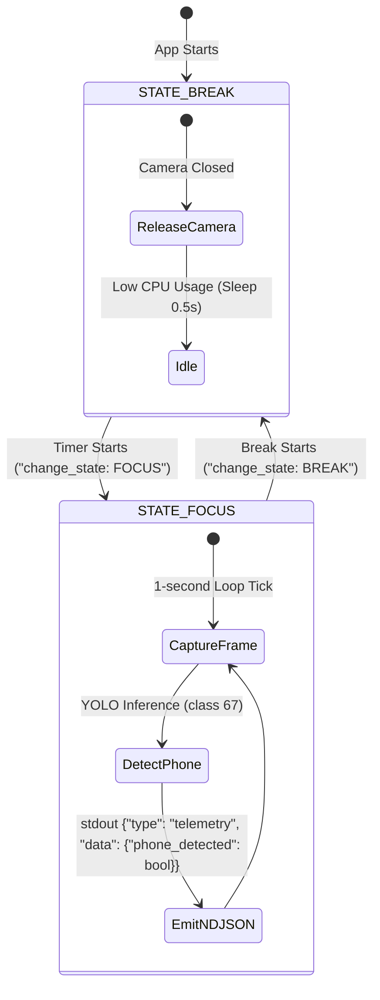

# Core Computer Vision Module Context

This module contains the core computer vision detection and evaluation algorithms. It captures frames from local camera feeds, runs inference on the frame stream to detect targeted distraction objects, and immediately drops raw frames from memory to maintain absolute user privacy.

---

## 1. Directory Manifest & Boundaries

*   **Directory Manifest:**
    *   `detector.py`: Contains the `ObjectDetector` class which wraps YOLO models to analyze camera frames for physical distraction objects (e.g., mobile phones).
*   **Integration Boundaries:**
    *   **OpenCV API:** Captures hardware video stream frame matrices.
    *   **Ultralytics YOLO:** Integrates with the `ultralytics` framework to perform deep-learning-based object detection.

---

## 2. Architecture & Flow

### Pipeline Execution & Throttling Flow
The state diagram below maps how the computer vision loop activates and sleeps based on the desktop timer states, minimizing CPU usage during breaks:

```mermaid
stateDiagram-v2
    [*] --> STATE_BREAK: App Starts
    
    STATE_BREAK --> STATE_FOCUS: Timer Starts ("change_state: FOCUS")
    STATE_FOCUS --> STATE_BREAK: Break Starts ("change_state: BREAK")
    
    state STATE_FOCUS {
        [*] --> CaptureFrame: 1-second Loop Tick
        CaptureFrame --> DetectPhone: YOLO Inference (class 67)
        DetectPhone --> EmitNDJSON: stdout {"type": "telemetry", "data": {"phone_detected": bool}}
        EmitNDJSON --> CaptureFrame
    }
    
    state STATE_BREAK {
        [*] --> ReleaseCamera: Camera Closed
        ReleaseCamera --> Idle: Low CPU Usage (Sleep 0.5s)
    }
```

---

## 3. Public Interfaces & Contracts

### `ObjectDetector` Class

#### `__init__(model_path="yolo26l.pt", threshold=0.75, imgsz=640)`
*   **Input:**
    *   `model_path: str` (Path to YOLO model weight file; downloads automatically if missing)
    *   `threshold: float` (Confidence cutoff value, defaults to `0.75`)
    *   `imgsz: int` (Image size used for inference scaling, defaults to `640`)

#### `set_threshold(threshold)`
*   **Input:** `threshold: float`
*   **Output:** `None`
*   **Description:** Updates the active confidence threshold (0.0 to 1.0) for detecting target objects.

#### `set_model(model_path)`
*   **Input:** `model_path: str`
*   **Output:** `None`
*   **Description:** Atomically swaps the active YOLO model weights.

#### `set_imgsz(imgsz)`
*   **Input:** `imgsz: int`
*   **Output:** `None`
*   **Description:** Updates the frame matrix scaling dimensions used for inference.

#### `detect_phone(frame)`
*   **Input:** `frame: any` (OpenCV BGR frame matrix)
*   **Output:** `bool`
*   **Description:** Performs detection scanning on the input frame. Returns `True` if a cell phone device (COCO class ID `67`) is detected with confidence higher than the threshold; `false` otherwise. Returns `false` immediately if the frame is `None`.
