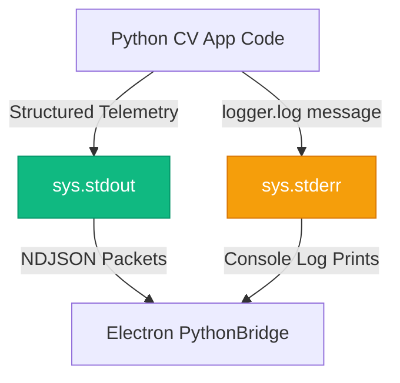

# Python Utilities Context

This module contains auxiliary helper scripts and utilities supporting the execution of the computer vision pipeline.

## Interfaces & API

### `logger.py` Module
To protect the integrity of the NDJSON stream on `stdout`, the Python CV process must never use standard `print()` statements for logs, diagnostic printouts, or error traces. This module wraps those outputs and routes them strictly to `sys.stderr`.

#### Public Functions
* **`log(message: str, level: str = "INFO") -> None`**
  * formats the string to include a timestamp and log level prefix (e.g. `[2026-06-03 15:40:00] [INFO] message`).
  * Writes the formatted log line to `sys.stderr`.
  * Flushes the stream immediately (`sys.stderr.flush()`) to ensure logs appear in real-time in the Electron console.

---

## Log Routing Diagram

## Dependencies
* Python standard library: `sys`, `datetime`.
