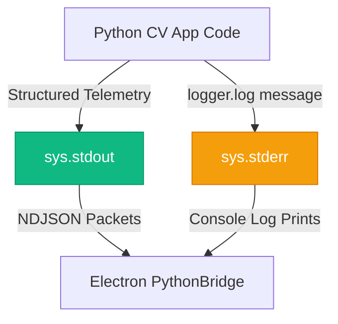

# Python Utilities Context

This module contains auxiliary helper scripts and logging utilities supporting the execution of the computer vision pipeline.

---

## 1. Directory Manifest & Boundaries

*   **Directory Manifest:**
    *   `logger.py`: Implements log redirection (`log()` function), writing diagnostic printouts to `sys.stderr` to keep `sys.stdout` clean for JSON telemetry streams.
*   **Integration Boundaries:**
    *   **Python System I/O:** Interacts directly with `sys.stderr` standard error stream.

---

## 2. Architecture & Flow

### Log Routing Flow
To protect the integrity of the NDJSON telemetry stream on `stdout`, the Python CV process must never write plain text logs or error traces to `stdout`. All diagnostic logs are intercepted and routed to `stderr`:

```mermaid
graph TD
    AppCode[Python CV App Code] -->|Structured Telemetry| Stdout[sys.stdout]
    AppCode -->|logger.log message | Stderr[sys.stderr]
    
    Stdout -->|NDJSON Packets| MainApp[Electron PythonBridge]
    Stderr -->|Console Log Prints| MainApp
    
    style Stdout fill:#10b981,stroke:#059669,color:#fff
    style Stderr fill:#f59e0b,stroke:#d97706,color:#fff
```

---

## 3. Public Interfaces & Contracts

### `logger.py` Module

#### `log(message, level="INFO")`
*   **Input:**
    *   `message: str` (Text content to print)
    *   `level: str` (Identifier tag, e.g. `'INFO'`, `'WARNING'`, `'ERROR'`)
*   **Output:** `None`
*   **Description:** Prefixes logs with a local formatted timestamp and log level, outputs the string directly to `sys.stderr`, and flushes the stream to ensure real-time delivery to the desktop process.
