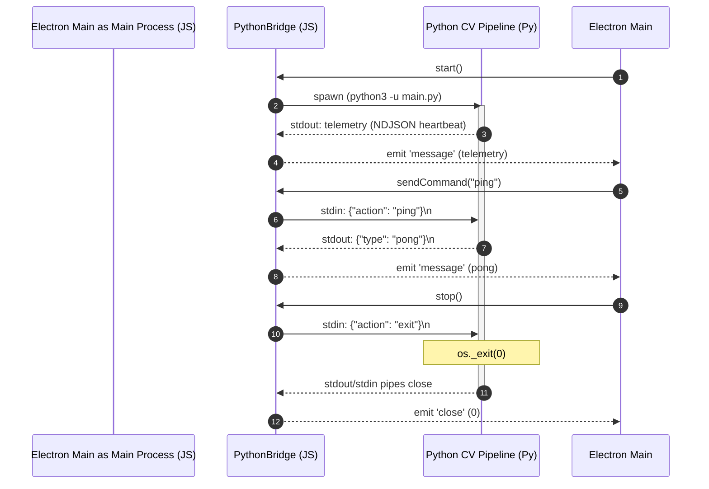

# Main Process Context

This module manages the Electron Main Process. It acts as the master system orchestrator, handles the desktop window lifecycle, and manages the execution and standard input/output pipes of the Python computer vision subprocess.

## Interfaces & API

### `PythonBridge` Class
The bridge communicates with Python using standard I/O (stdio) streams with Newline Delimited JSON (NDJSON) serialization.

#### Public Methods
* **`start(): void`**
  * Spawns the Python process (`python3 -u main.py`).
  * Establishes event listeners on `stdout` (telemetry parsing) and `stderr` (log capture).
* **`sendCommand(action: string, data?: Record<string, any>): void`**
  * Serializes `{ action, ...data }` to a JSON line and writes it to Python's `stdin` (terminated by `\n`).
* **`stop(): void`**
  * Sends an `{ action: "exit" }` shutdown payload to Python.
  * Starts a 2-second timeout. If the child process does not close within the window, it executes `child.kill('SIGKILL')`.

#### Events Emitted (Extends `EventEmitter`)
* **`'message' (payload: any)`**: Triggered when a complete JSON object is parsed from the Python standard output stream.
* **`'close' (code: number | null)`**: Triggered when the Python process exits.
* **`'error' (err: Error)`**: Triggered if the process fails to spawn.

### IPC Window Control Listeners
The main process intercepts the following desktop window commands from the renderer via the preload bridge:
* **`window-minimize`**: Minimizes the desktop window.
* **`window-maximize`**: Toggles standard maximized and unmaximized window sizes.
* **`window-close`**: Triggers a window close operation, which subsequently tears down the active PythonBridge connection.

---

## Data & Process Flow

## Dependencies
* Node.js `child_process.spawn`
* Node.js `events.EventEmitter`
* Python Entrypoint: [main.py](file:///home/yugp/projects/FocusSentinel/src-python/main.py)
