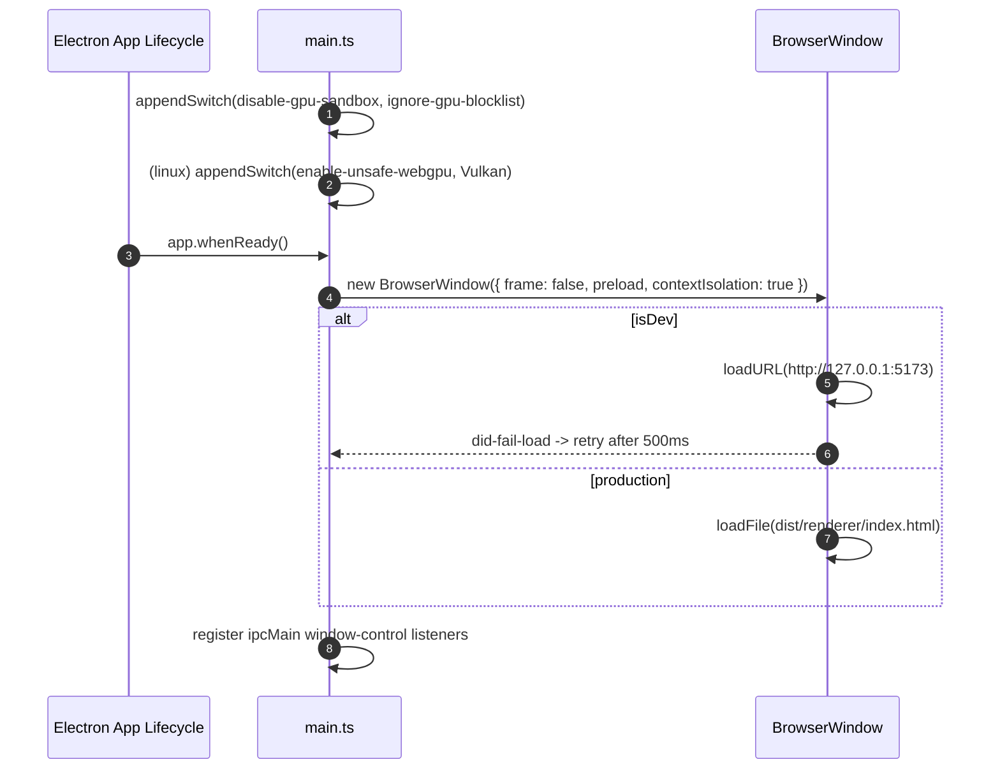
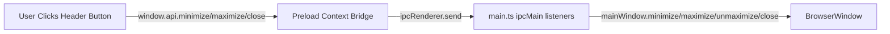

# Main Process Context

This module manages the Electron Main Process: desktop window lifecycle, GPU/WebGPU command-line flags required for the renderer's local LLM, and IPC listeners for custom window chrome.

---

## 1. Directory Manifest & Boundaries

*   **Directory Manifest:**
    *   `main.ts`: Main process entry point. Configures GPU command-line switches, creates the `BrowserWindow`, handles Vite dev-server loading (with auto-retry) vs. production file loading, and registers window-control IPC listeners.
*   **Integration Boundaries:**
    *   **IPC Communication:** Receives window-control requests from the Renderer via the Preload context bridge (see [preload/CONTEXT.md](file:///home/yugp/projects/FocusSentinel/src/preload/CONTEXT.md)) over Electron `ipcMain` channels.
    *   **Electron Runtime APIs:** Directly drives `app` and `BrowserWindow` lifecycle events.
    *   **Chromium GPU Flags:** Configures command-line switches consumed by Electron's underlying Chromium renderer, enabling WebGPU for the local LLM evaluator (see [renderer/services/llm/CONTEXT.md](file:///home/yugp/projects/FocusSentinel/src/renderer/services/llm/CONTEXT.md)) even inside virtualized/WSL2 environments.

> There is currently no subprocess or background pipeline running alongside the window — the previous Python computer-vision bridge (`PythonBridge`, stdio NDJSON contract) was removed. See `docs/adr/008-retire-camera-pipeline-and-licensing.md`. The next distraction-tracking signal (planned: desktop/active-window usage) is expected to run in-process rather than via a spawned subprocess, but is not yet built.

---

## 2. Architecture & Flow

### Startup Sequence

```mermaid
sequenceDiagram
    autonumber
    participant OS as Electron App Lifecycle
    participant Main as main.ts
    participant Win as BrowserWindow

    Main->>Main: appendSwitch(disable-gpu-sandbox, ignore-gpu-blocklist)
    Main->>Main: (linux) appendSwitch(enable-unsafe-webgpu, Vulkan)
    OS->>Main: app.whenReady()
    Main->>Win: new BrowserWindow({ frame: false, preload, contextIsolation: true })
    alt isDev
        Win->>Win: loadURL(http://127.0.0.1:5173)
        Win-->>Main: did-fail-load -> retry after 500ms
    else production
        Win->>Win: loadFile(dist/renderer/index.html)
    end
    Main->>Main: register ipcMain window-control listeners
```

### Window Control Flow

```mermaid
graph LR
    User[User Clicks Header Button] -->|window.api.minimize/maximize/close| Preload[Preload Context Bridge]
    Preload -->|ipcRenderer.send| Main[main.ts ipcMain listeners]
    Main -->|mainWindow.minimize/maximize/unmaximize/close| Win[BrowserWindow]
```

---

## 3. Public Interfaces & Contracts

### GPU / WebGPU Command-Line Switches
Applied once at module load, before `app.whenReady()`:
*   `disable-gpu-sandbox`, `ignore-gpu-blocklist`: allow hardware acceleration inside virtualized/WSL2/network-share environments that would otherwise fail Chromium's default GPU checks.
*   `enable-unsafe-webgpu`, `enable-features=Vulkan` (Linux only): required for `@mlc-ai/web-llm` to access a WebGPU adapter inside the renderer.

### `createWindow()`
*   **Input:** None
*   **Output:** `void`
*   **Description:** Creates a frameless (`frame: false`) `900x700` `BrowserWindow` with `contextIsolation: true` and `nodeIntegration: false`, wired to the preload script at `dist/preload/preload.js`. Loads the Vite dev server in development (retrying on `did-fail-load`) or the built `index.html` in production.

### Main IPC Listeners (Preload Channel Gating)
Registered inside `app.whenReady()`:
*   **`'window-minimize'`**: Minimizes the desktop application window.
*   **`'window-maximize'`**: Toggles maximized/restored window frame state.
*   **`'window-close'`**: Closes the application window.

### App Lifecycle Hooks
*   **`app.on('activate')`**: Re-creates the window if none exist (macOS dock-icon click behavior).
*   **`app.on('window-all-closed')`**: Quits the app on all platforms except macOS.
