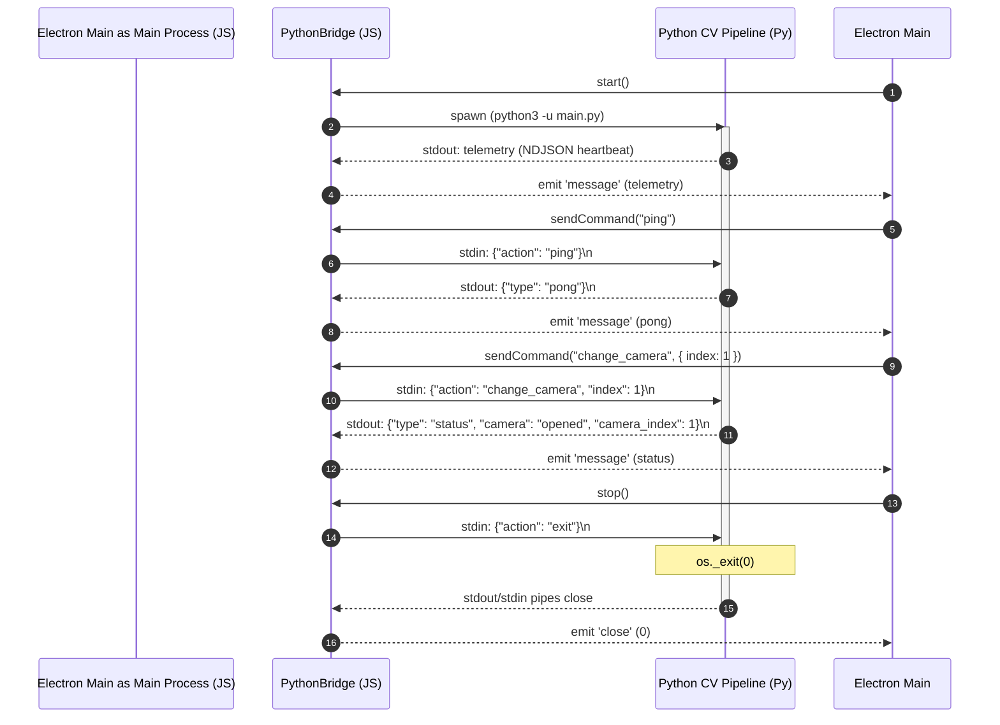

# Main Process Context

This module manages the Electron Main Process, acts as the master desktop window lifecycle coordinator, and manages the execution and standard I/O streams of the Python computer vision subprocess.

---

## 1. Directory Manifest & Boundaries

*   **Directory Manifest:**
    *   `main.ts`: Main process entry point. Handles window creation, Vite dev-server auto-retries, GPU flags configuration, and IPC listeners setup.
    *   `pythonBridge.ts`: Controller class (`PythonBridge`) that spawns the Python child process, formats JSON standard streams, and manages graceful terminations.
    *   `pythonBridge.test.ts`: Stdio mocking tests confirming serialization, stream fragmentation handling, and force-kill timeouts.
*   **Integration Boundaries:**
    *   **IPC Communication:** Intercepts UI requests from the Preload context bridge (via Electron `ipcMain` channels).
    *   **OS Spawning:** Interacts directly with the host operating system via Node.js `child_process.spawn` to execute python binaries (`python3` or virtual environments).
    *   **Python Pipeline:** Relies on a standard streams contract with [main.py](file:///home/yugp/projects/FocusSentinel/src-python/main.py).

---

## 2. Architecture & Flow

The sequence diagram below maps standard I/O communications, NDJSON message serialization, and process exit sequences between JS and Python layers:

```mermaid
sequenceDiagram
    autonumber
    participant Electron Main as Main Process (JS)
    participant Bridge as PythonBridge (JS)
    participant Python as Python CV Pipeline (Py)
 
    Electron Main->>Bridge: start()
    Bridge->>Python: spawn (python3 -u main.py)
    activate Python
    Python-->>Bridge: stdout: telemetry (NDJSON heartbeat)
    Bridge-->>Electron Main: emit 'message' (telemetry)
    
    Electron Main->>Bridge: sendCommand("ping")
    Bridge->>Python: stdin: {"action": "ping"}\n
    Python-->>Bridge: stdout: {"type": "pong"}\n
    Bridge-->>Electron Main: emit 'message' (pong)
 
    Electron Main->>Bridge: sendCommand("change_camera", { index: 1 })
    Bridge->>Python: stdin: {"action": "change_camera", "index": 1}\n
    Python-->>Bridge: stdout: {"type": "status", "camera": "opened", "camera_index": 1}\n
    Bridge-->>Electron Main: emit 'message' (status)
 
    Electron Main->>Bridge: stop()
    Bridge->>Python: stdin: {"action": "exit"}\n
    Note over Python: os._exit(0)
    Python-->>Bridge: stdout/stdin pipes close
    deactivate Python
    Bridge-->>Electron Main: emit 'close' (0)
```

---

## 3. Public Interfaces & Contracts

### `PythonBridge` Class (Extends `events.EventEmitter`)

#### `constructor(pythonPath?, scriptPath?)`
*   **Input:** 
    *   `pythonPath?: string` (Executable path, defaults to looking up local virtual environment path `.venv` or `'python3'`)
    *   `scriptPath?: string` (Python file path, defaults to `src-python/main.py`)

#### `start()`
*   **Input:** None
*   **Output:** `void`
*   **Description:** Spawns the child Python process with unbuffered options (`-u`) and hooks listeners to stdout, stderr, close, and error events.

#### `sendCommand(action, data)`
*   **Input:** `action: string`, `data?: Record<string, any>`
*   **Output:** `void`
*   **Description:** Serializes `{ action, ...data }` to standard JSON format, appends a newline (`\n`), and writes the message payload directly to the Python stdin stream.

#### `stop()`
*   **Input:** None
*   **Output:** `void`
*   **Description:** Issues an `exit` command to the Python subprocess. Sets up a 2-second timeout to issue a hard `SIGKILL` if the child process hangs.

#### Events Emitted
*   **`'message'`**: Emitted with parsed JSON objects from Python stdout.
*   **`'close'`**: Emitted with exit code (number | null) when process closes.
*   **`'error'`**: Emitted with Error object when child spawn fails.

---

### Main IPC Listeners (Preload Channel Gating)
The main process intercepts the following message events from the renderer process:
*   **`'window-minimize'`**: Minimizes the desktop application window.
*   **`'window-maximize'`**: Toggles maximized/restored desktop window frame state.
*   **`'window-close'`**: Closes the application frame and terminates the Python subprocess.
*   **`'send-to-python'`**: Expects `{ action: string, data: any }` and forwards the payload to `pythonBridge.sendCommand`. 
