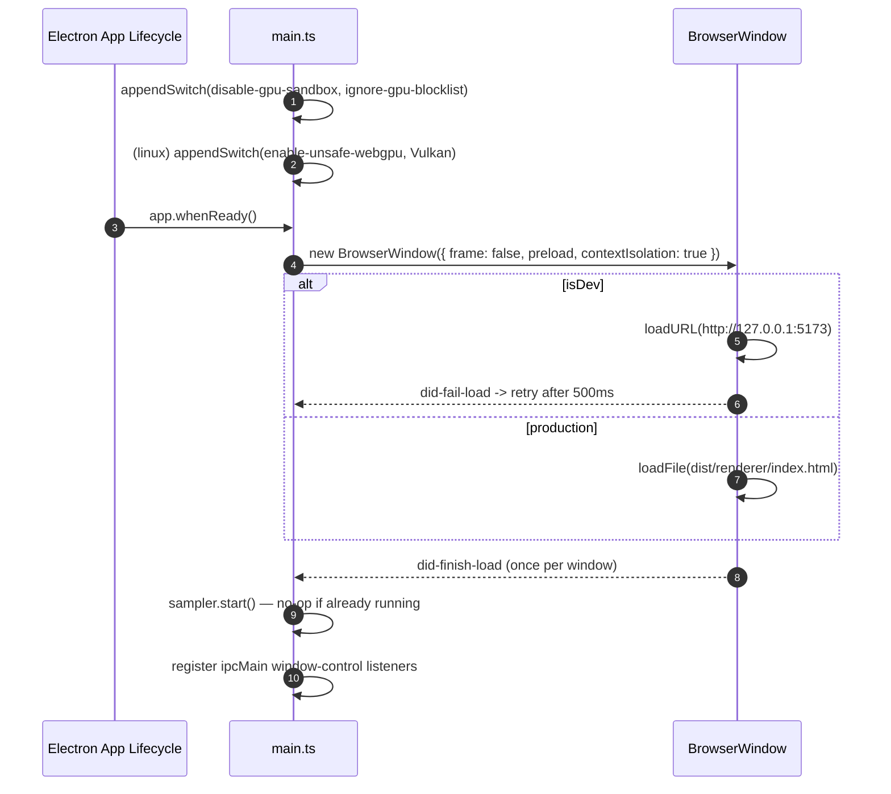
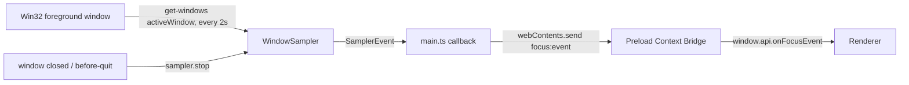
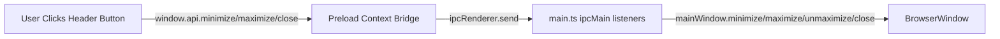

# Main Process Context

This module manages the Electron Main Process: desktop window lifecycle, GPU/WebGPU command-line flags required for the renderer's local LLM, and IPC listeners for custom window chrome.

---

## 1. Directory Manifest & Boundaries

*   **Directory Manifest:**
    *   `main.ts`: Main process entry point. Configures GPU command-line switches, creates the `BrowserWindow`, handles Vite dev-server loading (with auto-retry) vs. production file loading, and registers window-control IPC listeners.
    *   `WindowSampler.ts`: Polls the OS for the foreground window on an interval and emits a `SamplerEvent` per tick. No rules or decisions — those live in `FocusTracker` in the renderer (see [renderer/services/focus/CONTEXT.md](../renderer/services/focus/CONTEXT.md)).
*   **Integration Boundaries:**
    *   **IPC Communication:** Receives window-control requests from the Renderer via the Preload context bridge (see [preload/CONTEXT.md](file:///home/yugp/projects/FocusSentinel/src/preload/CONTEXT.md)) over Electron `ipcMain` channels.
    *   **Electron Runtime APIs:** Directly drives `app` and `BrowserWindow` lifecycle events.
    *   **Chromium GPU Flags:** Configures command-line switches consumed by Electron's underlying Chromium renderer, enabling WebGPU for the local LLM evaluator (see [renderer/services/llm/CONTEXT.md](file:///home/yugp/projects/FocusSentinel/src/renderer/services/llm/CONTEXT.md)) even inside virtualized/WSL2 environments.
    *   **`get-windows` (native N-API addon):** `WindowSampler` reads the foreground window through it, in-process. The package is ESM-only while this process compiles to CommonJS, so it is loaded with a dynamic `import()` — which only survives compilation because `tsconfig.json` sets `module: node16`. Its `owner.name` is the app's display name (`Google Chrome`, `Visual Studio Code`), not the process name. A missing native binary does not throw; `activeWindow()` returns `undefined`, which the sampler reports as an `addon-unavailable` error.
    *   **`src/shared/types.ts`:** `WindowSample` and `SamplerEvent`, the shapes that cross into the renderer.

> There is no subprocess running alongside the window — the previous Python computer-vision bridge (`PythonBridge`, stdio NDJSON contract) was removed. See `docs/adr/008-retire-camera-pipeline-and-licensing.md`. Its replacement signal, `WindowSampler`, runs in-process through a native addon; nothing is spawned.
>
> `WindowSampler` never logs a sample. `windowTitle` is personal activity data (`context.md` constraint 1).

---

## 2. Architecture & Flow

### Startup Sequence

```mermaid
sequenceDiagram
    autonumber
    participant OS as Electron App Lifecycle
    participant Main as main.ts
    participant Win as BrowserWindow

    Main->>Main: appendSwitch(disable-gpu-sandbox, ignore-gpu-blocklist)
    Main->>Main: (linux) appendSwitch(enable-unsafe-webgpu, Vulkan)
    OS->>Main: app.whenReady()
    Main->>Win: new BrowserWindow({ frame: false, preload, contextIsolation: true })
    alt isDev
        Win->>Win: loadURL(http://127.0.0.1:5173)
        Win-->>Main: did-fail-load -> retry after 500ms
    else production
        Win->>Win: loadFile(dist/renderer/index.html)
    end
    Win-->>Main: did-finish-load (once per window)
    Main->>Main: sampler.start() — no-op if already running
    Main->>Main: register ipcMain window-control listeners
```

### Focus Sampling Flow

```mermaid
graph LR
    OS[Win32 foreground window] -->|get-windows activeWindow, every 2s| Sampler[WindowSampler]
    Sampler -->|SamplerEvent| Main[main.ts callback]
    Main -->|webContents.send focus:event| Preload[Preload Context Bridge]
    Preload -->|window.api.onFocusEvent| Renderer[Renderer]
    Closed[window closed / before-quit] -->|sampler.stop| Sampler
```

The sampler is constructed once at module scope rather than inside `createWindow()`, because `activate` can call `createWindow()` again; a per-window sampler would leave the old interval running. It starts on `did-finish-load` because a `webContents.send` before the page has loaded is silently dropped.

### Window Control Flow

```mermaid
graph LR
    User[User Clicks Header Button] -->|window.api.minimize/maximize/close| Preload[Preload Context Bridge]
    Preload -->|ipcRenderer.send| Main[main.ts ipcMain listeners]
    Main -->|mainWindow.minimize/maximize/unmaximize/close| Win[BrowserWindow]
```

---

## 3. Public Interfaces & Contracts

### GPU / WebGPU Command-Line Switches
Applied once at module load, before `app.whenReady()`:
*   `disable-gpu-sandbox`, `ignore-gpu-blocklist`: allow hardware acceleration inside virtualized/WSL2/network-share environments that would otherwise fail Chromium's default GPU checks.
*   `enable-unsafe-webgpu`, `enable-features=Vulkan` (Linux only): required for `@mlc-ai/web-llm` to access a WebGPU adapter inside the renderer.

### `createWindow()`
*   **Input:** None
*   **Output:** `void`
*   **Description:** Creates a frameless (`frame: false`) `900x700` `BrowserWindow` with `contextIsolation: true` and `nodeIntegration: false`, wired to the preload script at `dist/preload/preload.js`. Loads the Vite dev server in development (retrying on `did-fail-load`) or the built `index.html` in production.

### Main → Renderer Channels
*   **`'focus:event'`**: One `SamplerEvent` per sampler tick (every 2000ms), sent to the current window. The name is duplicated in `preload.ts`; see [preload/CONTEXT.md](../preload/CONTEXT.md).

### Main IPC Listeners (Preload Channel Gating)
Registered inside `app.whenReady()`:
*   **`'window-minimize'`**: Minimizes the desktop application window.
*   **`'window-maximize'`**: Toggles maximized/restored window frame state.
*   **`'window-close'`**: Closes the application window.

### App Lifecycle Hooks
*   **`app.on('before-quit')`**: Stops the window sampler.
*   **`app.on('activate')`**: Re-creates the window if none exist (macOS dock-icon click behavior).
*   **`app.on('window-all-closed')`**: Quits the app on all platforms except macOS.

### `WindowSampler` Class

#### `constructor(intervalMs, onEvent)`
*   **Input:** `intervalMs: number`, `onEvent: (event: SamplerEvent) => void`
*   **Description:** Configures the polling interval and the single callback every sample or error is delivered to.

#### `start()`
*   **Output:** `Promise<void>`
*   **Description:** Loads `get-windows`, reports one sample immediately, then one per interval. No-op if already running. If the package cannot load, emits `{ kind: 'error', error: { reason: 'addon-unavailable' } }` and does not start the timer. A query that is still in flight when the next tick fires causes that tick to be skipped rather than queued.

#### `stop()`
*   **Description:** Clears the timer and drops the module reference, so a later `start()` re-imports and re-checks the addon. Safe to call repeatedly.

#### `SamplerEvent` (from `src/shared/types.ts`)
```typescript
type SamplerEvent =
  | { kind: 'sample'; sample: WindowSample }  // timestamp = Date.now() at query time
  | { kind: 'error'; error: { reason: 'addon-unavailable' | 'query-failed'; message: string } };
```
