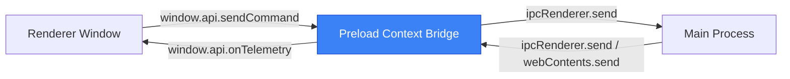

# Preload Module Context

The preload script acts as a secure gateway, exposing isolated Electron IPC channels from the Main process to the Renderer process in a type-safe manner without exposing full Node.js API privileges.

## Exposed Interfaces (`window.api`)

The main world context exposes a single `api` object on the global `window`:

### `window.api.onTelemetry(callback: (data: any) => void): () => void`
* **Purpose:** Registers a subscription function to receive real-time telemetry updates broadcast from the Python subprocess via the Main process.
* **Arguments:** 
  * `callback`: Function called when a telemetry packet arrives.
* **Returns:** An unsubscribe function (`() => void`) that detaches the listener. This must be invoked upon UI component unmounting to prevent memory leaks.

### `window.api.sendCommand(action: string, data?: Record<string, any>): void`
* **Purpose:** Relays a control payload (such as state changes or diagnostics) from the Renderer UI down to the Python child process.
* **Arguments:**
  * `action`: Command identifier (e.g. `"ping"`, `"change_state"`).
  * `data`: Optional command metadata.

### `window.api.minimize(): void`
* **Purpose:** Requests the Main process to minimize the application window.

### `window.api.maximize(): void`
* **Purpose:** Requests the Main process to toggle the application window's maximized state.

### `window.api.close(): void`
* **Purpose:** Requests the Main process to close the application window and terminate the CV pipeline child process.

---

## Architecture & Security Boundary

## Dependencies
* Electron `contextBridge`
* Electron `ipcRenderer`
