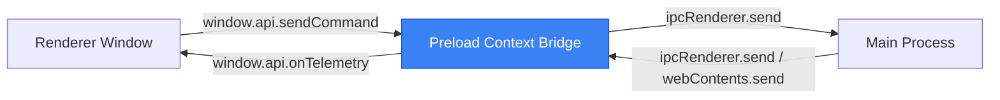

# Preload Module Context

The preload script acts as a secure, type-safe gateway exposing isolated Electron IPC channels from the Main process to the Renderer process without granting full Node.js API privileges.

---

## 1. Directory Manifest & Boundaries

*   **Directory Manifest:**
    *   `preload.ts`: Exposes safe Main-process messaging APIs to the global `window.api` namespace.
*   **Integration Boundaries:**
    *   **Electron Context Bridge:** Relies on `contextBridge` to expose functions to the UI securely.
    *   **IPC Communication:** Communicates with the Electron Main process via `ipcRenderer`.

---

## 2. Architecture & Flow

```mermaid
graph LR
    Renderer[Renderer Window] -- window.api.sendCommand --> Preload[Preload Context Bridge]
    Preload -- ipcRenderer.send --> Main[Main Process]
    Main -- ipcRenderer.send / webContents.send --> Preload
    Preload -- window.api.onTelemetry --> Renderer
    
    style Preload fill:#3b82f6,stroke:#1d4ed8,color:#fff
```

---

## 3. Public Interfaces & Contracts

The Main World context exposes the following methods on the global `window.api` object:

### `window.api.onTelemetry(callback)`
*   **Input:** `callback: (data: any) => void`
*   **Output:** `() => void` (Unsubscribe function)
*   **Description:** Subscribes a listener to real-time telemetry updates broadcast from the Python child process. Returns a cleanup function that detaches the listener.

### `window.api.sendCommand(action, data)`
*   **Input:** `action: string`, `data?: Record<string, any>`
*   **Output:** `void`
*   **Description:** Sends a command payload from the UI to the Python child process via IPC.

### `window.api.minimize()`
*   **Input:** None
*   **Output:** `void`
*   **Description:** Requests the main process to minimize the application window.

### `window.api.maximize()`
*   **Input:** None
*   **Output:** `void`
*   **Description:** Requests the main process to maximize/restore the application window.

### `window.api.close()`
*   **Input:** None
*   **Output:** `void`
*   **Description:** Requests the main process to close the application window and terminate subprocesses.
