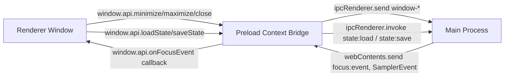

# Preload Module Context

The preload script acts as a secure, type-safe gateway exposing isolated Electron IPC channels from the Main process to the Renderer process without granting full Node.js API privileges.

---

## 1. Directory Manifest & Boundaries

*   **Directory Manifest:**
    *   `preload.ts`: Exposes safe Main-process messaging APIs to the global `window.api` namespace via `contextBridge`.
*   **Integration Boundaries:**
    *   **Electron Context Bridge:** Relies on `contextBridge` to expose functions to the UI securely.
    *   **IPC Communication:** Communicates with the Electron Main process via `ipcRenderer`.
    *   **`src/shared/types.ts`:** `SamplerEvent`, the payload of `'focus:event'`. Imported with `import type` only.
    *   **`src/renderer/global.d.ts`:** Declares `window.api` for the renderer. It must match what this file exposes; `setupTests.ts` types its mock against it, so a drift there fails to compile.

> **Sandboxed preload.** Electron runs preload scripts sandboxed by default: they can `require('electron')` but not local modules. So the channel name `'focus:event'` is a string literal duplicated in `preload.ts` and `main.ts`, not a shared runtime import. Type-only imports are fine — they are erased at compile time.
>
> The camera-era `onTelemetry`/`sendCommand` channels were deleted and replaced by the typed `onFocusEvent` (see `docs/adr/008-retire-camera-pipeline-and-licensing.md` for why they were orphaned). There is no renderer → main command channel; nothing needs one yet.
>
> `contextBridge` structured-clones what crosses it. `SamplerEvent` is plain strings and numbers — keep it that way: no `Date`, class instances, or functions.

---

## 2. Architecture & Flow

```mermaid
graph LR
    Renderer[Renderer Window] -- window.api.minimize/maximize/close --> Preload[Preload Context Bridge]
    Preload -- ipcRenderer.send window-* --> Main[Main Process]

    Main -- webContents.send focus:event, SamplerEvent --> Preload
    Renderer -- window.api.loadState/saveState --> Preload
    Preload -- ipcRenderer.invoke state:load / state:save --> Main
    Preload -- window.api.onFocusEvent callback --> Renderer
```

---

## 3. Public Interfaces & Contracts

The Main World context exposes the following methods on the global `window.api` object:

### `window.api.onFocusEvent(callback)`
*   **Input:** `callback: (event: SamplerEvent) => void`
*   **Output:** `() => void` (Unsubscribe function)
*   **Description:** Subscribes a listener to the `'focus:event'` IPC channel, on which `WindowSampler` in the main process emits one `SamplerEvent` every 2 seconds — either a `WindowSample` or a `SamplerError`. See `src/shared/types.ts` and [main/CONTEXT.md](../main/CONTEXT.md).

### `window.api.loadState()`
*   **Output:** `Promise<StoredState>` — only the fields that were present and valid on disk.
*   **Description:** Invokes `'state:load'` (ADR-009).

### `window.api.saveState(state)`
*   **Input:** `state: PersistedState`
*   **Output:** `Promise<void>`
*   **Description:** Invokes `'state:save'`. The main process validates before writing.

### `window.api.minimize()`
*   **Input:** None
*   **Output:** `void`
*   **Description:** Requests the main process to minimize the application window. Sends `'window-minimize'`.

### `window.api.maximize()`
*   **Input:** None
*   **Output:** `void`
*   **Description:** Requests the main process to maximize/restore the application window. Sends `'window-maximize'`.

### `window.api.close()`
*   **Input:** None
*   **Output:** `void`
*   **Description:** Requests the main process to close the application window. Sends `'window-close'`.
