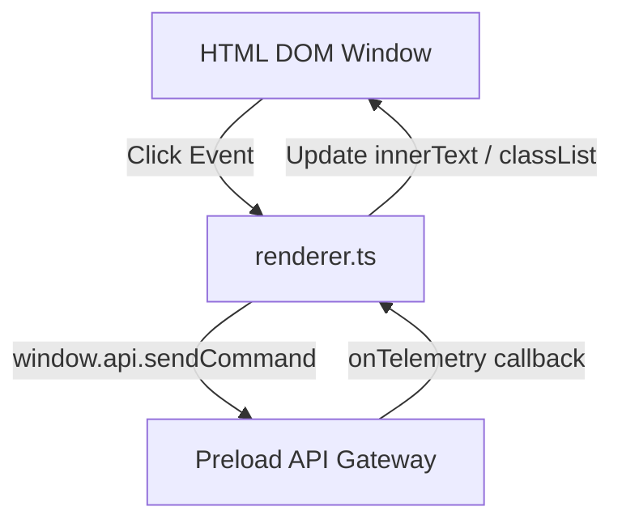

# Renderer UI Context

This module manages the user interface (UI) rendering and user interactions within the Electron window. It registers DOM event listeners, binds controls to the preload context bridge, and updates UI gauges based on telemetry data.

## Interfaces & Bindings

### User Actions (Control Board)
HTML button inputs bind to the bridge API to issue commands:
* **`#btn-ping`**: Sends a `"ping"` payload down standard input to check pipeline responsiveness.
* **`#btn-focus`**: Issues `{ action: "change_state", state: "FOCUS" }` to transition the system to study evaluation mode.
* **`#btn-break`**: Issues `{ action: "change_state", state: "BREAK" }` to suspend CV capture during break times.
* **`#btn-clear`**: Clears the console logging history on the screen.

### Displays & Gauges
The UI listens to `window.api.onTelemetry` and maps JSON fields to HTML elements:
* **`#val-yaw`**: Renders coordinates (e.g. `12.5°`).
* **`#val-pitch`**: Renders vertical pitch coordinates.
* **`#val-phone`**: Toggles indicator classes depending on the boolean flag `phone_detected` (adds `.alert-active` with a text-pulse animation if true).
* **`#log-body`**: Appends formatted packet prints to the custom console log.
* **`#status-badge`**: Tracks the connection state (adds `.connected` and activates the green pulsing status indicator when the first telemetry heartbeat arrives).

---

## UI Components & DOM Bindings

## Dependencies
* FocusSentinel CSS UI System: [index.css](file:///home/yugp/projects/FocusSentinel/src/renderer/index.css)
* Preload context bridge script: [preload.ts](file:///home/yugp/projects/FocusSentinel/src/preload/preload.ts)
