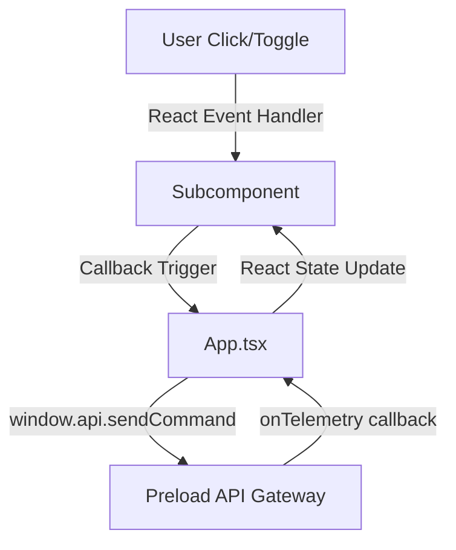

# Renderer UI Context

This module manages the user interface (UI) rendering and user interactions within the Electron window using React, Vite, and TypeScript. It binds state parameters, coordinates IPC commands via the preload context bridge, and updates components based on incoming telemetry.

## Component Architecture

The UI is structured into modular functional components under `src/renderer/components/`:

1. **`App.tsx`**: The parent controller component. It manages state hooks (`focusMode`, `cameraStatus`, `phoneDetected`, `streamLogs`), handles the telemetry channel subscription setup, and maps callback events down to specific views.
2. **`Header.tsx`**: Renders the app logo header, the pulsing connection/camera status badge (`#status-badge`), and Electron window window control actions (minimize, maximize, close).
3. **`ControlBoard.tsx`**: Manages user actions for standard input control:
   - **Ping Command (`#btn-ping`)**: Issues a `"ping"` action down the IPC channel.
   - **Focus Switch (`#focus-switch`)**: Toggles the overall Pomodoro focus state, triggering `{ action: "change_state", state: "FOCUS" | "BREAK" }` to start/stop the camera capture pipeline.
4. **`TelemetryDisplay.tsx`**: Renders standard output telemetry metrics (e.g. Yaw, Pitch, Phone Detection state alerts) and embeds the log console.
5. **`LogConsole.tsx`**: Encapsulates raw packet console log displays (`#log-body`) and provides a button to clear logs. It features a self-contained automatic scroll-to-bottom effect when logs are updated.

---

## Inter-Process Communication & Render Flow

---

## Testing

* **`App.test.tsx`**: UI test suite written in Vitest and React Testing Library (under a JSDOM environment). It uses a mock `window.api` telemetry callback loop to verify component rendering, state transitions, warning triggers, and mock IPC transmissions.
* **`setupTests.ts`**: Sets up global mock interfaces for the Electron preload bridge in testing environments.

---

## Dependencies
* Bundler & Dev Server: [vite.config.ts](file:///home/yugp/projects/FocusSentinel/vite.config.ts)
* Styling system: [index.css](file:///home/yugp/projects/FocusSentinel/src/renderer/index.css)
* Preload context bridge: [preload.ts](file:///home/yugp/projects/FocusSentinel/src/preload/preload.ts)
