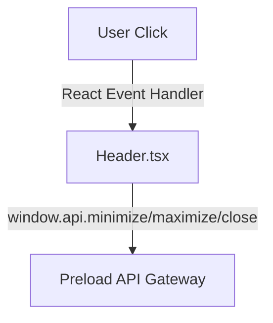

# Renderer UI Context

This module manages the user interface (UI) rendering and user interactions within the Electron window using React, Vite, and TypeScript.

> The app is currently a minimal shell. The camera/vision UI (`ControlBoard`, `TelemetryDisplay`) and the licensing UI (`PremiumGuard`, `PremiumUpsellBanner`) were removed as part of the pivot away from camera-based detection and monetization — see `docs/adr/008-retire-camera-pipeline-and-licensing.md`. The next increments (goal input, a new distraction signal, and wiring the LLM/TTS services into it) will rebuild this section.

## Component Architecture

1. **`App.tsx`**: The parent controller component. Currently renders just the `Header` and an empty `<main>` placeholder.
2. **`Header.tsx`**: Renders the app logo header, a static status badge, and Electron window control actions (minimize, maximize, close).
3. **`LogConsole.tsx`**: Encapsulates a scrollable log display (`#log-body`) with a clear-logs button and auto-scroll-to-bottom. Currently unused pending the next feature increment.

---

## Inter-Process Communication & Render Flow

```mermaid
graph TD
    User[User Click] -->|React Event Handler| Header[Header.tsx]
    Header -->|window.api.minimize/maximize/close| Preload[Preload API Gateway]
```

---

## Testing

* **`App.test.tsx`**: Smoke test written in Vitest and React Testing Library (JSDOM environment) — confirms the header renders and window-control buttons call `window.api`.
* **`setupTests.ts`**: Sets up global mock interfaces (`window.api.minimize/maximize/close`) for the Electron preload bridge in testing environments.

---

## Dependencies
* Bundler & Dev Server: [vite.config.ts](file:///home/yugp/projects/FocusSentinel/vite.config.ts)
* Styling system: [index.css](file:///home/yugp/projects/FocusSentinel/src/renderer/index.css)
* Preload context bridge: [preload.ts](file:///home/yugp/projects/FocusSentinel/src/preload/preload.ts)
