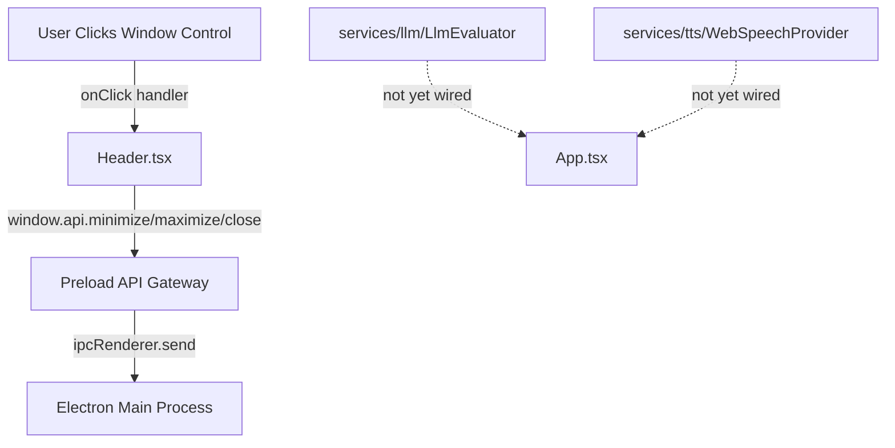

# Renderer UI Context

This module manages the user interface (UI) rendering and user interactions within the Electron window using React, Vite, and TypeScript.

---

## 1. Directory Manifest & Boundaries

*   **Directory Manifest:**
    *   `App.tsx`: Root component. Currently a minimal shell — renders `Header` and an empty `<main>` placeholder.
    *   `components/Header.tsx`: App logo, a static status badge, and window-control buttons (minimize, maximize, close).
    *   `components/LogConsole.tsx`: Scrollable, auto-scrolling log display with a clear-logs button. Not currently mounted by `App.tsx` — retained for the next feature increment to wire up.
    *   `App.test.tsx`: Smoke test suite (Vitest + React Testing Library, JSDOM environment).
    *   `setupTests.ts`: Global `window.api` mocks for the test environment.
*   **Integration Boundaries:**
    *   **Preload Context Bridge:** Calls `window.api.minimize/maximize/close`, exposed by [preload/preload.ts](file:///home/yugp/projects/FocusSentinel/src/preload/preload.ts) (see [preload/CONTEXT.md](file:///home/yugp/projects/FocusSentinel/src/preload/CONTEXT.md)).
    *   **Local Services:** `services/llm/` and `services/tts/` exist as standalone, tested modules (see their own `CONTEXT.md` files) but are **not yet wired into `App.tsx`** — that integration is the next planned increment, not part of the current shell.

> The camera/vision UI (`ControlBoard`, `TelemetryDisplay`) and the licensing UI (`PremiumGuard`, `PremiumUpsellBanner`) were removed as part of the pivot away from camera-based detection and monetization — see `docs/adr/008-retire-camera-pipeline-and-licensing.md`.

---

## 2. Architecture & Flow

```mermaid
graph TD
    User[User Clicks Window Control] -->|onClick handler| Header[Header.tsx]
    Header -->|window.api.minimize/maximize/close| Preload[Preload API Gateway]
    Preload -->|ipcRenderer.send| Main[Electron Main Process]

    LLM[services/llm/LlmEvaluator] -.not yet wired.-> App[App.tsx]
    TTS[services/tts/WebSpeechProvider] -.not yet wired.-> App
```

---

## 3. Public Interfaces & Contracts

### Component: `App` (default export)
*   **Props:** None.
*   **Description:** Renders `Header` wired to `window.api`, plus an empty `<main className="app-main">` placeholder where the goal input, distraction signal, and LLM/TTS integration will land.

### Component: `Header`
| Prop | Type | Required | Description |
| :--- | :--- | :---: | :--- |
| `onMinimize` | `() => void` | Yes | Called when the minimize button is clicked. |
| `onMaximize` | `() => void` | Yes | Called when the maximize/restore button is clicked. |
| `onClose` | `() => void` | Yes | Called when the close button is clicked. |

### Component: `LogConsole`
| Prop | Type | Required | Description |
| :--- | :--- | :---: | :--- |
| `streamLogs` | `string[]` | Yes | Log lines to render. Each entry may be prefixed `typeClass|message` for styling; entries without a `|` render as plain text. |
| `onClearLogs` | `() => void` | Yes | Called when the "Clear Logs" button is clicked. |

---

## 4. Testing
* **`App.test.tsx`**: Confirms the header renders and that its window-control buttons call `window.api.minimize/maximize/close`.
* **`setupTests.ts`**: Stubs `window.api` with `vi.fn()` mocks for `minimize`, `maximize`, and `close`.
