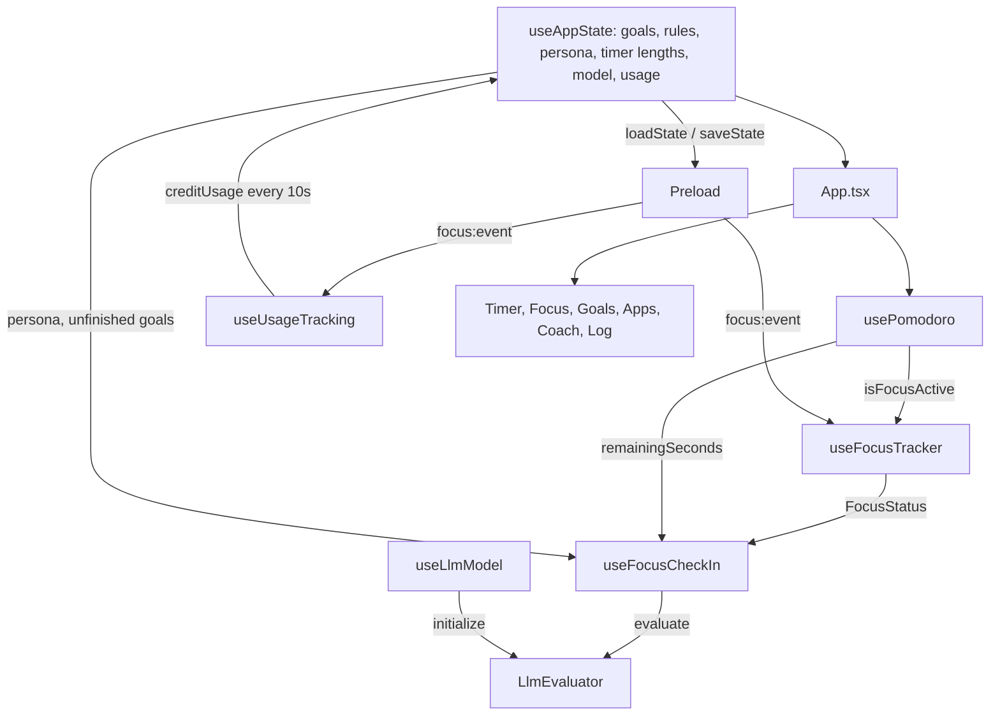

# Renderer UI Context

This module manages the user interface (UI) rendering and user interactions within the Electron window using React, Vite, and TypeScript.

---

## 1. Directory Manifest & Boundaries

*   **Directory Manifest:**
    *   `App.tsx`: Root component. Owns every hook (`useAppState`, `usePomodoro`, `useFocusTracker`, `useUsageTracking`, `useFocusCheckIn`, `useLlmModel`) and passes data and callbacks down. Left column: timer and focus status. Right: tabs for Goals, Apps, Coach and Log.
    *   `global.d.ts`: Declares `window.api`, the single source of truth for what preload exposes to the renderer.
    *   `components/Header.tsx`: Logo, a static status badge, and window controls.
    *   `components/PomodoroCard.tsx`: Countdown, Start/Pause, Skip, Reset, and editable lengths.
    *   `components/FocusStatusPanel.tsx`: Focus state (`Focused` / `Distracted` / `Paused` outside a focus block), distraction time, violations, current app, sampler-error alert, session reset.
    *   `components/Tabs.tsx`: Accessible tab list (arrow keys move between tabs).
    *   `components/GoalsPanel.tsx`: Add, tick off, remove and clear goals.
    *   `components/AppsPanel.tsx`: Every app used, sorted by time, each with a "counts as" select (focus / distraction / browser: judge by tab); allowed tab keywords; two-step "clear usage history".
    *   `components/CoachPanel.tsx`: Personality picker, model picker with Load and progress, and the list of check-ins (newest first, in memory only).
    *   `components/LogConsole.tsx`: The activity log, in the Log tab.
    *   `components/format.ts`: `formatDuration` ("2m 5s") and `formatClock` ("24:30").
    *   `App.test.tsx`, `components/format.test.ts`: UI tests against the real hooks with `window.api` mocked.
    *   `setupTests.ts`: Global `window.api` mock, typed against `global.d.ts`; skipped in Node-environment tests.
*   **Integration Boundaries:**
    *   **Preload Context Bridge:** window controls, `onFocusEvent`, `loadState`/`saveState` (see [preload/CONTEXT.md](../preload/CONTEXT.md)).
    *   **Local Services:** `services/focus/`, `services/pomodoro/`, `services/session/`, `services/llm/`, each with its own `CONTEXT.md`. `services/tts/` is not yet wired.

> **Privacy.** Nothing in the UI renders a window title — only app names and focus state. `App.test.tsx` asserts this.
>
> The camera/vision UI (`ControlBoard`, `TelemetryDisplay`) and the licensing UI (`PremiumGuard`, `PremiumUpsellBanner`) were removed as part of the pivot away from camera-based detection and monetization — see `docs/adr/008-retire-camera-pipeline-and-licensing.md`.

---

## 2. Architecture & Flow

```mermaid
graph TD
    State[useAppState: goals, rules, persona, timer lengths, model, usage] -->|loadState / saveState| Preload[Preload]
    State --> App[App.tsx]
    App --> Timer[usePomodoro]
    Timer -->|isFocusActive| Tracker[useFocusTracker]
    Preload -->|focus:event| Tracker
    Preload -->|focus:event| Usage[useUsageTracking]
    Usage -->|creditUsage every 10s| State
    Tracker -->|FocusStatus| CheckIn[useFocusCheckIn]
    Timer -->|remainingSeconds| CheckIn
    State -->|persona, unfinished goals| CheckIn
    CheckIn -->|evaluate| LLM[LlmEvaluator]
    Model[useLlmModel] -->|initialize| LLM
    App --> Panels[Timer, Focus, Goals, Apps, Coach, Log]
```

---

## 3. Public Interfaces & Contracts

Components are presentational: props in, callbacks out. Only `App` and the hooks touch `window.api`.

### Component: `App` (default export)
*   **Props:** None.
*   **Description:** Logs one line per change of app or focus state, per focus-block start/stop, and per check-in (max 100). Keeps the last 50 check-ins for the Coach tab. Choosing a model and pressing Load saves the choice and loads it.

---

## 4. Testing
* **`App.test.tsx`**: distractions ignored until a focus block starts; live status during a block; timer start/pause; goals add/tick/remove; saved goals, persona and usage shown after load; changing an app to focus on the Apps tab stops it counting; changes saved after 1s; a check-in failure reported in the Coach tab without stopping tracking; no window title on any tab; sampler errors shown as an alert.
* The focus-event mock delivers to every subscriber, as preload does, because two hooks subscribe.
