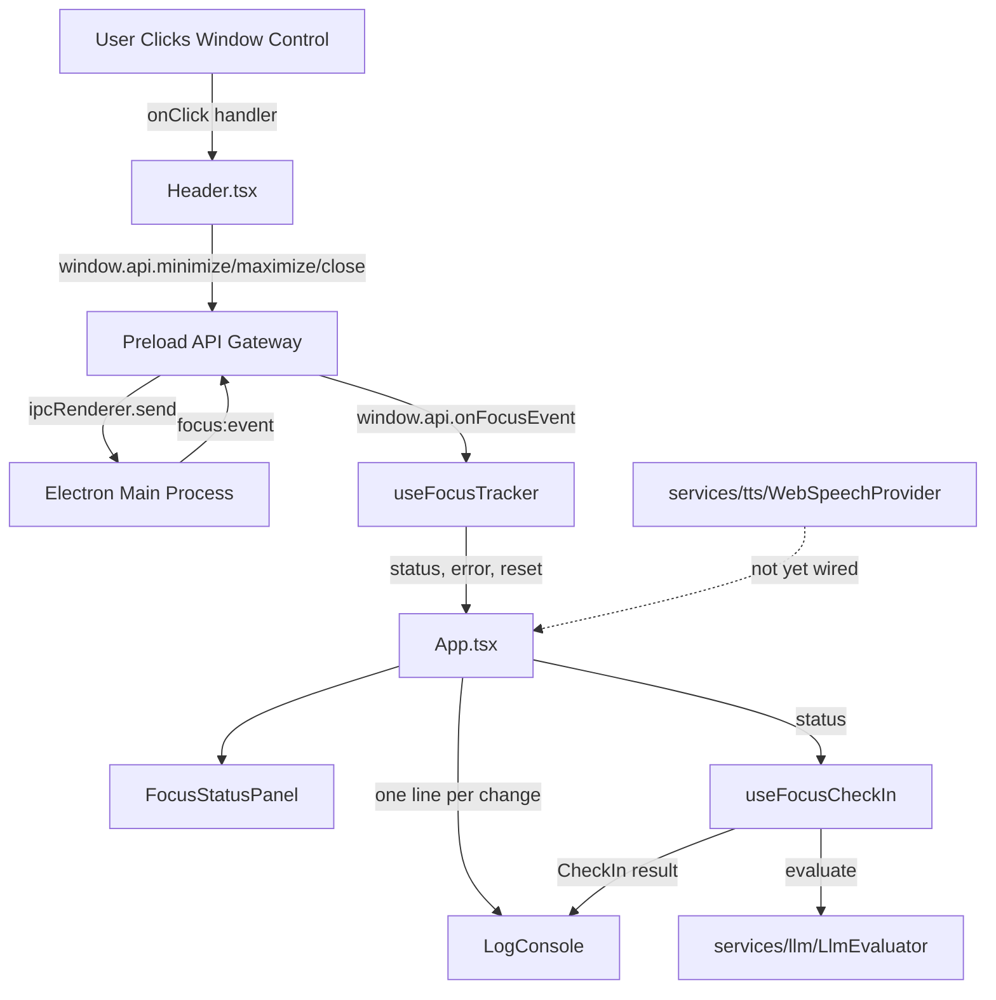

# Renderer UI Context

This module manages the user interface (UI) rendering and user interactions within the Electron window using React, Vite, and TypeScript.

---

## 1. Directory Manifest & Boundaries

*   **Directory Manifest:**
    *   `App.tsx`: Root component. Runs `useFocusTracker(DEFAULT_RULES)` and renders `Header`, `FocusStatusPanel`, and `LogConsole` as a capped activity log (one line per change of app or focus state, max 100 lines).
    *   `global.d.ts`: Declares `window.api` — the single source of truth for what preload exposes to the renderer.
    *   `components/Header.tsx`: App logo, a static status badge, and window-control buttons (minimize, maximize, close).
    *   `components/FocusStatusPanel.tsx`: Live focus state, distraction duration, violation count, current app, a visible alert when the sampler fails, and a reset button.
    *   `components/LogConsole.tsx`: Scrollable, auto-scrolling log display with a clear-logs button. Used as the focus activity log.
    *   `App.test.tsx`: Vitest + React Testing Library suite: header, window controls, live status, log-per-change, sampler errors, and a privacy check that no window title is ever rendered.
    *   `setupTests.ts`: Global `window.api` mock, typed against `global.d.ts`.
*   **Integration Boundaries:**
    *   **Preload Context Bridge:** Calls `window.api.minimize/maximize/close` and subscribes via `window.api.onFocusEvent` (see [preload/CONTEXT.md](../preload/CONTEXT.md)).
    *   **Local Services:** `services/focus/` is wired into `App.tsx` (see [services/focus/CONTEXT.md](services/focus/CONTEXT.md)). `services/llm/` is called once per distraction episode through `useFocusCheckIn`, and each outcome is logged. `services/tts/` is not yet wired.

> **Privacy.** Nothing in the UI renders a window title — only app names and focus state. `App.test.tsx` asserts this.
>
> The camera/vision UI (`ControlBoard`, `TelemetryDisplay`) and the licensing UI (`PremiumGuard`, `PremiumUpsellBanner`) were removed as part of the pivot away from camera-based detection and monetization — see `docs/adr/008-retire-camera-pipeline-and-licensing.md`.

---

## 2. Architecture & Flow

```mermaid
graph TD
    User[User Clicks Window Control] -->|onClick handler| Header[Header.tsx]
    Header -->|window.api.minimize/maximize/close| Preload[Preload API Gateway]
    Preload -->|ipcRenderer.send| Main[Electron Main Process]

    Main -->|focus:event| Preload
    Preload -->|window.api.onFocusEvent| Hook[useFocusTracker]
    Hook -->|status, error, reset| App[App.tsx]
    App --> Panel[FocusStatusPanel]
    App -->|one line per change| Log[LogConsole]

    App -->|status| CheckIn[useFocusCheckIn]
    CheckIn -->|evaluate| LLM[services/llm/LlmEvaluator]
    CheckIn -->|CheckIn result| Log
    TTS[services/tts/WebSpeechProvider] -.not yet wired.-> App
```

---

## 3. Public Interfaces & Contracts

### Component: `App` (default export)
*   **Props:** None.
*   **Description:** Owns the focus session for the window's lifetime. Appends a log line whenever `status.currentApp` or `status.isDistracted` changes — app name and state only, never a title — and one per check-in outcome. Keeps the last 100.

### Component: `Header`
| Prop | Type | Required | Description |
| :--- | :--- | :---: | :--- |
| `onMinimize` | `() => void` | Yes | Called when the minimize button is clicked. |
| `onMaximize` | `() => void` | Yes | Called when the maximize/restore button is clicked. |
| `onClose` | `() => void` | Yes | Called when the close button is clicked. |

### Component: `FocusStatusPanel`
| Prop | Type | Required | Description |
| :--- | :--- | :---: | :--- |
| `status` | `FocusStatus` | Yes | Current tracker status. |
| `error` | `SamplerError \| null` | Yes | Rendered as a `role="alert"` banner when present, so a broken sampler never looks like a focused user. |
| `onReset` | `() => void` | Yes | Called by the "Reset session" button. |

### Component: `LogConsole`
| Prop | Type | Required | Description |
| :--- | :--- | :---: | :--- |
| `streamLogs` | `string[]` | Yes | Log lines to render. Each entry may be prefixed `typeClass|message` for styling (`info`, `warn`); entries without a `|` render as plain text. |
| `onClearLogs` | `() => void` | Yes | Called when the "Clear Logs" button is clicked. |

---

## 4. Testing
* **`App.test.tsx`**: Header and window controls; live status from emitted samples; one log line per change rather than per sample; a sustained distraction producing a handled check-in failure while the model is unloaded; sampler errors shown as an alert; no window title anywhere in the rendered DOM.
* **`setupTests.ts`**: Stubs `window.api` with `vi.fn()` mocks for `onFocusEvent`, `minimize`, `maximize`, and `close`. Tests that need to emit focus events override `onFocusEvent` to capture the callback.
