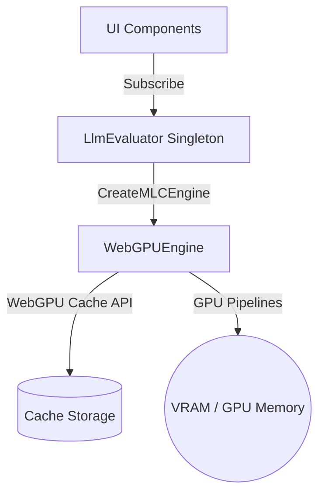

# LLM Services Context

This directory manages the local Large Language Model (LLM) execution, lifecycle state tracking, graphics memory (VRAM) management, and browser cache clearing within the Electron renderer process using WebGPU.

---

## Architecture & Design Pattern

The LLM integration is built as an offline-first service that leverages WebGPU via `@mlc-ai/web-llm` to download and execute quantized model weights locally inside the browser environment. The core evaluator is exposed as a single-instance (singleton) pub/sub service to allow multiple UI components (e.g. control boards, telemetry logs) to register for state transitions, download progress updates, and output completion messages.

---

## Core Modules

### 1. [LlmEvaluator.ts](./LlmEvaluator.ts)
This is the master evaluator service. It implements a pub/sub event system, coordinates MLC model initialization, manages VRAM caching, and clears disk weights.

* **Types & Interfaces**:
  * [LlmState](./LlmEvaluator.ts#L3): Represents the state machine lifecycle: `'uninitialized'`, `'downloading'`, `'loading'`, `'ready'`, `'generating'`, or `'error'`.
  * [LlmStatusUpdate](./LlmEvaluator.ts#L5): Schema for broadcasted events, containing `state`, `progress` (0 to 100), and optional `message`.
  * [LlmStateListener](./LlmEvaluator.ts#L11): Callback subscriber signature: `(status: LlmStatusUpdate) => void`.

* **Service Methods ([LlmEvaluator](./LlmEvaluator.ts#L13))**:
  * [getState()](./LlmEvaluator.ts#L25): Returns the current execution state.
  * [getProgress()](./LlmEvaluator.ts#L32): Returns the current download or compilation progress percentage.
  * [getMessage()](./LlmEvaluator.ts#L39): Returns current status log snippet.
  * [subscribe(listener)](./LlmEvaluator.ts#L47): Registers a subscriber callback. Returns an unsubscribe function to prevent leaks.
  * [updateStatus(state, progress, message)](./LlmEvaluator.ts#L65): Mutates internal state and triggers all registered listener callbacks.
  * [initialize(modelId)](./LlmEvaluator.ts#L89): Creates the MLC WebGPUEngine instance.
    * Checks if the target model is already loaded in VRAM (returns immediately if cached).
    * Releases prior active models from VRAM before loading the new model.
    * Hooks the MLC loader's progress callback to update progress percentages using string regex parsing.
    * Identifies download events versus compilation events to transition state flags between `'downloading'` and `'loading'` dynamically.
  * [unloadModel()](./LlmEvaluator.ts#L131): Instructs the engine to release graphics pipeline shaders and clear out VRAM allocations.
  * [deleteModelFromDisk(modelId)](./LlmEvaluator.ts#L148): Utilizes `@mlc-ai/web-llm`'s official cache utilities (`hasModelInCache` and `deleteModelAllInfoInCache`) to safely purge all model weights, tokenizer configs, and compiled WASM libraries across storage backends (Cache API, IndexedDB, or OPFS).
  * [evaluate(prompt)](./LlmEvaluator.ts#L183): Stub method representing future generation logic.
  * [cancel()](./LlmEvaluator.ts#L196): Stub method representing future active generation cancellation.

### 2. [test-webgpu-llm.ts](./test-webgpu-llm.ts)
A diagnostic verification utility script to ensure hardware WebGPU adapters are available and running inference.

* **Helper Functions**:
  * [checkWebGPUSupport()](./test-webgpu-llm.ts#L3): Checks `navigator.gpu` availability and returns details of the GPU adapter (e.g. Nvidia, Intel, Apple Silicon).
  * [runWebGPUVerification(logCallback, progressCallback)](./test-webgpu-llm.ts#L30): Downloads a lightweight model (`Qwen2.5-0.5B-Instruct-q4f16_1-MLC`, ~390MB), runs a basic verification prompt, logs response content, and disposes the engine context.

---

## Testing & Verification

### Unit Test Suite: [LlmEvaluator.test.ts](./LlmEvaluator.test.ts)
The tests are written in Vitest and run inside an offline simulation environment.

* **Mock Strategy**:
  * Mocks `@mlc-ai/web-llm` dynamic loader calls to avoid weight compilation and network overhead.
  * Stubs browser `caches.delete` and `caches.keys` to safely verify disk purge logic.
* **Covered Behaviors**:
  * Verifies initial/default states.
  * Asserts pub/sub listener notification patterns upon subscription, updates, and unsubscription.
  * Validates that `initialize()` transitions states in sequence (`downloading` -> `loading` -> `ready`) and handles percentage parsers.
  * Verifies VRAM unloading and model references cleanup.
  * Asserts proper Cache Storage deletions.
