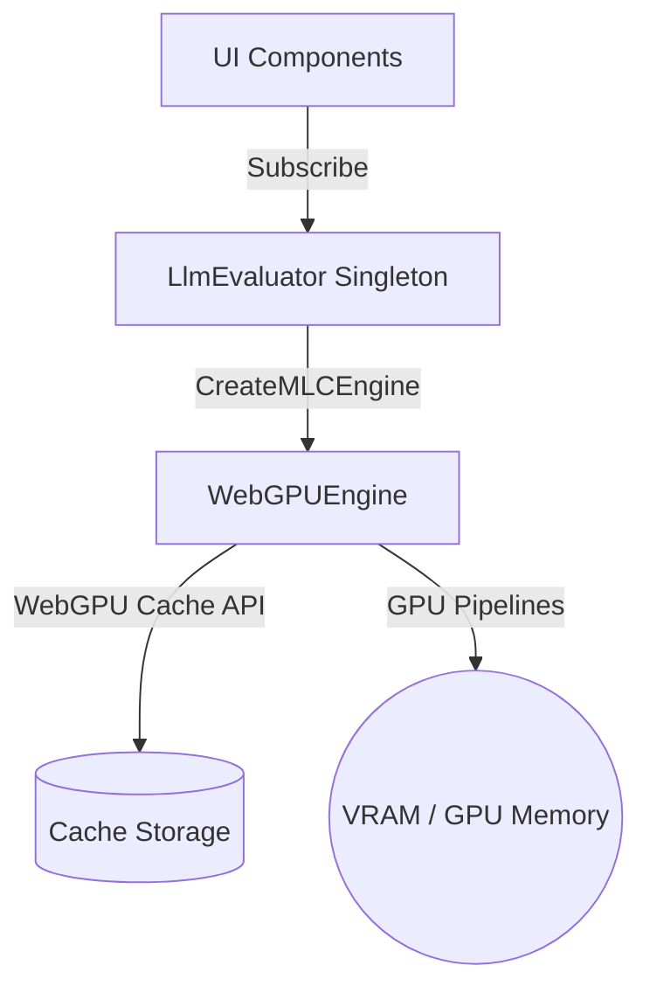

# LLM Services Context

This directory manages the local Large Language Model (LLM) execution, lifecycle state tracking, graphics memory (VRAM) management, and browser cache clearing within the Electron renderer process using WebGPU.

---

## Architecture & Design Pattern

The LLM integration is built as an offline-first service that leverages WebGPU via `@mlc-ai/web-llm` to download and execute quantized model weights locally inside the browser environment. The core evaluator is exposed as a single-instance (singleton) pub/sub service to allow multiple UI components (e.g. control boards, telemetry logs) to register for state transitions, download progress updates, and output completion messages.

---

## Core Modules

### 1. [PromptBuilder.ts](./PromptBuilder.ts) (Internal Helper)
An isolated internal module responsible for prompt construction, presets configuration, and sentence boundary trimming. This isolates all prompt details from the evaluator service.

* **Types & Interfaces**:
  * [LlmPreset](./PromptBuilder.ts#L11): Derived union type matching supported LLM personalities (`'Drill Sergeant' | 'Sarcastic Critic' | 'Supportive Mentor' | 'Disappointed Parent'`).
  * [EvaluatorContext](./PromptBuilder.ts#L13): Structured parameters containing `violationCount`, `distractionDuration`, `timeRemaining`, `activeSessionGoal`, and an optional `additionalMetadata` catch-all map.

* **Helper Functions**:
  * [buildPrompt(preset, context)](./PromptBuilder.ts#L25): Compiles system instructions and user parameters into formatted headers, automatically title-casing extra metadata keys, omitting goal headers if missing, and adjusting user reminders dynamically.
  * [trimTrailingIncompleteSentence(text)](./PromptBuilder.ts#L65): Sanitizes generated speech responses by trimming fragments cut off at token limits.

### 2. [LlmEvaluator.ts](./LlmEvaluator.ts) (Shallow Service)
The master evaluation singleton. It maintains a clean, shallow public interface by delegating prompt compilation and re-exporting only required types (`LlmPreset`, `EvaluatorContext`).

* **Types & State Definitions**:
  * `LlmState`: Machine lifecycle flags (`'uninitialized'`, `'downloading'`, `'loading'`, `'ready'`, `'generating'`, `'error'`).
  * `LlmStatusUpdate`: Schema containing state status, progress percentage (0 to 100), and messages.
  * `LlmStateListener`: Pub/sub callback signature.

* **Service Methods**:
  * `getState()` / `getProgress()` / `getMessage()`: State getter endpoints.
  * `subscribe(listener)`: Hooks up listener callbacks (returns clean unsubscribe closures).
  * `initialize(modelId)`: Loads model weights into VRAM, parses loading logs, and manages engine references.
  * `unloadModel()`: Safely releases pipeline shaders and clears VRAM allocations.
  * `deleteModelFromDisk(modelId)`: Purges CDN weights from disk storage via official WebLLM APIs.
  * [evaluate(preset, context)](./LlmEvaluator.ts#L106): Takes preset options and context variables, delegates to the prompt builder, executes live inference (stubbed for validation), trims sentence ends, and returns final speech.
  * `cancel()`: Safely aborts active generation requests.
  * *Encapsulated internals*: The status mutation helper `updateStatus()` is marked `private` to lock downstream state changes to the evaluator class context.

### 3. [test-webgpu-llm.ts](./test-webgpu-llm.ts)
A diagnostic helper script to verify hardware adapter capabilities.
* `checkWebGPUSupport()`: Checks `navigator.gpu` adapters.
* `runWebGPUVerification(logCallback, progressCallback)`: Evaluates a diagnostic Qwen prompt offline.

---

## Testing & Verification

### Unit Test Suite: [LlmEvaluator.test.ts](./LlmEvaluator.test.ts)
Vitest suite run inside an offline simulation environment.

* **Mock Strategy**:
  * Mocks `@mlc-ai/web-llm` dynamic loader, cache functions, and completions to avoid actual network/VRAM execution.
  * Re-orders state clearing inside `beforeEach` to call `unloadModel()` first and clear call histories afterwards, ensuring every test starts clean.
* **Covered Behaviors**:
  * Subscription hooks and dynamic notification updates.
  * Safe model cache deletions.
  * Prompt compiler template assertions (validating formatted variables, title-cased additional metadata, empty goal fallbacks, and sentence trimmings).
