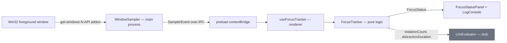
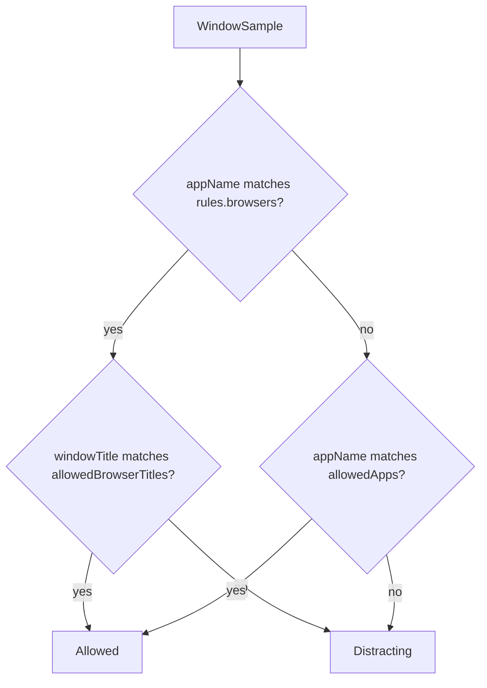
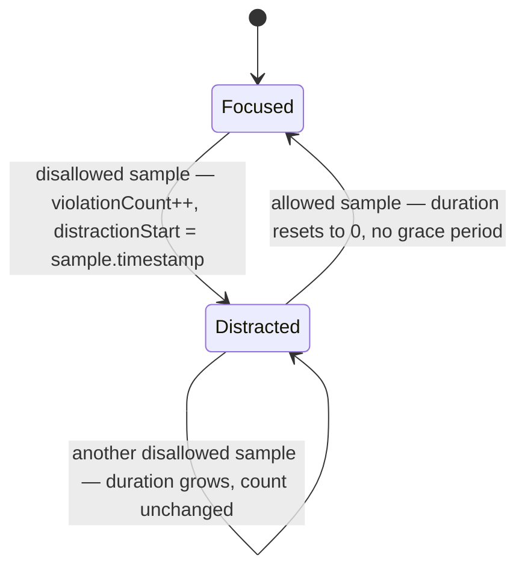

# Focus Tracking Subsystem

This directory decides whether the user is on-task from a stream of foreground-window samples, and reports how long the current distraction has lasted and how many have occurred this session. It produces the `violationCount` and `distractionDuration` fields of `LlmEvaluator`'s `EvaluatorContext`.

It holds every rule and all the state, but never calls an OS API — samples are fed in from outside. That split is what makes it fully testable, and it mirrors the `LlmEvaluator`/`PromptBuilder` split in ADR-007. See `docs/plans/desktop-usage-tracking.md` for the plan and `docs/plans/desktop-usage-tracking-implementation-guide.md` for the decisions behind it.

---

## 1. Directory Manifest & Boundaries

*   **Directory Manifest:**
    *   `types.ts`: `FocusStatus` and `FocusRules`, plus a re-export of the shared `WindowSample` so consumers import everything from here.
    *   `FocusTracker.ts`: The state machine and the hybrid allowlist rule. Pure logic — no timers, no `Date.now()`, no OS access.
    *   `FocusTracker.test.ts`: Test suite covering distraction episodes, duration arithmetic, case-insensitive matching, reset, and the browser-title rule.
    *   `useFocusTracker.ts`: React hook. Subscribes to `window.api.onFocusEvent`, runs each sample through a session-long `FocusTracker` held in a ref, and exposes `{ status, error, reset }`.
    *   `useFocusTracker.test.ts`: Hook tests — subscription, error surfacing, reset, unsubscribe on unmount.
    *   `rules.ts`: `DEFAULT_RULES`, the in-memory v1 allowlist.
    *   `rules.test.ts`: Pins the defaults against the app names `get-windows` really reports on Windows.
*   **Integration Boundaries:**
    *   **Preload bridge:** `useFocusTracker` is the only code here that touches `window.api` (see [preload/CONTEXT.md](../../../preload/CONTEXT.md)).
    *   **`src/shared/types.ts`:** `WindowSample` and `SamplerEvent` live there because they cross the main → preload → renderer boundary. Import them with `import type` only — the file sits outside vite's `root`, and only type-only imports are erased before resolution.

> **Wired in.** `WindowSampler` in the main process emits a sample every 2s over `'focus:event'`; `App.tsx` runs `useFocusTracker(DEFAULT_RULES)` and renders the result. Not yet connected to `LlmEvaluator`.

> **Privacy.** `windowTitle` is personal activity data (`context.md` constraint 1). The tracker compares it in memory and never stores it; `FocusStatus` deliberately carries the app name only. Do not render, log, or persist titles.

---

## 2. Architecture & Flow

End-to-end flow. Grey nodes do not exist yet.



### The decision rule (hybrid allowlist)

For a browser the app name says nothing useful — the tab is the activity — so browsers are judged on title. Every other app is judged on its name, and its title is ignored.



### State machine



A violation is counted only on the transition into `Distracted`, so switching directly from one disallowed app to another is one continuous distraction, not two. There is no grace period: a brief flick to an allowed window ends the episode, and returning starts a new one.

---

## 3. Public Interfaces & Contracts

### Data Structures

#### `WindowSample` (from `src/shared/types.ts`)
```typescript
interface WindowSample {
  appName: string;
  windowTitle: string;
  timestamp: number; // ms since epoch, supplied by the sampler
}
```

#### `FocusStatus`
```typescript
interface FocusStatus {
  isDistracted: boolean;
  distractionDuration: number; // consecutive SECONDS in the current distraction; 0 when focused
  violationCount: number;      // distinct distraction episodes this session
  currentApp: string;
}
```

#### `FocusRules`
```typescript
interface FocusRules {
  allowedApps: string[];          // matched against appName, for non-browsers
  browsers: string[];             // appNames whose windowTitle is judged instead
  allowedBrowserTitles: string[]; // matched against windowTitle, for browsers only
}
```

All matching is case-insensitive substring matching. That is forgiving in the useful direction (`'Code'` matches `"Visual Studio Code"`) and loose in the other (`'Code'` would also match `"Codecademy"`). For a personal tool tuned by its only user, that trade is accepted.

---

### `FocusTracker` Class

#### `constructor(rules)`
*   **Input:** `rules: FocusRules`
*   **Description:** Starts in the focused state with all counters at zero. Rules are fixed for the tracker's lifetime.

#### `accept(sample)`
*   **Input:** `sample: WindowSample`
*   **Output:** `FocusStatus`
*   **Description:** Feeds one observation in and returns the resulting status. All time arithmetic uses `sample.timestamp`, never the wall clock. Duration is floored to whole seconds and clamped at zero, so an out-of-order sample cannot produce a negative value.

#### `getStatus()`
*   **Output:** `FocusStatus`
*   **Description:** Returns the current status as a fresh object, so a consumer (e.g. React state) holding an earlier status never sees it change underneath it.

#### `reset()`
*   **Description:** Returns every counter to the initial state, as at construction.

---

### `useFocusTracker(rules)` Hook
*   **Input:** `rules: FocusRules` — read once, on first render.
*   **Output:** `{ status: FocusStatus; error: SamplerError | null; reset: () => void }`
*   **Description:** Subscribes on mount and unsubscribes on unmount. A `sample` event updates `status` and clears `error`; an `error` event sets `error` and leaves the last `status` in place. `reset` is stable across renders.

### `DEFAULT_RULES`
```typescript
{
  allowedApps: ['Visual Studio Code', 'Windows Terminal', 'Obsidian', 'Electron', 'FocusSentinel'],
  browsers: ['Chrome', 'Edge', 'Firefox', 'Zen'],
  allowedBrowserTitles: ['MDN', 'Stack Overflow', 'GitHub', 'localhost'],
}
```
`get-windows` reports **display names** (`Google Chrome`, `Visual Studio Code`, `Microsoft Edge`), not process names (`chrome`, `Code`, `msedge`), so entries must match those. `Electron` is FocusSentinel's own window in development. In memory only — persisting the list is a deliberate exception to the zero-retention rule and needs its own decision.
