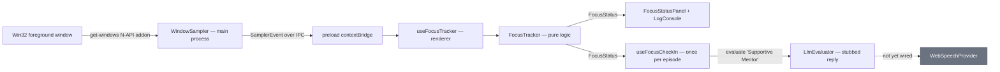
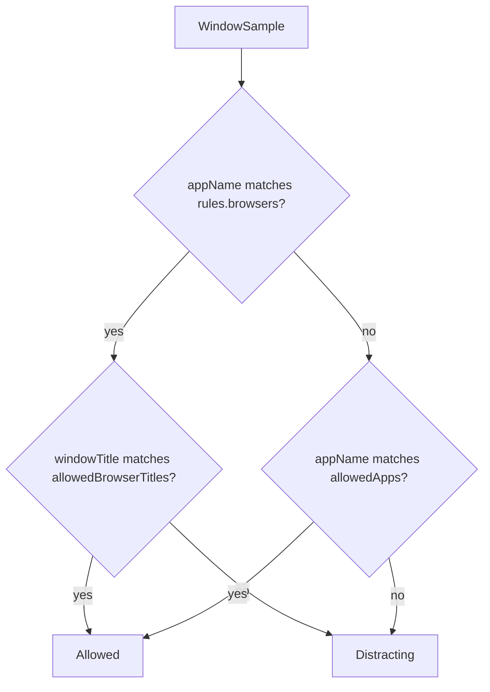
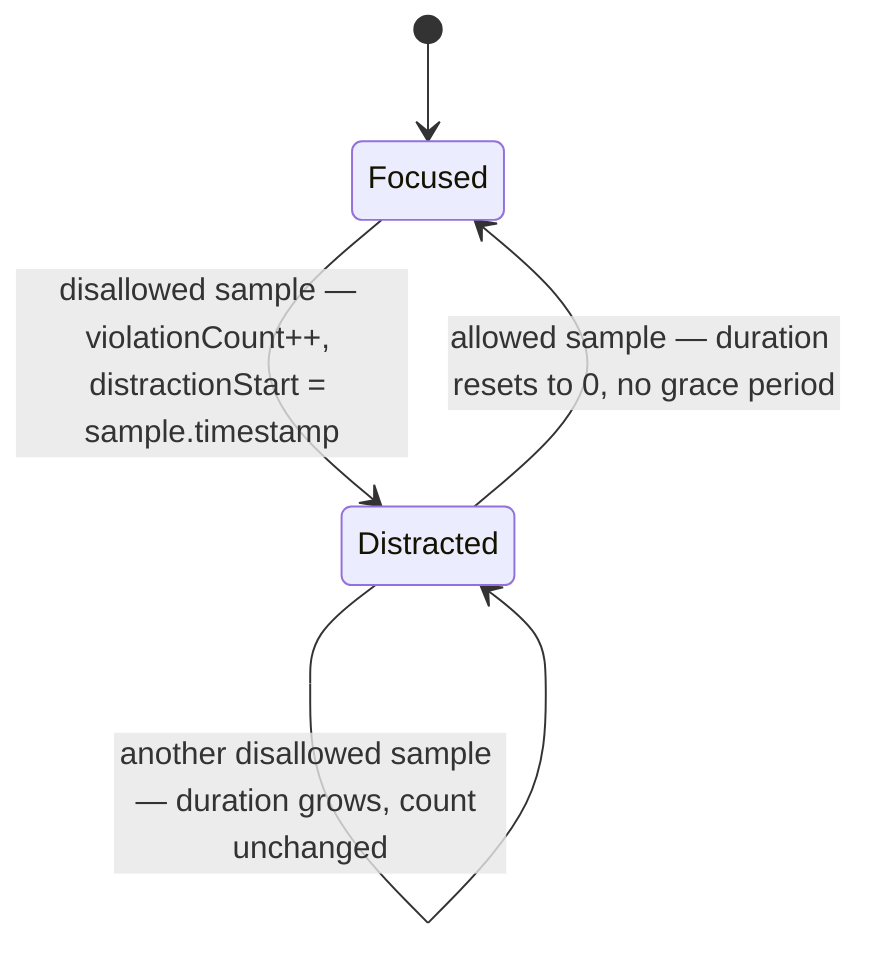
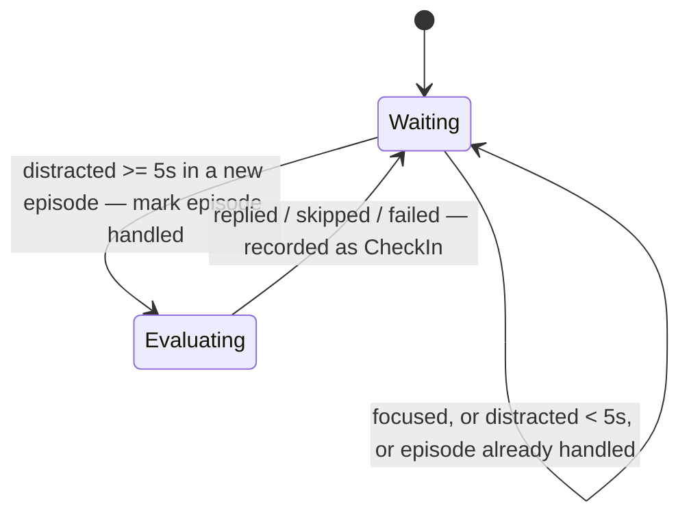

# Focus Tracking Subsystem

This directory decides whether the user is on-task from a stream of foreground-window samples, and reports how long the current distraction has lasted and how many have occurred this session. It produces the `violationCount` and `distractionDuration` fields of `LlmEvaluator`'s `EvaluatorContext`.

It holds every rule and all the state, but never calls an OS API — samples are fed in from outside. That split is what makes it fully testable, and it mirrors the `LlmEvaluator`/`PromptBuilder` split in ADR-007. See `docs/plans/desktop-usage-tracking.md` for the plan and `docs/plans/desktop-usage-tracking-implementation-guide.md` for the decisions behind it.

---

## 1. Directory Manifest & Boundaries

*   **Directory Manifest:**
    *   `types.ts`: `FocusStatus` and `FocusRules`, plus a re-export of the shared `WindowSample` so consumers import everything from here.
    *   `FocusTracker.ts`: The state machine and the hybrid allowlist rule. Pure logic — no timers, no `Date.now()`, no OS access.
    *   `FocusTracker.test.ts`: Test suite covering distraction episodes, duration arithmetic, case-insensitive matching, reset, and the browser-title rule.
    *   `useFocusTracker.ts`: React hook `useFocusTracker(rules, isTracking)`. Subscribes to `window.api.onFocusEvent`, runs samples through a session-long `FocusTracker` only while `isTracking` (a Pomodoro focus block is running), forwards rule changes via `setRules`, and calls `interrupt()` when tracking stops. Exposes `{ status, error, reset, isTracking }`.
    *   `AppUsageTracker.ts`: Pure. Credits the time between consecutive samples to the earlier sample's app; gaps over `MAX_CREDITED_GAP_MS` (10s) are not credited.
    *   `useUsageTracking.ts`: Runs `AppUsageTracker` on every sample (focus block or not) and hands one combined `UsageCredit` per app to a callback every `USAGE_FLUSH_MS` (10s) and on unmount, so usage causes a state change and save every 10s, not every 2s.
    *   `useFocusTracker.test.ts`: Hook tests — subscription, error surfacing, reset, unsubscribe on unmount.
    *   `rules.ts`: `DEFAULT_RULES`, the starting rule map, used until saved rules load. The user's own rules are saved (ADR-009) and edited on the Apps tab.
    *   `useFocusCheckIn.ts`: React hook `useFocusCheckIn(status, evaluator, session)`. Asks an evaluator for one check-in per distraction episode, once it reaches `MIN_DISTRACTION_SECONDS`, passing the session's persona, unfinished goals and time remaining.
    *   `useFocusCheckIn.test.ts`: Hook tests against a fake evaluator — threshold, once-per-episode, new episodes, skipped/failed outcomes, and session reset.
    *   `checkIn.integration.test.ts`: Real `FocusTracker` → `useFocusCheckIn` → `LlmEvaluator` → `PromptBuilder`, with only the WebGPU engine faked. Proves the real counts reach the prompt.
    *   `rules.test.ts`: Pins the defaults against the app names `get-windows` really reports on Windows.
*   **Integration Boundaries:**
    *   **Preload bridge:** `useFocusTracker` is the only code here that touches `window.api` (see [preload/CONTEXT.md](../../../preload/CONTEXT.md)).
    *   **`src/shared/types.ts`:** `WindowSample` and `SamplerEvent` live there because they cross the main → preload → renderer boundary. Import them with `import type` only — the file sits outside vite's `root`, and only type-only imports are erased before resolution.

> **Wired in.** `WindowSampler` in the main process emits a sample every 2s over `'focus:event'`; `App.tsx` runs `useFocusTracker(DEFAULT_RULES)` and renders the result. `App.tsx` also runs `useFocusCheckIn(status, llmEvaluator)` and logs each check-in; replies are not yet spoken.

> **Privacy.** `windowTitle` is compared in memory and never stored, rendered, logged, or saved (ADR-009). `FocusStatus`, `UsageCredit` and the check-in context carry app names only.

---

## 2. Architecture & Flow

End-to-end flow. Grey nodes do not exist yet.



### The decision rule (hybrid allowlist)

For a browser the app name says nothing useful — the tab is the activity — so browsers are judged on title. Every other app is judged on its name, and its title is ignored.



### State machine



A violation is counted only on the transition into `Distracted`, so switching directly from one disallowed app to another is one continuous distraction, not two. There is no grace period: a brief flick to an allowed window ends the episode, and returning starts a new one.

---

## 3. Public Interfaces & Contracts

### Data Structures

#### `WindowSample` (from `src/shared/types.ts`)
```typescript
interface WindowSample {
  appName: string;
  windowTitle: string;
  timestamp: number; // ms since epoch, supplied by the sampler
}
```

#### `FocusStatus`
```typescript
interface FocusStatus {
  isDistracted: boolean;
  distractionDuration: number; // consecutive SECONDS in the current distraction; 0 when focused
  violationCount: number;      // distinct distraction episodes this session
  currentApp: string;
}
```

#### `FocusRules` and `AppCategory` (from `src/shared/types.ts`, persisted)
```typescript
type AppCategory = 'focus' | 'distraction' | 'browser';
interface FocusRules {
  apps: Record<string, AppCategory>; // keyed by app display name
  allowedBrowserTitles: string[];    // matched against windowTitle, for 'browser' apps only
}
```

#### `classifyApp(appName, rules)` → `AppCategory`
Case-insensitive. An exact key match wins; otherwise the longest key contained in the name; otherwise `'distraction'`. So a default `Chrome: 'browser'` covers "Google Chrome" until the user sets "Google Chrome" itself on the Apps tab.

---

### `FocusTracker` Class

#### `constructor(rules)`
*   **Input:** `rules: FocusRules`
*   **Description:** Starts in the focused state with all counters at zero.

#### `setRules(rules)`
*   **Description:** Replaces the rules; they apply from the next sample.

#### `interrupt()`
*   **Description:** Ends the current distraction episode without counting or timing anything (used when a focus block ends). The violation count is kept; a later distraction starts a new episode.

#### `accept(sample)`
*   **Input:** `sample: WindowSample`
*   **Output:** `FocusStatus`
*   **Description:** Feeds one observation in and returns the resulting status. All time arithmetic uses `sample.timestamp`, never the wall clock. Duration is floored to whole seconds and clamped at zero, so an out-of-order sample cannot produce a negative value.

#### `getStatus()`
*   **Output:** `FocusStatus`
*   **Description:** Returns the current status as a fresh object, so a consumer (e.g. React state) holding an earlier status never sees it change underneath it.

#### `reset()`
*   **Description:** Returns every counter to the initial state, as at construction.

---

### `useFocusTracker(rules, isTracking)` Hook
*   **Input:** `rules: FocusRules` (changes applied via `setRules`), `isTracking: boolean` (true while a focus block runs).
*   **Output:** `{ status: FocusStatus; error: SamplerError | null; reset: () => void; isTracking: boolean }`
*   **Description:** Subscribes on mount and unsubscribes on unmount. While tracking, a `sample` event updates `status`; otherwise samples are ignored and the current episode is interrupted. `error` events are surfaced either way.

### `useFocusCheckIn(status, evaluator, session)` Hook
*   **Input:** `status: FocusStatus`, `evaluator: CheckInEvaluator` (`{ evaluate(preset, context): Promise<string> }`), `session: CheckInSession` (`{ preset, goals, timeRemainingSeconds }`, read through a ref at fire time)
*   **Output:** `CheckIn | null` — `{ episode: number; outcome: 'replied' | 'skipped' | 'failed'; text: string }` for the latest attempt.
*   **Description:** When distracted for at least `MIN_DISTRACTION_SECONDS`, calls `evaluate(session.preset, context)` once per episode, keyed on `violationCount`. Context carries the real `violationCount`, `distractionDuration`, `timeRemaining`, unfinished `sessionGoals`, and `distractingApp` (name only). An empty reply is `skipped`; a thrown error is `failed` and never propagates. If `violationCount` drops (session reset), episode tracking restarts.
*   **Behaviour choice:** "once per episode" means once *attempted*. If an episode's attempt lands in `LlmEvaluator`'s 2-minute cooldown, that episode passes silently, with no retry.



### `DEFAULT_RULES`
Focus: Visual Studio Code, Windows Terminal, Obsidian, Electron (FocusSentinel itself in development), FocusSentinel. Browser: Chrome, Edge, Firefox, Zen. Allowed tab keywords: MDN, Stack Overflow, GitHub, localhost. `get-windows` reports **display names** (`Google Chrome`, `Microsoft Edge`), not process names.

### `AppUsageTracker` / `useUsageTracking(onCredits)`
*   `accept(sample)` → `UsageCredit | null` (`{ appName, ms, at }`); `reset()`.
*   The hook delivers `UsageCredit[]` (one per app) every 10s and on unmount. App names only.
