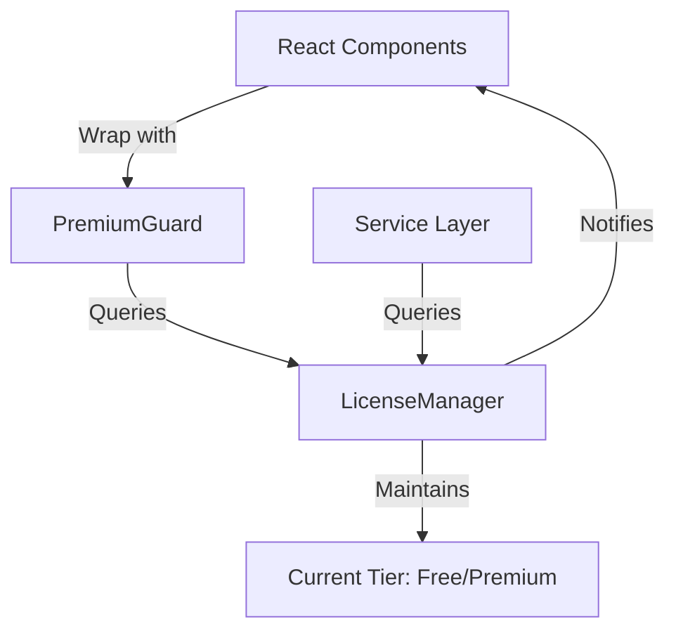
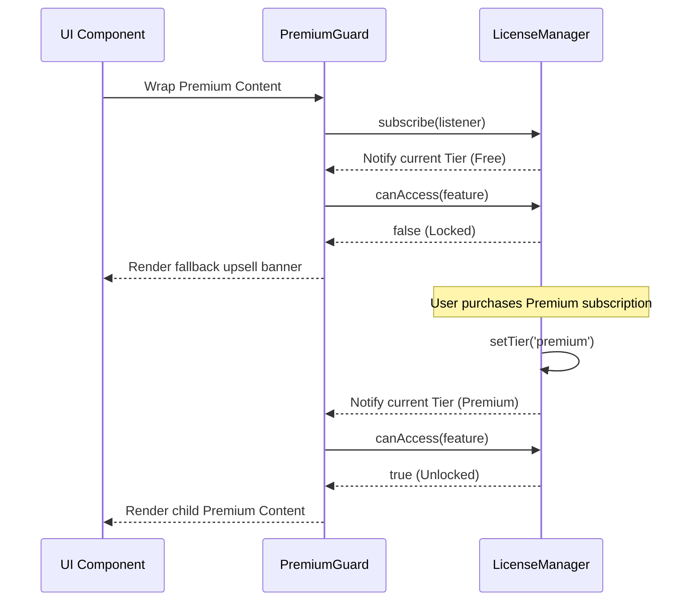

# License & Premium Feature Gating

This context document describes the architecture, public interfaces, contracts, and directory mapping for FocusSentinel's license and feature-gating subsystem.

---

## 1. Directory Manifest & Boundaries

*   **Directory Manifest:**
    *   `LicenseManager.ts`: Public singleton class (`licenseManager`) orchestrating runtime subscription state and feature authorization checks.
    *   `LicenseManager.test.ts`: Complete unit test suite verifying subscription handlers and access limits.
*   **Integration Boundaries:**
    *   **Local-Only Operation:** Decoupled from active subscription verification nodes, auth servers, or payment gateways. Billing details are resolved by upper-tier wrappers, keeping local queries synchronous and fast.

---

## 2. Architecture & Flow

### Subsystem Layout
Access control in FocusSentinel is split into three main parts:
1. **The Service Layer (Single Source of Truth):** Enforced by the `licenseManager` singleton.
2. **The UI Gating Layer (Declarative Guards):** Enforced by the `<PremiumGuard>` React component.
3. **The User Feedback Layer:** Provided by fallback views like `<PremiumUpsellBanner>`.



### Licensing State Lifecycle
The sequence diagram below visualizes how components register with the licensing system and reactively adapt to tier upgrades in real-time:



---

## 3. Public Interfaces & Contracts

### Data Types

#### `Tier`
Represents the subscription level of the user.
*   **Type:** `'free' | 'premium'`

#### `LicenseStatus`
The payload emitted to license state subscribers.
*   **Structure:**
    ```typescript
    interface LicenseStatus {
      tier: Tier;
    }
    ```

#### `PremiumFeature`
Type-safe string literal union containing all known premium feature identifiers to prevent typos in the codebase.
*   **Allowed Values:** `'piper-tts' | 'cloud-tts' | 'advanced-telemetry' | string`

---

### Service Interface: `licenseManager` (Singleton)

The `licenseManager` is a singleton service that provides synchronous lookups and subscription capabilities.

#### `getTier()`
*   **Input:** None
*   **Output:** `Tier` (current active tier)
*   **Description:** Synchronously returns the user's current subscription tier.

#### `setTier(tier)`
*   **Input:** `tier: Tier`
*   **Output:** `void`
*   **Description:** Updates the global subscription tier and fires notifications to all registered listeners.

#### `canAccess(feature)`
*   **Input:** `feature: PremiumFeature`
*   **Output:** `boolean`
*   **Description:** Returns `true` if the current tier has access to the requested feature; `false` otherwise. (Free users are blocked from any feature listed in the system's known premium features; premium users have access to all).

#### `subscribe(listener)`
*   **Input:** `listener: (status: LicenseStatus) => void`
*   **Output:** `() => void` (Unsubscribe function)
*   **Description:** Registers a callback that is fired immediately with the current license status and subsequently on any tier updates. Returns a cleanup function to cancel the subscription.

---

### Component Interface: `<PremiumGuard>`

A declarative React wrapper used to gate UI components.

#### Properties
| Property | Type | Required | Description |
| :--- | :--- | :---: | :--- |
| `feature` | `PremiumFeature` | Yes | The identifier of the feature being guarded. |
| `fallback` | `React.ReactNode` | No | Component to render when access is denied (defaults to `null`). |
| `children` | `React.ReactNode` | Yes | Components to render when access is granted. |
