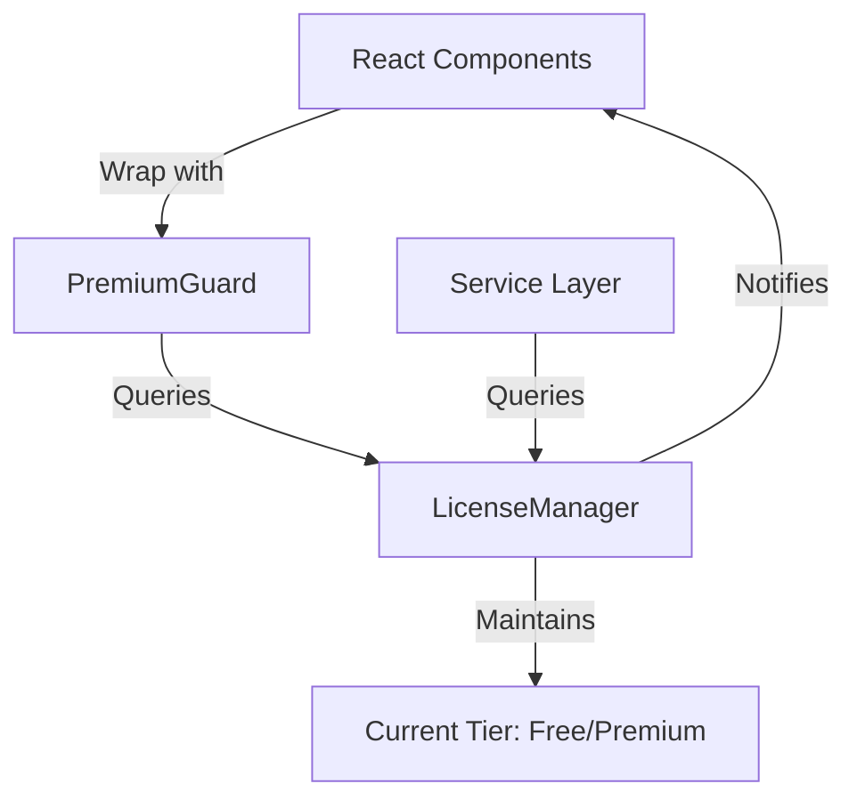

# License & Premium Architecture

This directory contains the central licensing and feature-gating subsystem for FocusSentinel. The architecture is designed to prevent "boolean blindness" (i.e., scatterings of `if (isPremium)` checks across the codebase) and to enforce a decoupled, declarative approach to managing tier-based access.

---

## Architecture Overview

Access control in FocusSentinel is split into three main parts:
1. **The Service Layer (Single Source of Truth):** Enforced by [LicenseManager.ts](file:///home/yugp/projects/FocusSentinel/src/renderer/services/license/LicenseManager.ts).
2. **The UI Gating Layer (Declarative Guards):** Enforced by the [PremiumGuard.tsx](file:///home/yugp/projects/FocusSentinel/src/renderer/components/PremiumGuard.tsx) React component.
3. **The User Feedback Layer:** Provided by fallback views like [PremiumUpsellBanner.tsx](file:///home/yugp/projects/FocusSentinel/src/renderer/components/PremiumUpsellBanner.tsx).



---

## Known Premium Features

To prevent typos and ensure consistency, premium features are tracked in `PREMIUM_FEATURES` within [LicenseManager.ts](file:///home/yugp/projects/FocusSentinel/src/renderer/services/license/LicenseManager.ts). 

Currently defined premium features:
- `"piper-tts"`: Neural local text-to-speech engine.
- `"cloud-tts"`: API-driven cloud text-to-speech.
- `"advanced-telemetry"`: Detailed statistics and monitoring telemetry dashboard.

Adding a new premium feature requires appending it to the `PREMIUM_FEATURES` array in [LicenseManager.ts](file:///home/yugp/projects/FocusSentinel/src/renderer/services/license/LicenseManager.ts#L10).

---

## Core APIs

### LicenseManager

The `licenseManager` singleton manages the subscription state and handles capability lookups.

*   `licenseManager.getTier(): Tier`
    Returns the current tier (`'free'` or `'premium'`).
*   `licenseManager.setTier(tier: Tier): void`
    Updates the tier and triggers notifications to all active listeners.
*   `licenseManager.canAccess(feature: PremiumFeature): boolean`
    Evaluates if the feature is permitted for the current tier.
    *   **Premium tier** users have access to all features.
    *   **Free tier** users are blocked from any feature listed in `PREMIUM_FEATURES`.
*   `licenseManager.subscribe(listener: LicenseListener): () => void`
    Registers a listener to react to tier changes. Returns an unsubscribe cleanup function.

---

## Usage Guidelines

### 1. UI Gating (React)

Never use conditional ternary checks on raw tier status (e.g. `licenseManager.getTier() === 'premium' ? ... : ...`). Instead, always use `<PremiumGuard>` with an explicit `feature` name and an optional fallback.

```tsx
import { PremiumGuard } from '../components/PremiumGuard';
import { PremiumUpsellBanner } from '../components/PremiumUpsellBanner';
import { AdvancedTelemetryPanel } from './AdvancedTelemetryPanel';

export const TelemetryDashboard = () => {
  return (
    <PremiumGuard 
      feature="advanced-telemetry" 
      fallback={<PremiumUpsellBanner featureName="Advanced Telemetry" />}
    >
      <AdvancedTelemetryPanel />
    </PremiumGuard>
  );
};
```

### 2. Service Layer (Non-UI code)

When invoking premium APIs or starting premium actions in service modules, check capabilities directly via `licenseManager.canAccess`.

```typescript
import { licenseManager } from '../license/LicenseManager';

export class VoiceSynthesisService {
  public speak(text: string, voiceType: string): void {
    if (voiceType === 'piper' && !licenseManager.canAccess('piper-tts')) {
      throw new Error('Access denied: Piper TTS is a premium feature.');
    }
    // Proceed with synthesis...
  }
}
```

### 3. Intercepting Actions

For actions triggered from settings or menus where access is restricted, route the request to a controller or service that checks `licenseManager.canAccess` and handles the restriction (e.g., dispatching an event to open the subscription/upgrade modal).

---

## Unit Testing

To test components or services that rely on the license subsystem, you can manipulate the `licenseManager` tier or mock its behavior.

### Testing Component Behavior with Different Tiers

You can call `licenseManager.setTier()` in your test setup and cleanup:

```typescript
import { licenseManager } from '../services/license/LicenseManager';

describe('Premium Component', () => {
  afterEach(() => {
    // Reset to default tier
    licenseManager.setTier('free');
  });

  it('renders fallback for free users', () => {
    licenseManager.setTier('free');
    // ...assert upsell banner is visible
  });

  it('renders content for premium users', () => {
    licenseManager.setTier('premium');
    // ...assert premium feature is visible
  });
});
```
