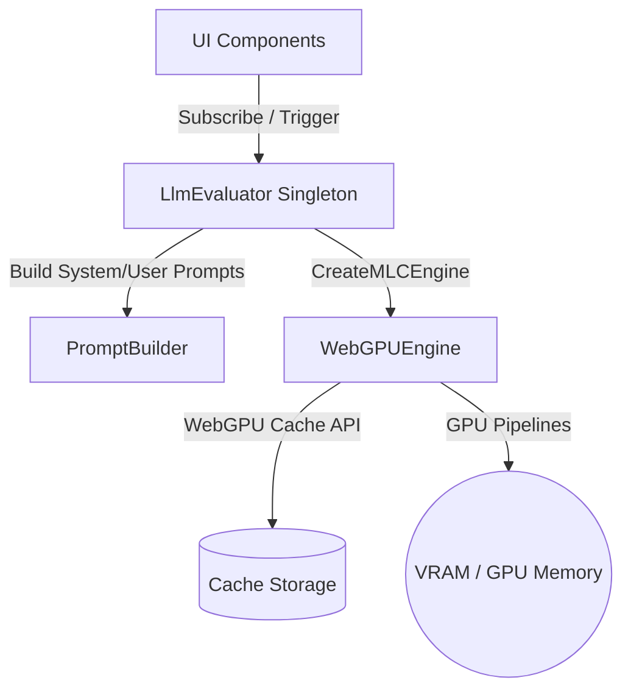
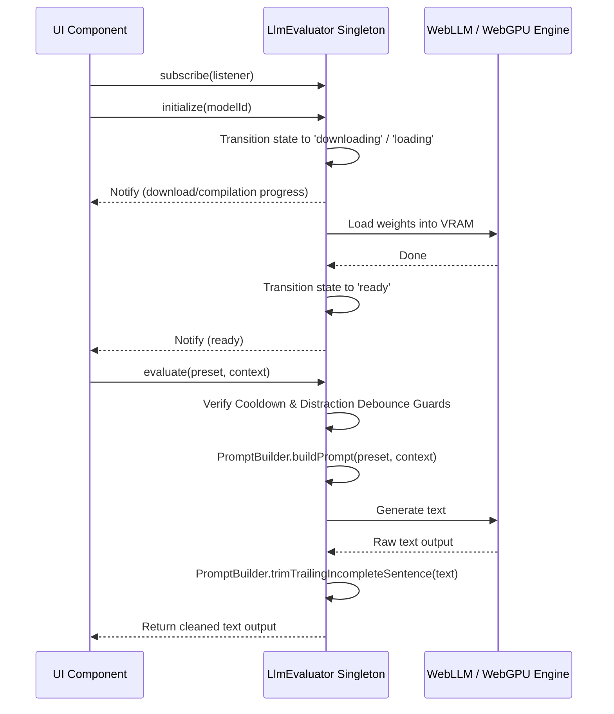

# Local LLM Evaluation Subsystem

This directory contains the core services for running local Large Language Model (LLM) evaluations inside the browser process using WebGPU via `@mlc-ai/web-llm`.

---

## 1. Directory Manifest & Boundaries

*   **Directory Manifest:**
    *   `LlmEvaluator.ts`: Public singleton class (`llmEvaluator`) orchestrating runtime state lifecycle, memory limits, and text evaluation tasks.
    *   `LlmEvaluator.test.ts`: Simulation test suites verifying dynamic state handlers and templates.
    *   `PromptBuilder.ts`: Pure utility module executing text formatting, system instructions compilations, and sentence trimming.
    *   `test-webgpu-llm.ts`: Developer utility script validating raw graphics card features and execution adaptions.
*   **Integration Boundaries:**
    *   **Browser WebGPU Engine:** Interfaces directly with the native browser graphics API (`navigator.gpu`).
    *   **MLC-AI Engine Core:** Coordinates with the third-party `@mlc-ai/web-llm` module to download CDN weights and execute pipeline inference tasks.

---

## 2. Architecture & Flow

### Subsystem Layout
The `llmEvaluator` singleton orchestrates state notifications and WebGPU instructions, delegating prompt formatting to an internal prompt compiler.



### Lifecycle & Inference Flow
The sequence diagram below visualizes how model initialization (caching/compiling) and text generation cycles:



---

## 3. Public Interfaces & Contracts

### Data Structures

#### `LlmState`
The execution lifecycle state.
*   **Type:** `'uninitialized' | 'downloading' | 'loading' | 'ready' | 'generating' | 'error'`

#### `LlmStatusUpdate`
*   **Structure:**
    ```typescript
    interface LlmStatusUpdate {
      state: LlmState;
      progress: number; // Value between 0 and 100
      message?: string; // Information logs (e.g., file transfer logs)
    }
    ```

#### `LlmPreset`
Personalities supported for generation.
*   **Type:** `'Drill Sergeant' | 'Sarcastic Critic' | 'Supportive Mentor' | 'Disappointed Parent'`

#### `EvaluatorContext`
State context passed to prompt builders.
*   **Structure:**
    ```typescript
    interface EvaluatorContext {
      violationCount: number;
      distractionDuration: number; // In seconds
      timeRemaining: string; // Formatting string e.g., "12:30"
      activeSessionGoal?: string;
      additionalMetadata?: Record<string, any>;
    }
    ```

---

### Service Interface: `llmEvaluator` (Singleton)

#### `getState()`
*   **Input:** None
*   **Output:** `LlmState`

#### `getProgress()`
*   **Input:** None
*   **Output:** `number` (0 to 100)

#### `getMessage()`
*   **Input:** None
*   **Output:** `string` (Current loading details)

#### `subscribe(listener)`
*   **Input:** `listener: LlmStateListener`
*   **Output:** `() => void` (Unsubscribe function)
*   **Description:** Subscribes a callback to state, progress, and logs updates. Returns a cleanup function.

#### `initialize(modelId)`
*   **Input:** `modelId: string`
*   **Output:** `Promise<void>`
*   **Description:** Loads WebGPU engine and loads weights into VRAM. Emits progress updates. Unloads any prior loaded model automatically.

#### `unloadModel()`
*   **Input:** None
*   **Output:** `Promise<void>`
*   **Description:** Safely releases pipelines and clears loaded weights from GPU VRAM.

#### `deleteModelFromDisk(modelId)`
*   **Input:** `modelId: string`
*   **Output:** `Promise<void>`
*   **Description:** Programmatically purges downloaded weights from the browser's Cache Storage.

#### `evaluate(preset, context)`
*   **Input:** `preset: LlmPreset`, `context: EvaluatorContext`
*   **Output:** `Promise<string>`
*   **Description:** Compiles custom prompt templates, runs local inference, sanitizes the response, and returns the speech reprimand. Implements safety guards (ignores distractions under 5s, enforces a 2-minute speech cooldown).

#### `cancel()`
*   **Input:** None
*   **Output:** `void`
*   **Description:** Aborts active inference generation immediately.
