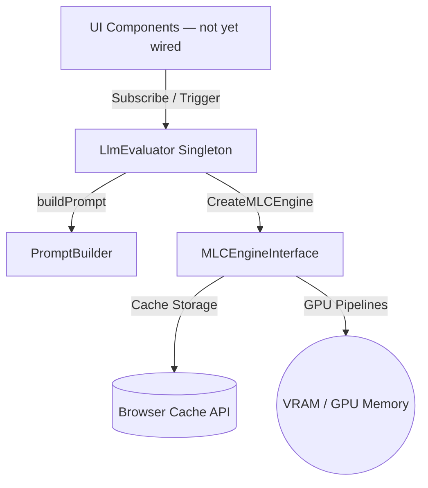
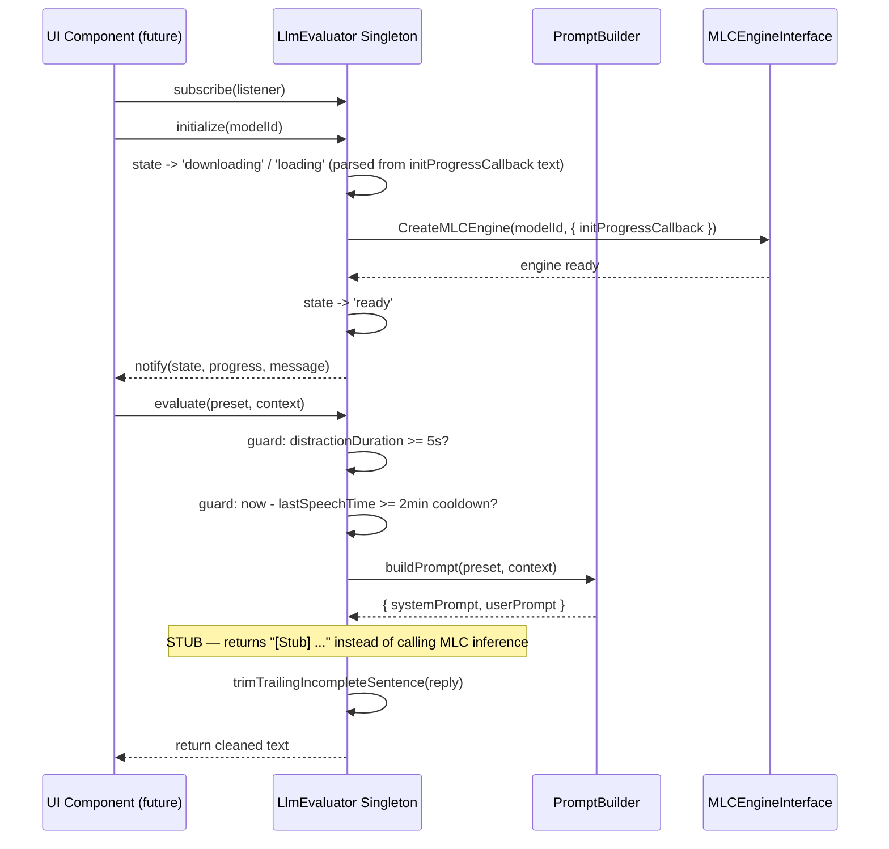

# Local LLM Evaluation Subsystem

This directory contains the core services for running local Large Language Model (LLM) evaluations inside the browser process using WebGPU via `@mlc-ai/web-llm`.

---

## 1. Directory Manifest & Boundaries

*   **Directory Manifest:**
    *   `LlmEvaluator.ts`: `LlmEvaluator` class, exported as a default singleton instance, orchestrating runtime state lifecycle, memory limits, and text evaluation tasks.
    *   `LlmEvaluator.test.ts`: Test suite verifying state handlers, guards, and templates.
    *   `PromptBuilder.ts`: Pure utility module — persona system-prompt table, prompt assembly (`buildPrompt`), and trailing-sentence trimming (`trimTrailingIncompleteSentence`).
    *   `test-webgpu-llm.ts`: Developer diagnostic script validating raw WebGPU adapter availability. Not currently called from the UI (its former call site, the "Verify WebGPU" button, was removed with `ControlBoard`).
*   **Integration Boundaries:**
    *   **Browser WebGPU Engine:** Interfaces directly with the native browser graphics API (`navigator.gpu`) via `@mlc-ai/web-llm`'s `CreateMLCEngine`.
    *   **MLC-AI Engine Core:** Coordinates with the third-party `@mlc-ai/web-llm` module to download CDN weights, cache them (`hasModelInCache`/`deleteModelAllInfoInCache`), and execute inference.

> **Not yet wired into the app.** Nothing in `App.tsx` currently calls `llmEvaluator`. Integrating it with a real distraction signal and a goal-input UI is the next planned increment (see root `context.md`).
>
> **`evaluate()` is currently a stub.** It builds real prompts via `PromptBuilder`, but instead of sending them to the loaded model, it returns a mock string embedding the compiled prompts (`[Stub] [System: ...] [User: ...]`) after an artificial 10ms delay. Real inference (`engine.chat.completions...`) has not been wired in yet. The cooldown/debounce guards and abort handling around it are real and already tested.

---

## 2. Architecture & Flow

### Subsystem Layout


### Lifecycle & Evaluation Flow


---

## 3. Public Interfaces & Contracts

### Data Structures

#### `LlmState`
*   **Type:** `'uninitialized' | 'downloading' | 'loading' | 'ready' | 'generating' | 'error'`

#### `LlmStatusUpdate`
```typescript
interface LlmStatusUpdate {
  state: LlmState;
  progress: number; // 0 to 100
  message?: string;
}
```

#### `LlmPreset`
Derived from the keys of `PromptBuilder`'s `SYSTEM_PRESETS` table (single source of truth).
*   **Type:** `'Drill Sergeant' | 'Sarcastic Critic' | 'Supportive Mentor' | 'Disappointed Parent'`
*   **Note:** The first two personas are punitive/shaming in tone, left over from the project's earlier direction. `docs/adr/008-retire-camera-pipeline-and-licensing.md` records a pivot toward supportive, goal-aware guidance — reframing or trimming this preset list is expected as part of that work, not done yet.

#### `EvaluatorContext`
```typescript
interface EvaluatorContext {
  violationCount: number;          // Count of distraction events in the session
  distractionDuration: number;     // Consecutive seconds currently distracted
  timeRemaining: number;           // Remaining Pomodoro focus time, in seconds
  activeSessionGoal: string;       // User-defined session objective (required)
  additionalMetadata?: Record<string, any>;
}
```

---

### Service Interface: `LlmEvaluator` (default-exported singleton)

#### `getState()`
*   **Output:** `LlmState`

#### `getProgress()`
*   **Output:** `number` (0 to 100)

#### `getMessage()`
*   **Output:** `string` — current status/log message

#### `subscribe(listener)`
*   **Input:** `listener: LlmStateListener`
*   **Output:** `() => void` (unsubscribe)
*   **Description:** Registers a callback, fired immediately with current status and again on every update.

#### `initialize(modelId)`
*   **Input:** `modelId: string`
*   **Output:** `Promise<void>`
*   **Description:** Unloads any prior model, then creates an MLC engine for `modelId`, emitting `downloading`/`loading` progress parsed from the engine's init log text, then `ready`.

#### `unloadModel()`
*   **Output:** `Promise<void>`
*   **Description:** Releases the engine and clears the loaded model reference.

#### `deleteModelFromDisk(modelId)`
*   **Input:** `modelId: string`
*   **Output:** `Promise<void>`
*   **Description:** Purges the model's cached weights from the browser's Cache Storage via `deleteModelAllInfoInCache`. Resets the in-memory engine reference if the deleted model was the active one.

#### `evaluate(preset, context)`
*   **Input:** `preset: LlmPreset`, `context: EvaluatorContext`
*   **Output:** `Promise<string>`
*   **Description:** Builds a prompt via `PromptBuilder`, applies cooldown (2 min) and minimum-distraction-duration (5s) guards, and returns the (currently stubbed — see note above) cleaned response text. Throws if no engine is initialized.

#### `cancel()`
*   **Output:** `void`
*   **Description:** Sets the abort flag and calls `engine.interruptGenerate()`.
