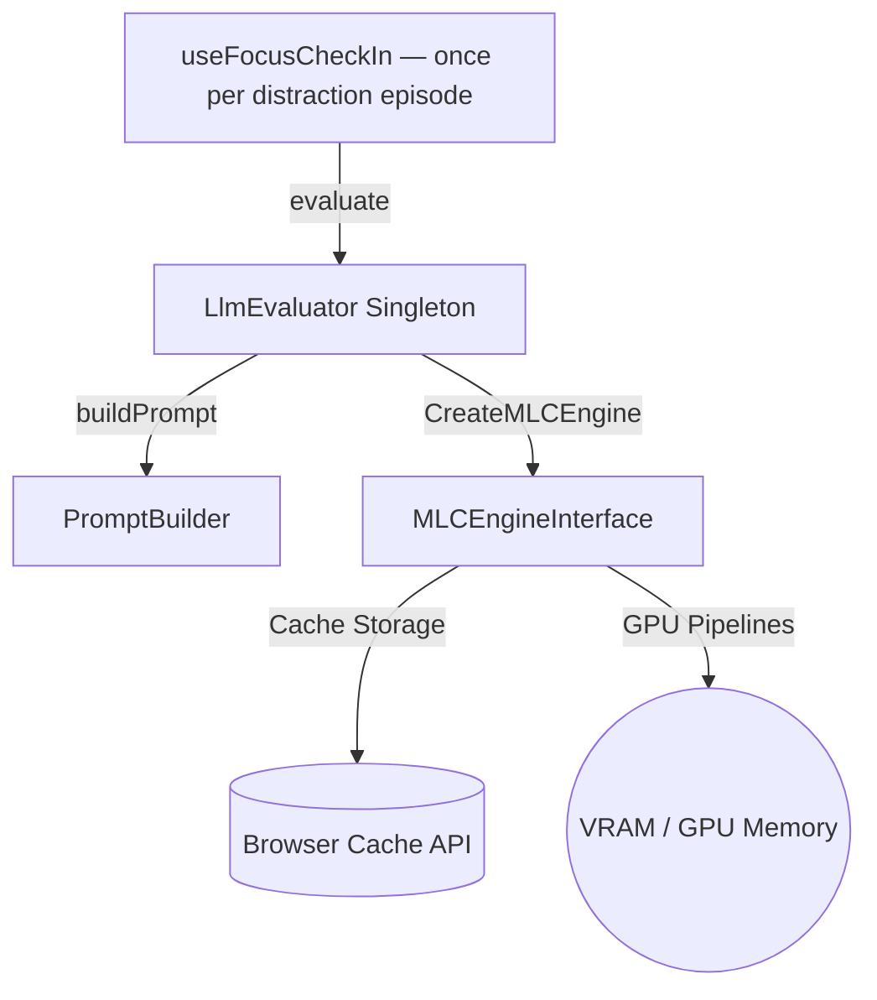
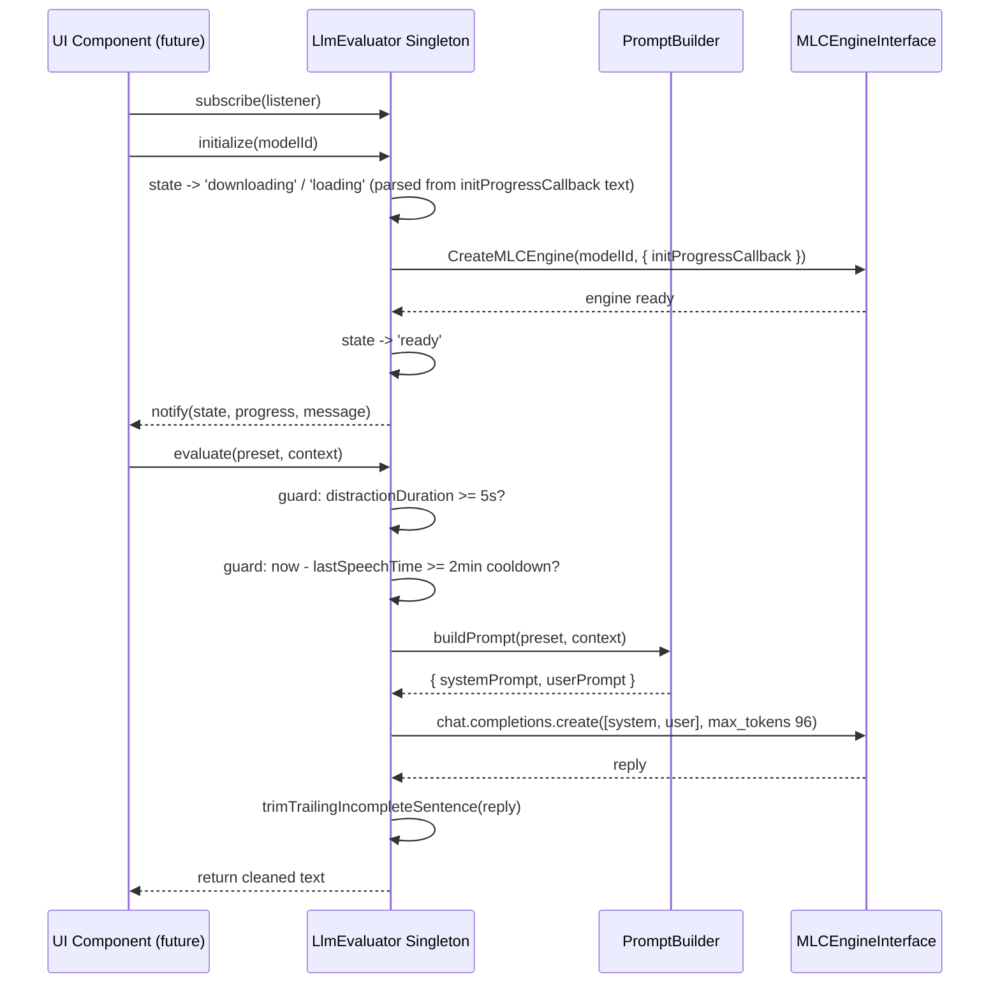

# Local LLM Evaluation Subsystem

This directory contains the core services for running local Large Language Model (LLM) evaluations inside the browser process using WebGPU via `@mlc-ai/web-llm`.

---

## 1. Directory Manifest & Boundaries

*   **Directory Manifest:**
    *   `LlmEvaluator.ts`: `LlmEvaluator` class, exported as a default singleton instance, orchestrating runtime state lifecycle, memory limits, and text evaluation tasks.
    *   `LlmEvaluator.test.ts`: Test suite verifying state handlers, guards, and templates.
    *   `PromptBuilder.ts`: Pure utility module — persona system-prompt table, prompt assembly (`buildPrompt`), and trailing-sentence trimming (`trimTrailingIncompleteSentence`).
    *   `test-webgpu-llm.ts`: Developer diagnostic script validating raw WebGPU adapter availability. Not currently called from the UI (its former call site, the "Verify WebGPU" button, was removed with `ControlBoard`).
*   **Integration Boundaries:**
    *   **Browser WebGPU Engine:** Interfaces directly with the native browser graphics API (`navigator.gpu`) via `@mlc-ai/web-llm`'s `CreateMLCEngine`.
    *   **MLC-AI Engine Core:** Coordinates with the third-party `@mlc-ai/web-llm` module to download CDN weights, cache them (`hasModelInCache`/`deleteModelAllInfoInCache`), and execute inference.

> **Wired to the focus signal.** `useFocusCheckIn` (in `services/focus/`) calls `evaluate(preset, context)` once per distraction episode with the real violation count and duration, the user's unfinished goals, the Pomodoro time remaining, and the distracting app's name (never a window title).
>
> **`evaluate()` calls the model.** It sends a system message (the persona) and a user message (the session context) to `engine.chat.completions.create` with `temperature: 0.7` and `max_tokens: 96`, then trims the reply back to its last complete sentence. The cooldown, minimum-duration and abort handling around it are unchanged.
>
> **Personas were reworded** for desktop distractions and the user's own goals. All four keep their character; none mention phones. `LLM_PRESETS` lists them for pickers.

---

## 2. Architecture & Flow

### Subsystem Layout

```mermaid
graph TD
    UI[useFocusCheckIn — once per distraction episode] -->|evaluate| Service[LlmEvaluator Singleton]
    Service -->|buildPrompt| PromptBuilder[PromptBuilder]
    Service -->|CreateMLCEngine| MLC[MLCEngineInterface]
    MLC -->|Cache Storage| Storage[(Browser Cache API)]
    MLC -->|GPU Pipelines| VRAM((VRAM / GPU Memory))
```

### Lifecycle & Evaluation Flow

```mermaid
sequenceDiagram
    participant UI as UI Component (future)
    participant LE as LlmEvaluator Singleton
    participant PB as PromptBuilder
    participant MLC as MLCEngineInterface

    UI->>LE: subscribe(listener)
    UI->>LE: initialize(modelId)
    LE->>LE: state -> 'downloading' / 'loading' (parsed from initProgressCallback text)
    LE->>MLC: CreateMLCEngine(modelId, { initProgressCallback })
    MLC-->>LE: engine ready
    LE->>LE: state -> 'ready'
    LE-->>UI: notify(state, progress, message)

    UI->>LE: evaluate(preset, context)
    LE->>LE: guard: distractionDuration >= 5s?
    LE->>LE: guard: now - lastSpeechTime >= 2min cooldown?
    LE->>PB: buildPrompt(preset, context)
    PB-->>LE: { systemPrompt, userPrompt }
    LE->>MLC: chat.completions.create([system, user], max_tokens 96)
    MLC-->>LE: reply
    LE->>LE: trimTrailingIncompleteSentence(reply)
    LE-->>UI: return cleaned text
```

---

## 3. Public Interfaces & Contracts

### Data Structures

#### `MIN_DISTRACTION_SECONDS`
*   **Value:** `5`
*   **Description:** `evaluate()` returns `''` for distractions shorter than this. Exported so callers (`useFocusCheckIn`) gate on the same value instead of duplicating it. With the sampler ticking every 2s, the first check-in of an episode fires at `distractionDuration: 6`.

#### `LlmState`
*   **Type:** `'uninitialized' | 'downloading' | 'loading' | 'ready' | 'generating' | 'error'`

#### `LlmStatusUpdate`
```typescript
interface LlmStatusUpdate {
  state: LlmState;
  progress: number; // 0 to 100
  message?: string;
}
```

#### `LlmPreset` and `LLM_PRESETS`
Derived from the keys of `PromptBuilder`'s `SYSTEM_PRESETS` table (single source of truth). `LLM_PRESETS` is the same list as an array, in display order.
*   **Type:** `'Drill Sergeant' | 'Sarcastic Critic' | 'Supportive Mentor' | 'Disappointed Parent'`
*   **Note:** All four are written for a computer focus block and the user's goals. The harsher two are firm or teasing about the distraction, never insulting to the person.

#### `EvaluatorContext`
```typescript
interface EvaluatorContext {
  violationCount: number;          // Count of distraction events in the session
  distractionDuration: number;     // Consecutive seconds currently distracted
  timeRemaining: number;           // Seconds left in the current Pomodoro focus block
  sessionGoals: string[];          // Unfinished goals; rendered as a bulleted [Session Goals] list, omitted if empty
  distractingApp?: string;         // App display name only — never a window title
  additionalMetadata?: Record<string, any>;
}
```

---

### Service Interface: `LlmEvaluator` (default-exported singleton)

#### `getState()`
*   **Output:** `LlmState`

#### `getProgress()`
*   **Output:** `number` (0 to 100)

#### `getMessage()`
*   **Output:** `string` — current status/log message

#### `subscribe(listener)`
*   **Input:** `listener: LlmStateListener`
*   **Output:** `() => void` (unsubscribe)
*   **Description:** Registers a callback, fired immediately with current status and again on every update.

#### `initialize(modelId)`
*   **Input:** `modelId: string`
*   **Output:** `Promise<void>`
*   **Description:** Unloads any prior model, then creates an MLC engine for `modelId`, emitting `downloading`/`loading` progress parsed from the engine's init log text, then `ready`.

#### `unloadModel()`
*   **Output:** `Promise<void>`
*   **Description:** Releases the engine and clears the loaded model reference.

#### `deleteModelFromDisk(modelId)`
*   **Input:** `modelId: string`
*   **Output:** `Promise<void>`
*   **Description:** Purges the model's cached weights from the browser's Cache Storage via `deleteModelAllInfoInCache`. Resets the in-memory engine reference if the deleted model was the active one.

#### `evaluate(preset, context)`
*   **Input:** `preset: LlmPreset`, `context: EvaluatorContext`
*   **Output:** `Promise<string>`
*   **Description:** Builds a prompt via `PromptBuilder`, applies cooldown (2 min) and minimum-distraction-duration (5s) guards, and sends both prompts to the model, and returns the reply trimmed to its last complete sentence. Throws if no engine is initialized.

#### `cancel()`
*   **Output:** `void`
*   **Description:** Sets the abort flag and calls `engine.interruptGenerate()`.
