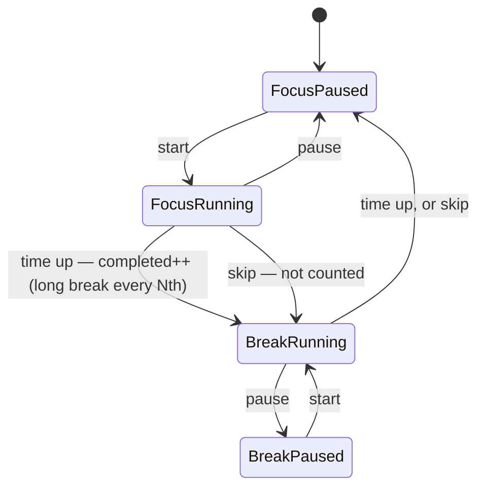

# Pomodoro Timer Subsystem

A focus/break timer. It decides *when* distractions count — only while a focus block is running — and supplies `timeRemaining` to the LLM check-in so the coach can say "eight minutes left, you're nearly there" instead of something generic.

---

## 1. Directory Manifest & Boundaries

*   **Directory Manifest:**
    *   `types.ts`: `PomodoroPhase`, `PomodoroStatus`, and a re-export of the persisted `PomodoroSettings` from `src/shared/types.ts`.
    *   `PomodoroTimer.ts`: The state machine. Pure — every time-dependent method takes `now`; it never reads a clock.
    *   `PomodoroTimer.test.ts`: Countdown, pause/resume, automatic breaks, long-break cadence, skip, reset, settings changes.
    *   `usePomodoro.ts`: React hook that ticks the timer once a second against `Date.now()` and exposes `start`, `pause`, `skip`, `reset`.
    *   `usePomodoro.test.ts`: Hook tests with fake timers.
*   **Integration Boundaries:**
    *   **`App.tsx`:** passes `status.isFocusActive` to `useFocusTracker` (gating) and `remainingSeconds`/`phase` to `useFocusCheckIn`.
    *   **Persistence:** `PomodoroSettings` is saved (ADR-009). The running timer itself is not — a restart begins at a paused focus block.

---

## 2. Architecture & Flow



Breaks start on their own because a break needs no decision. A finished break waits at a paused focus block, so a new block never starts while the user is away from the desk.

---

## 3. Public Interfaces & Contracts

```typescript
interface PomodoroSettings { focusMinutes: number; shortBreakMinutes: number; longBreakMinutes: number; longBreakEvery: number }
type PomodoroPhase = 'focus' | 'shortBreak' | 'longBreak';
interface PomodoroStatus {
  phase: PomodoroPhase;
  isRunning: boolean;
  remainingSeconds: number;     // rounded up
  completedFocusBlocks: number; // skipped blocks don't count
  isFocusActive: boolean;       // isRunning && phase === 'focus'
}
```

### `PomodoroTimer`
*   `constructor(settings)` — starts paused at a full focus block.
*   `start(now)`, `pause(now)`, `tick(now)`, `skip(now)` → `PomodoroStatus`.
*   `reset()` — back to the first focus block, count zeroed.
*   `setSettings(settings, now)` — applies immediately to a phase that has not started; otherwise from the next phase, so a running block is never stretched or cut.
*   `getStatus(now)` → `PomodoroStatus`.

### `usePomodoro(settings)`
*   **Output:** `{ status, start, pause, skip, reset }`. One timer for the component's lifetime; a 1s interval drives `tick`. Settings changes are forwarded via `setSettings`.
