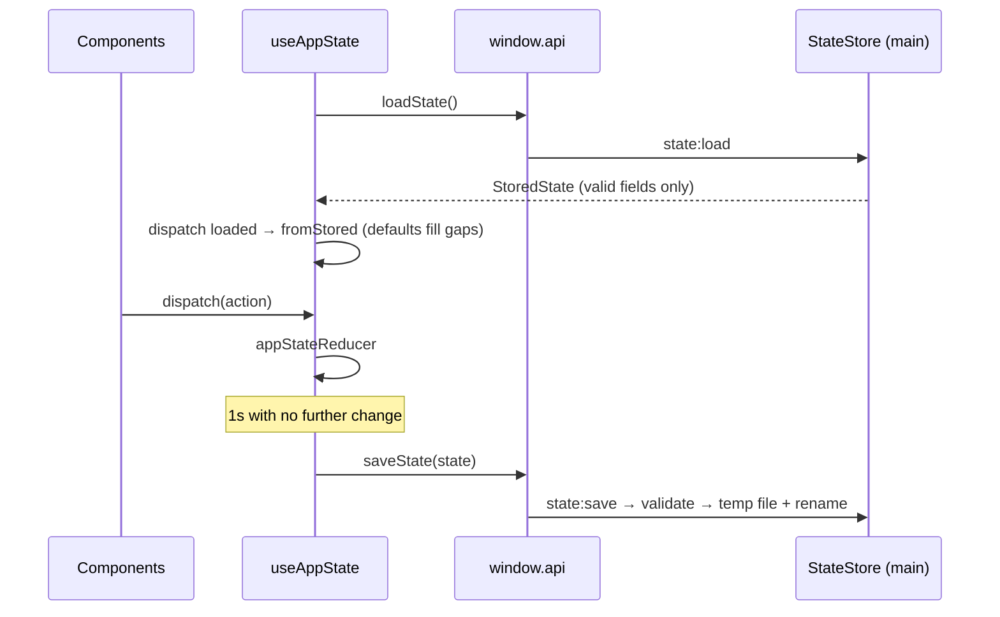

# Session State Subsystem

The renderer's single source of truth for everything the user sets up and everything that is saved (ADR-009): goals, per-app rules, allowed browser titles, persona, Pomodoro lengths, chosen model, and per-app usage time. One reducer, one hook, loaded once and saved automatically.

---

## 1. Directory Manifest & Boundaries

*   **Directory Manifest:**
    *   `types.ts`: `AppStateAction` (every change the UI can make) and re-exports of the persisted shapes from `src/shared/types.ts`.
    *   `appState.ts`: `DEFAULT_STATE`, `fromStored` (saved fields over defaults, unknown persona rejected), `isPreset`, and the pure `appStateReducer`.
    *   `appState.test.ts`: Reducer and merge tests.
    *   `useAppState.ts`: Loads via `window.api.loadState()` on mount; saves via `window.api.saveState()` `SAVE_DELAY_MS` (1s) after the last change.
    *   `useAppState.test.ts`: Load, debounced save, and the guards below, with fake timers.
*   **Integration Boundaries:**
    *   **Preload bridge:** `loadState`/`saveState` only.
    *   **Defaults:** `DEFAULT_RULES` from `services/focus/rules.ts`; presets from `services/llm/PromptBuilder.ts` (imported from there, not `LlmEvaluator`, so this module never pulls in the WebGPU library).

> **Save guards.** Nothing is saved until the load succeeds — otherwise the first render's defaults would overwrite the user's file. The state produced by the load is not itself saved back. If the load *fails* (IPC error), saving stays off for the session and `storageError` says so. A corrupt file is not a load failure: the main process moves it aside and returns `{}`.
>
> **What can be lost.** A change made less than a second before the window closes may not be saved.

---

## 2. Architecture & Flow

---

## 3. Public Interfaces & Contracts

### `useAppState()`
*   **Output:** `{ state: PersistedState; dispatch: (action: AppStateAction) => void; isLoaded: boolean; storageError: string | null }`

### `AppStateAction`
| Action | Effect |
| :--- | :--- |
| `loaded { stored }` | Replace state with `fromStored(stored)`. |
| `addGoal { id, text }` | Append a goal; text trimmed; blank ignored. The caller supplies the id, keeping the reducer pure. |
| `toggleGoal { id }`, `removeGoal { id }`, `clearDoneGoals` | Goal list edits. |
| `setAppCategory { appName, category }` | Set one app's rule (exact name). |
| `setBrowserTitles { titles }` | Replace allowed browser-title keywords; blanks and duplicates dropped. |
| `setPersona { persona }` | Ignored unless it is a known preset. |
| `setPomodoro { settings }`, `setModel { modelId }` | Replace. |
| `creditUsage { appName, ms, at }` | Add `ms` to the app's total seconds; set `lastSeen`. |
| `clearUsage` | Empty the usage history. |
