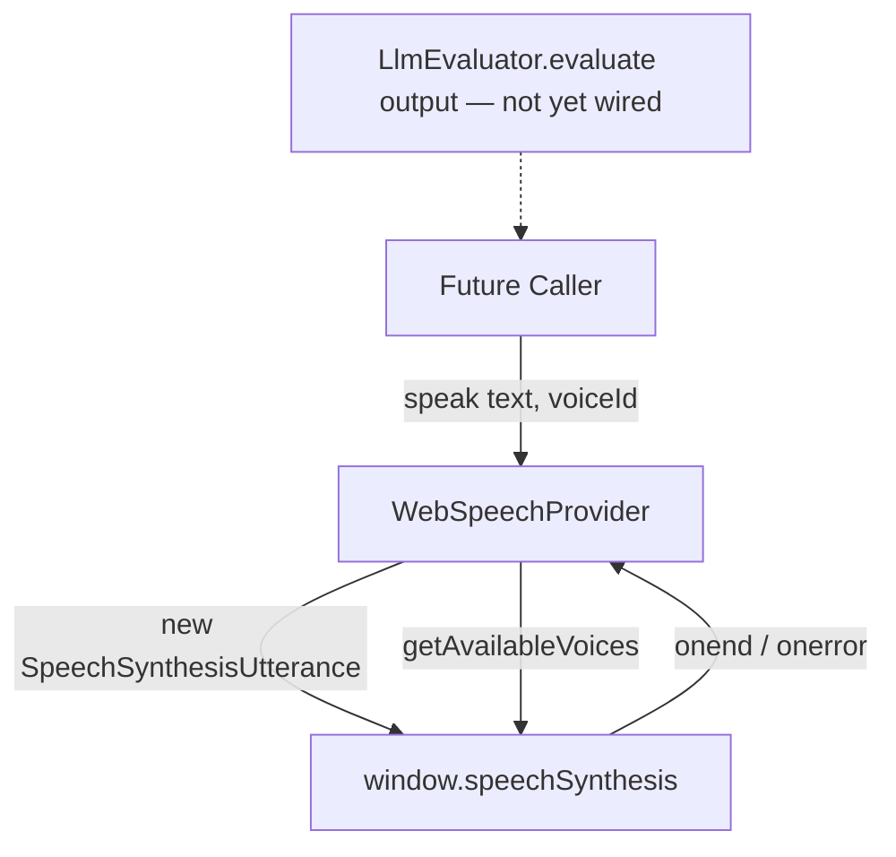
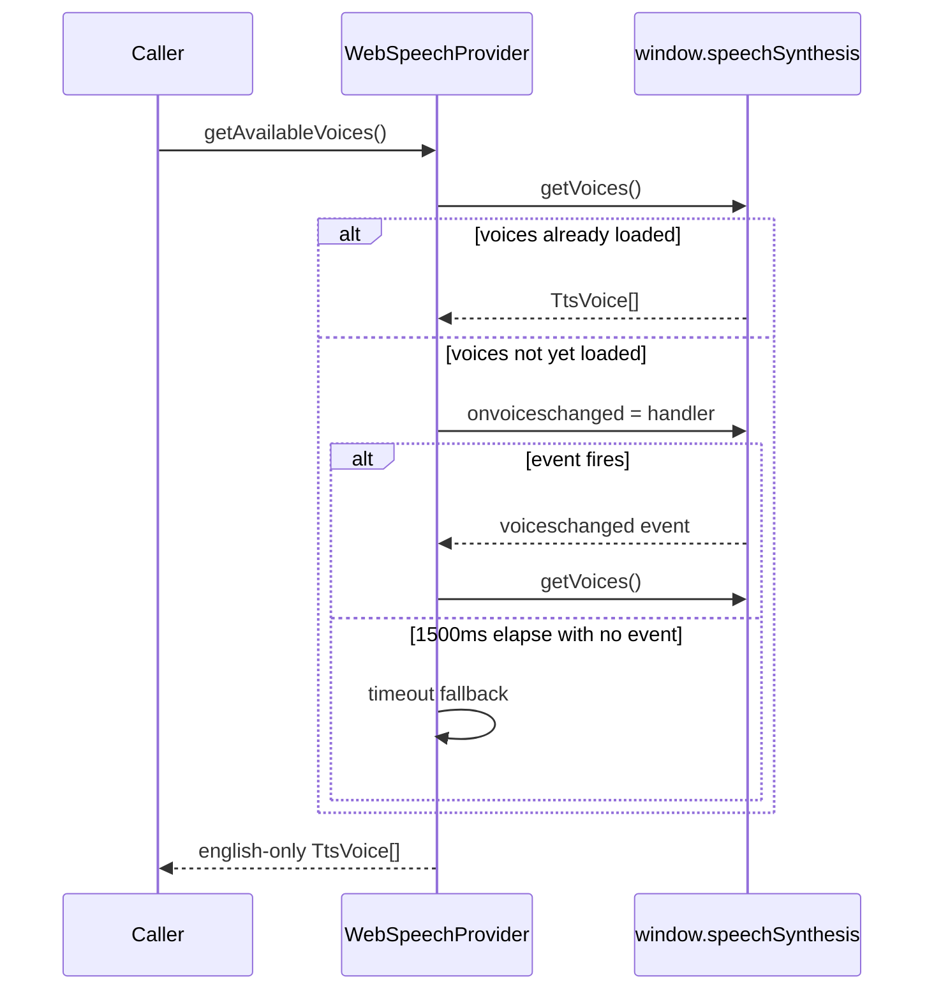

# Text-to-Speech (TTS) Subsystem

This directory contains the provider abstraction and browser-native implementation for speaking LLM-generated text aloud.

---

## 1. Directory Manifest & Boundaries

*   **Directory Manifest:**
    *   `types.ts`: `ITtsProvider` interface and `TtsVoice` shared shape, so the UI can treat any provider's voices uniformly.
    *   `WebSpeechProvider.ts`: `ITtsProvider` implementation backed by the browser's native `SpeechSynthesis` API.
    *   `WebSpeechProvider.test.ts`: Test suite covering voice enumeration (immediate, `onvoiceschanged`-deferred, and timeout-fallback paths) and speech playback/error handling.
*   **Integration Boundaries:**
    *   **Web Speech API:** Interfaces directly with `window.speechSynthesis` / `SpeechSynthesisUtterance`, native to Chromium/Electron's renderer — no network calls, no external service.

> **Not yet wired into the app.** Nothing in `App.tsx` currently calls `WebSpeechProvider`. Piping `LlmEvaluator.evaluate()` output into `speak()` is part of the next planned increment (see root `context.md`). No provider selection/factory exists yet — `ITtsProvider` supports multiple future providers (`'webspeech' | 'cloud' | 'piper'`), but only `WebSpeechProvider` exists today.
>
> Licensing/feature-gating on TTS providers (e.g. gating `'piper-tts'`/`'cloud-tts'` to a premium tier) was removed along with the rest of the licensing subsystem — see `docs/adr/008-retire-camera-pipeline-and-licensing.md`. `TtsVoice` no longer has a `requiredFeature` field.

---

## 2. Architecture & Flow



### Voice Enumeration (handles both sync and async voice list loading)


---

## 3. Public Interfaces & Contracts

### Data Structures

#### `TtsVoice`
```typescript
interface TtsVoice {
  id: string;
  name: string;
  provider: 'webspeech' | 'cloud' | 'piper';
}
```

#### `ITtsProvider`
```typescript
interface ITtsProvider {
  initialize(config?: any): Promise<void>;
  getAvailableVoices(): Promise<TtsVoice[]>;
  speak(text: string, voiceId: string, options?: { pitch?: number; rate?: number }): Promise<void>;
}
```

---

### `WebSpeechProvider` Class (implements `ITtsProvider`)

#### `initialize()`
*   **Output:** `Promise<void>`
*   **Description:** Marks the provider initialized. Logs a console warning (does not throw) if `window.speechSynthesis` is unavailable in the current environment.

#### `getAvailableVoices()`
*   **Output:** `Promise<TtsVoice[]>`
*   **Description:** Returns English-only (`lang` starting with `en`) native voices, mapped to `TtsVoice` with `provider: 'webspeech'`. Returns `[]` immediately if Speech Synthesis isn't supported. Handles browsers that populate the voice list asynchronously by waiting on `onvoiceschanged`, with a 1500ms fallback timeout.

#### `speak(text, voiceId, options?)`
*   **Input:** `text: string`, `voiceId: string` (matched against native voice `name`), `options?: { pitch?: number; rate?: number }`
*   **Output:** `Promise<void>` — resolves on `utterance.onend`, rejects on `utterance.onerror`.
*   **Description:** Cancels any in-progress speech (`synth.cancel()`) before speaking, so playback is always "latest wins." Throws synchronously if Speech Synthesis isn't supported.
