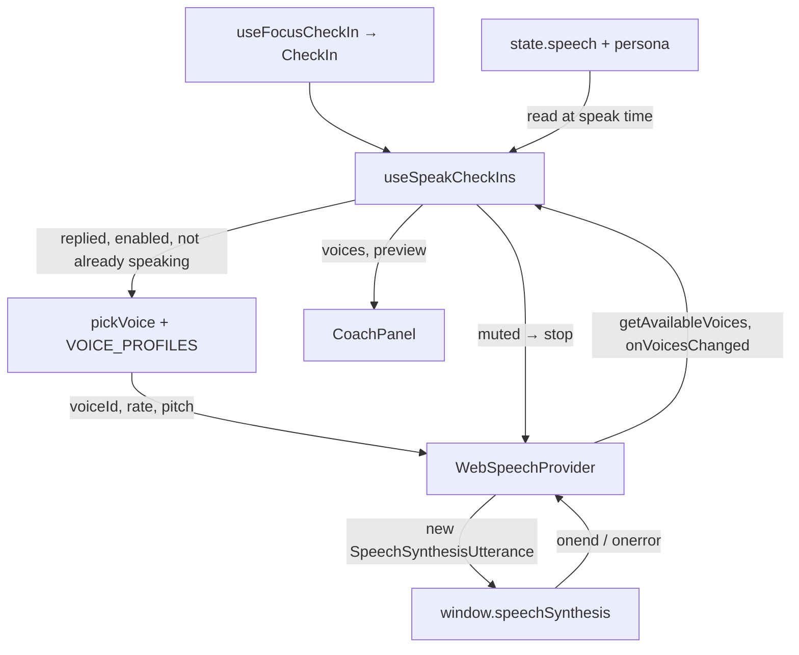
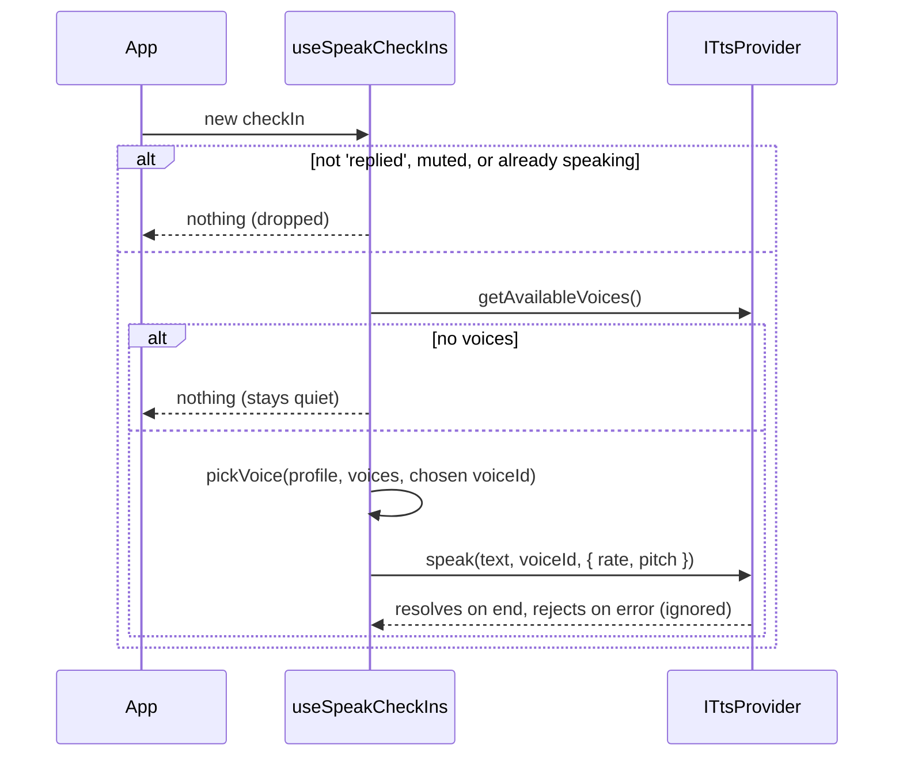
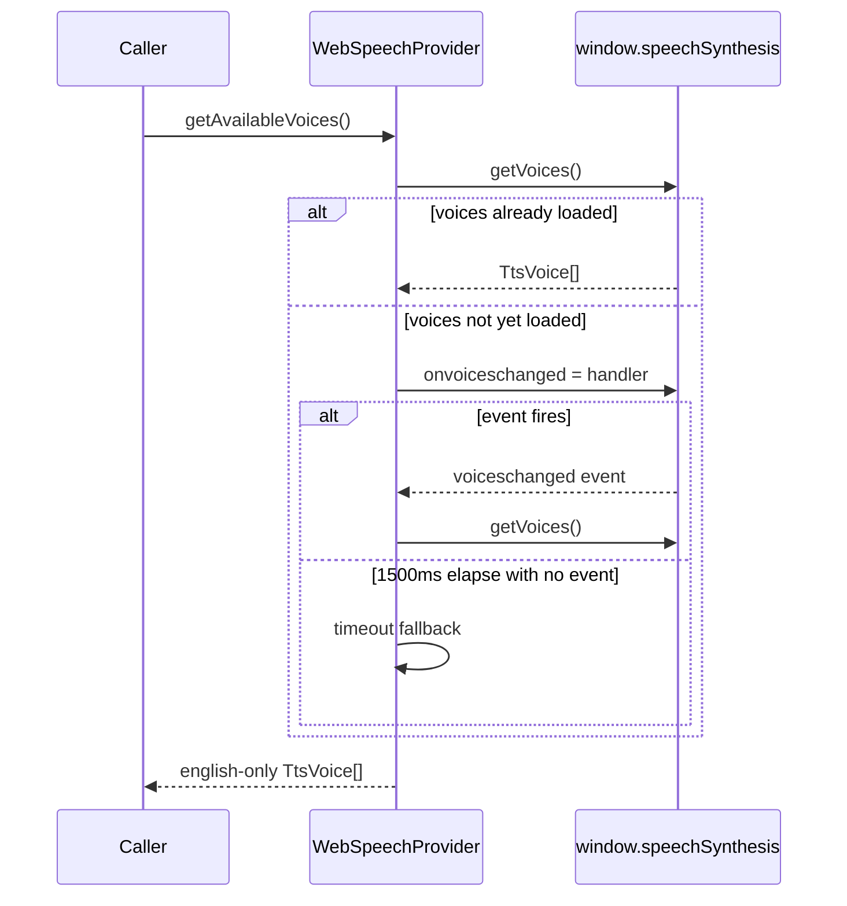

# Text-to-Speech (TTS) Subsystem

Speaks coach check-ins aloud, offline, in a voice that fits the chosen persona. A provider abstraction, the browser-native provider, a persona → voice table, and the hook that ties them to check-ins.

---

## 1. Directory Manifest & Boundaries

*   **Directory Manifest:**
    *   `types.ts`: `ITtsProvider` interface and `TtsVoice` shared shape, so the UI can treat any provider's voices uniformly.
    *   `WebSpeechProvider.ts`: `ITtsProvider` implementation backed by the browser's native `SpeechSynthesis` API.
    *   `WebSpeechProvider.test.ts`: Voice enumeration (immediate, `onvoiceschanged`-deferred, and timeout-fallback paths), playback, errors, `stop()` and `onVoicesChanged()`.
    *   `voiceProfiles.ts`: Pure. `VOICE_PROFILES` (rate, pitch, voice-name hints and a sample line per persona) and `pickVoice()`.
    *   `voiceProfiles.test.ts`: Every persona covered, values in Web Speech range, the Drill Sergeant faster and lower than the Mentor, no two personas alike on stock Windows voices, and `pickVoice` precedence.
    *   `useSpeakCheckIns.ts`: React hook that speaks replied check-ins through an `ITtsProvider`.
    *   `useSpeakCheckIns.test.ts`: Hook tests against a fake provider — what is spoken and in which voice, mute, no overlap, no repeats on a settings change, no voices, errors, preview.
*   **Integration Boundaries:**
    *   **Web Speech API:** Interfaces directly with `window.speechSynthesis` / `SpeechSynthesisUtterance`, native to Chromium/Electron's renderer. On Windows these are the system's SAPI voices — no network calls, no external service.
    *   **Check-ins:** consumes `CheckIn` from `services/focus/useFocusCheckIn.ts`. Only `outcome: 'replied'` is spoken.
    *   **Settings:** `SpeechSettings` (`enabled`, `voiceId`) lives in `src/shared/types.ts` and is saved with the rest of the state (ADR-009); `App.tsx` adds the current persona and passes all three in.

> **Wired in.** `App.tsx` creates one `WebSpeechProvider` and runs `useSpeakCheckIns(checkIn, tts, { ...state.speech, preset })`. The Coach tab has a "Speak check-ins" switch, a voice picker ("Automatic" = per persona) and a "Try voice" button. No provider selection exists yet — `TtsVoice.provider` allows `'cloud' | 'piper'` for later, but only `WebSpeechProvider` exists.
>
> **No voices.** On Linux/WSL, Electron often reports no voices at all. The hook then speaks nothing and the Coach tab says check-ins are shown but not spoken. Nothing throws.
>
> Licensing/feature-gating on TTS providers was removed with the rest of the licensing subsystem — see `docs/adr/008-retire-camera-pipeline-and-licensing.md`.

---

## 2. Architecture & Flow


```mermaid
graph TD
    CheckIn[useFocusCheckIn → CheckIn] --> Hook[useSpeakCheckIns]
    Settings[state.speech + persona] -->|read at speak time| Hook
    Hook -->|replied, enabled, not already speaking| Pick[pickVoice + VOICE_PROFILES]
    Pick -->|voiceId, rate, pitch| Provider[WebSpeechProvider]
    Hook -->|muted → stop| Provider
    Provider -->|new SpeechSynthesisUtterance| Synth[window.speechSynthesis]
    Synth -->|onend / onerror| Provider
    Provider -->|getAvailableVoices, onVoicesChanged| Hook
    Hook -->|voices, preview| Coach[CoachPanel]
```

### Speaking one check-in

```mermaid
sequenceDiagram
    participant App
    participant Hook as useSpeakCheckIns
    participant Provider as ITtsProvider

    App->>Hook: new checkIn
    alt not 'replied', muted, or already speaking
        Hook-->>App: nothing (dropped)
    else
        Hook->>Provider: getAvailableVoices()
        alt no voices
            Hook-->>App: nothing (stays quiet)
        else
            Hook->>Hook: pickVoice(profile, voices, chosen voiceId)
            Hook->>Provider: speak(text, voiceId, { rate, pitch })
            Provider-->>Hook: resolves on end, rejects on error (ignored)
        end
    end
```

### Voice Enumeration (handles both sync and async voice list loading)

```mermaid
sequenceDiagram
    participant Caller
    participant Provider as WebSpeechProvider
    participant Synth as window.speechSynthesis

    Caller->>Provider: getAvailableVoices()
    Provider->>Synth: getVoices()
    alt voices already loaded
        Synth-->>Provider: TtsVoice[]
    else voices not yet loaded
        Provider->>Synth: onvoiceschanged = handler
        alt event fires
            Synth-->>Provider: voiceschanged event
            Provider->>Synth: getVoices()
        else 1500ms elapse with no event
            Provider->>Provider: timeout fallback
        end
    end
    Provider-->>Caller: english-only TtsVoice[]
```

---

## 3. Public Interfaces & Contracts

### Data Structures

#### `TtsVoice`
```typescript
interface TtsVoice {
  id: string;   // the native voice name, e.g. "Microsoft David - English (United States)"
  name: string;
  provider: 'webspeech' | 'cloud' | 'piper';
}
```

#### `ITtsProvider`
```typescript
interface ITtsProvider {
  initialize(config?: any): Promise<void>;
  getAvailableVoices(): Promise<TtsVoice[]>;
  speak(text: string, voiceId: string, options?: { pitch?: number; rate?: number }): Promise<void>;
  stop(): void;
  onVoicesChanged(listener: () => void): () => void; // returns unsubscribe
}
```

#### `VoiceProfile`
```typescript
interface VoiceProfile {
  rate: number;         // Web Speech rate, 1 = normal
  pitch: number;        // Web Speech pitch, 1 = normal
  voiceHints: string[]; // voice-name fragments, best first, case-insensitive
  sample: string;       // one line in character, for "Try voice"
}
```

| Persona | Rate | Pitch | First hint on Windows |
| :--- | :--- | :--- | :--- |
| Drill Sergeant | 1.2 | 0.6 | David |
| Sarcastic Critic | 1.05 | 1.1 | Mark |
| Supportive Mentor | 0.9 | 1.05 | Zira |
| Disappointed Parent | 0.85 | 0.9 | Hazel, else Zira |

---

### `pickVoice(profile, voices, chosenVoiceId)`
*   **Output:** `string` — a voice id.
*   **Description:** The chosen voice if it is still installed; else the first installed voice matching a hint, in hint order; else `''`, which the provider reads as "system default".

### `useSpeakCheckIns(checkIn, tts, settings)`
*   **Input:** `checkIn: CheckIn | null`, `tts: ITtsProvider`, `settings: { enabled: boolean; voiceId: string | null; preset: LlmPreset }`
*   **Output:** `{ voices: TtsVoice[]; preview: () => void }`
*   **Description:** Speaks each new `'replied'` check-in once. Settings are read at speak time, so changing them never repeats the last check-in. Never overlaps: a check-in that arrives mid-sentence is dropped. Turning `enabled` off calls `tts.stop()`. Voices are fetched on mount, again whenever `onVoicesChanged` fires, and again at each speak: on a cold start Windows can take longer than `getAvailableVoices()`'s 1.5s timeout to report them. `preview()` speaks the persona's sample line even while muted.

---

### `WebSpeechProvider` Class (implements `ITtsProvider`)

#### `initialize()`
*   **Output:** `Promise<void>`
*   **Description:** Marks the provider initialized. Logs a console warning (does not throw) if `window.speechSynthesis` is unavailable in the current environment.

#### `getAvailableVoices()`
*   **Output:** `Promise<TtsVoice[]>`
*   **Description:** Returns English-only (`lang` starting with `en`) native voices, mapped to `TtsVoice` with `provider: 'webspeech'`. Returns `[]` immediately if Speech Synthesis isn't supported. Handles browsers that populate the voice list asynchronously by waiting on `onvoiceschanged`, with a 1500ms fallback timeout.

#### `speak(text, voiceId, options?)`
*   **Input:** `text: string`, `voiceId: string` (matched against native voice `name`), `options?: { pitch?: number; rate?: number }`
*   **Output:** `Promise<void>` — resolves on `utterance.onend`, rejects on `utterance.onerror`.
*   **Description:** Cancels any in-progress speech (`synth.cancel()`) before speaking. Throws if Speech Synthesis isn't supported.

#### `stop()`
*   **Description:** `synth.cancel()`. Does nothing if Speech Synthesis isn't supported.

#### `onVoicesChanged(listener)`
*   **Output:** `() => void` — unsubscribe.
*   **Description:** Adds a `voiceschanged` event listener. Uses `addEventListener`, not the `onvoiceschanged` property, because `getAvailableVoices()` sets and clears that property itself. A no-op when Speech Synthesis isn't supported.
